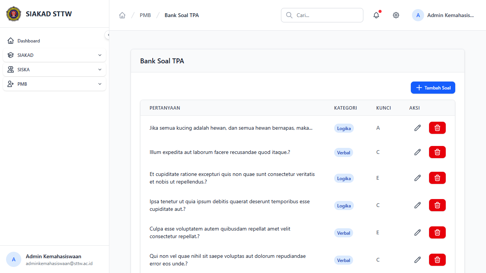
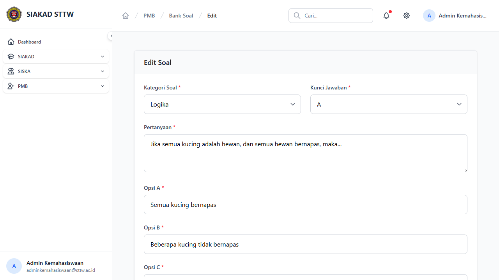

# Workflow Report: Bank Soal TPA PMB

**Tanggal**: 2026-04-13
**Role**: Admin Kemahasiswaan
**Modul**: PMB — Bank Soal TPA
**Status**: ✅ Berhasil

## Ringkasan

CRUD bank soal Tes Potensi Akademik (TPA) — mengelola pertanyaan pilihan ganda dengan 4 opsi jawaban.

## Langkah-langkah

### 1. Daftar Bank Soal

Halaman index menampilkan tabel dengan kolom:
- Pertanyaan (preview), Kategori, Kunci Jawaban, Aksi (edit/hapus)
- 51 soal tersedia dalam 3 kategori: Numerik, Verbal, Logika

### 2. Edit Soal

Form edit menampilkan field:
- Kategori Soal (dropdown: Numerik/Verbal/Logika)
- Kunci Jawaban (dropdown: A/B/C/D)
- Pertanyaan (textarea)
- Opsi A, B, C, D (text input)

Contoh: Soal logika "Jika semua kucing adalah hewan, dan semua hewan bernapas, maka..." dengan opsi dan kunci jawaban A.

## Catatan

- Soal TPA digunakan dalam ujian online PMB
- Jumlah soal yang ditampilkan per ujian diatur di Setting PMB
- 3 kategori soal: Numerik (hitungan), Verbal (bahasa), Logika (penalaran)
