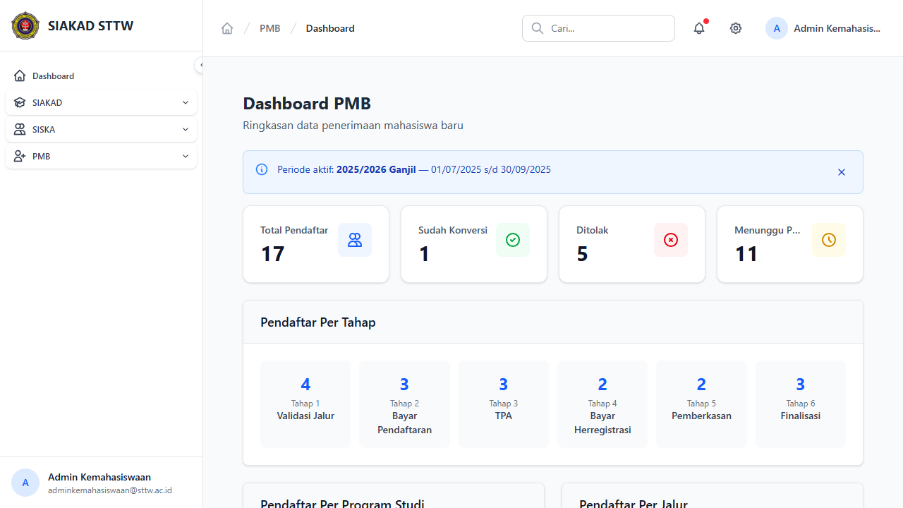
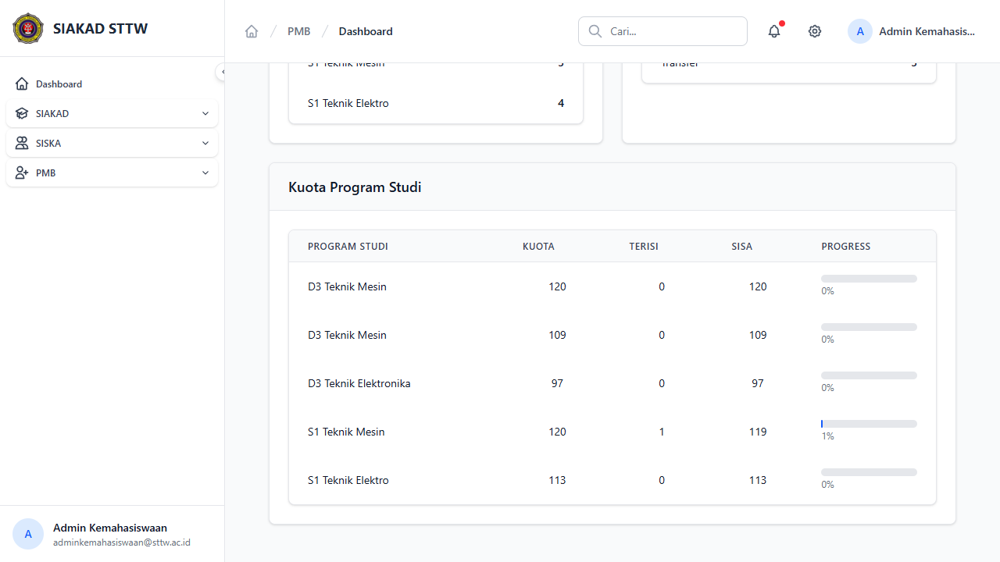

# Workflow Report: Dashboard PMB

**Tanggal**: 2026-04-13
**Role**: Admin Kemahasiswaan
**Modul**: PMB (Penerimaan Mahasiswa Baru)
**Status**: ✅ Berhasil

## Ringkasan

Dashboard PMB menampilkan ringkasan statistik pendaftaran mahasiswa baru, termasuk total pendaftar, status konversi, jumlah ditolak, dan distribusi per tahap/prodi/jalur.

## Langkah-langkah

### 1. Halaman Dashboard PMB — Overview

Dashboard menampilkan info periode aktif, 4 stats card (Total Pendaftar, Sudah Konversi, Ditolak, Menunggu Proses), dan distribusi pendaftar per tahap (Tahap 1–6).

### 2. Dashboard PMB — Kuota Program Studi

Bagian bawah dashboard menampilkan tabel kuota per program studi dengan kolom Kuota, Terisi, Sisa, dan progress bar visual.

## Catatan

- Data test seed: 17 pendaftar, 1 sudah konversi, 5 ditolak, 11 menunggu proses
- Periode aktif: 2025/2026 Ganjil (01/07/2025 s/d 30/09/2025)
- Kuota prodi menunjukkan progress pengisian (S1 Teknik Mesin: 1 terisi dari 120)
