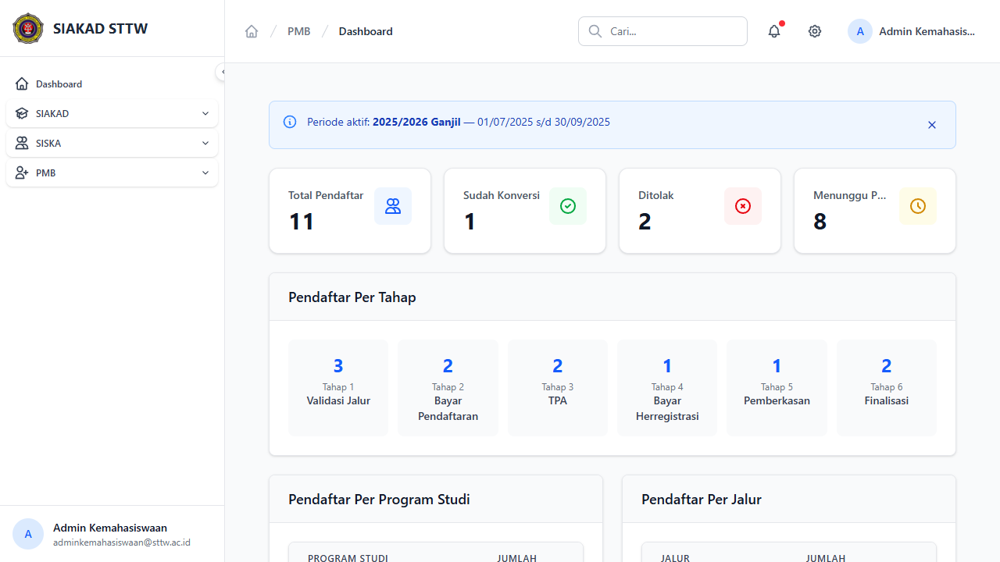
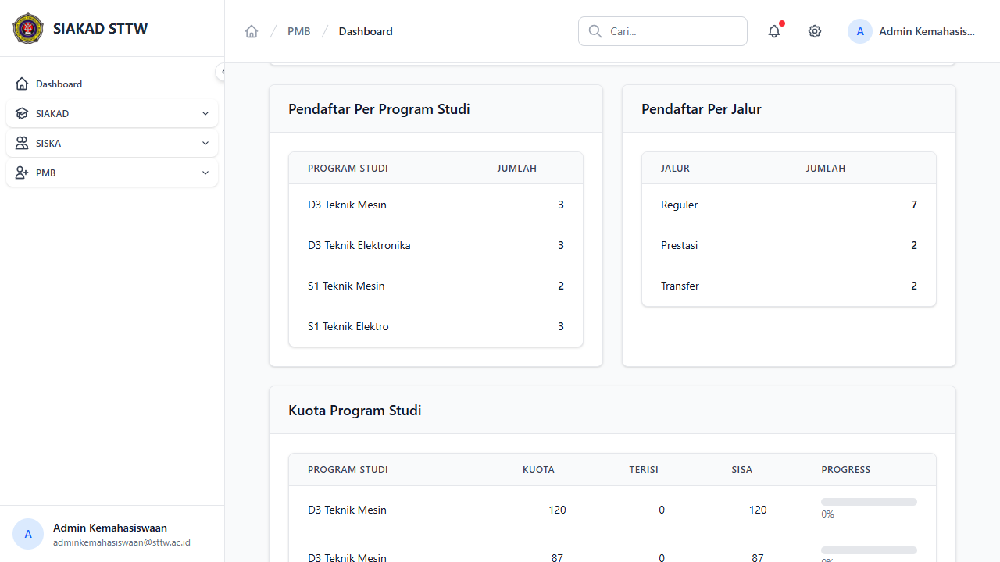
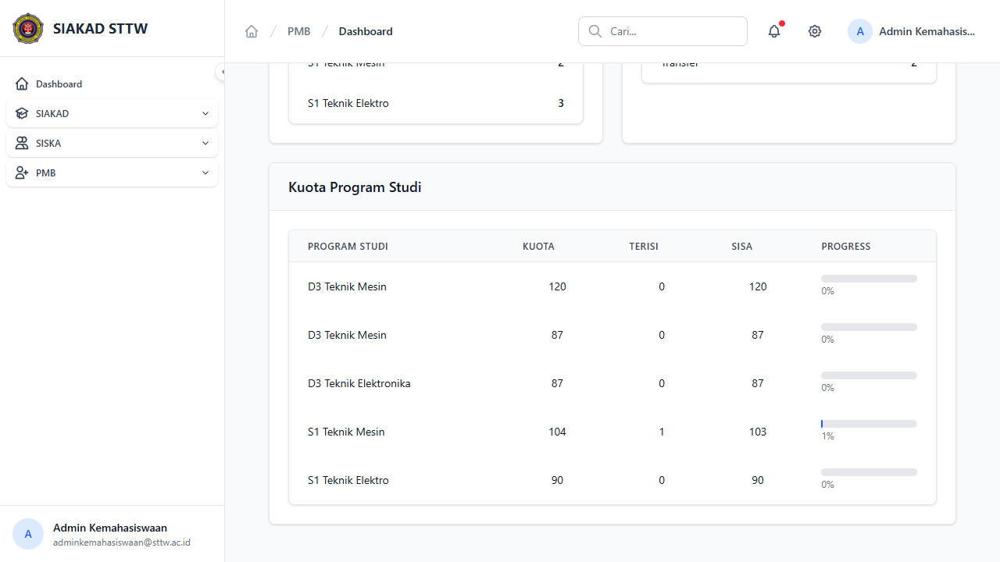

# Workflow Report: Dashboard PMB

**Tanggal**: 2026-04-13
**Role**: Admin Kemahasiswaan
**Modul**: PMB (Penerimaan Mahasiswa Baru)
**Status**: ✅ Berhasil

## Ringkasan

Dashboard PMB menampilkan ringkasan statistik pendaftar mahasiswa baru, termasuk total pendaftar, status konversi, jumlah ditolak, pendaftar per tahap, per program studi, per jalur, dan kuota program studi dengan progress bar.

## Langkah-langkah

### 1. Dashboard Utama — Statistik & Tahap

Halaman utama menampilkan:
- **Total Pendaftar**: 11
- **Sudah Konversi**: 1
- **Ditolak**: 2
- **Menunggu Proses**: 8
- Info periode aktif: 2025/2026 Ganjil
- Breakdown pendaftar per tahap (1-6)

### 2. Dashboard — Per Program Studi & Per Jalur

Bagian tengah menampilkan:
- Tabel pendaftar per program studi (D3 Teknik Mesin, S1 Teknik Mesin, S1 Teknik Elektro)
- Tabel pendaftar per jalur (Reguler, Transfer, Prestasi)

### 3. Dashboard — Kuota Program Studi

Bagian bawah menampilkan tabel kuota per program studi dengan kolom:
- Program Studi, Kuota, Terisi, Sisa, Progress bar
- S1 Teknik Mesin sudah terisi 1 dari 104 (1%)

## Catatan

- Dashboard menampilkan data dari periode PMB aktif (2025/2026 Ganjil)
- Semua statistik bersifat real-time berdasarkan data pendaftar
- Progress bar kuota menampilkan persentase terisi secara visual
