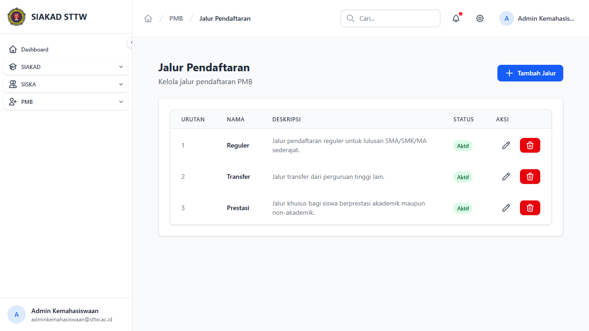
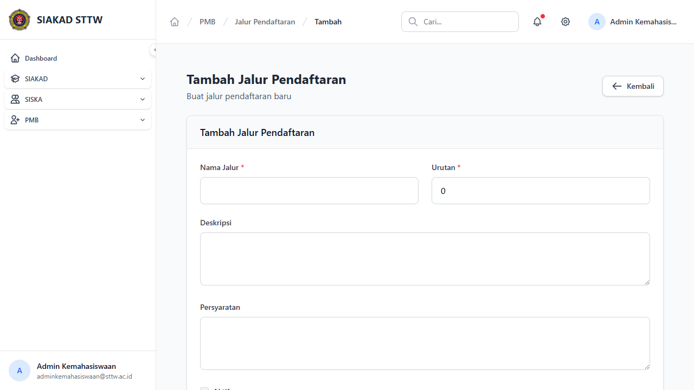
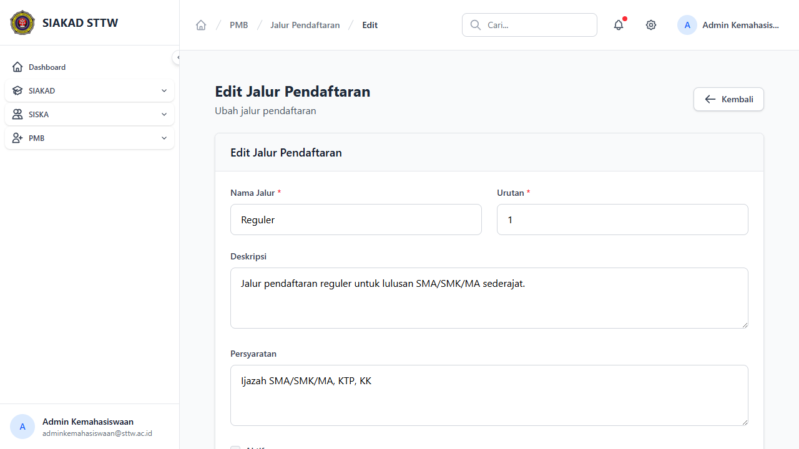

# Workflow Report: Jalur Pendaftaran PMB

**Tanggal**: 2026-04-13
**Role**: Admin Kemahasiswaan
**Modul**: PMB — Jalur Pendaftaran
**Status**: ✅ Berhasil

## Ringkasan

Halaman master data jalur pendaftaran PMB untuk mengelola jenis jalur masuk (Reguler, Prestasi, Transfer).

## Langkah-langkah

### 1. Daftar Jalur Pendaftaran

Halaman index menampilkan tabel jalur pendaftaran dengan kolom Nama Jalur, Keterangan, Status, dan tombol Aksi. Terdapat tombol "Tambah Jalur" di header.

### 2. Form Tambah Jalur

Form create untuk menambah jalur pendaftaran baru dengan field nama, keterangan, dan status aktif.

### 3. Form Edit Jalur

Form edit untuk mengubah data jalur yang sudah ada.

## Catatan

- 3 jalur tersedia: Reguler, Prestasi, Transfer
- Semua jalur berstatus aktif
