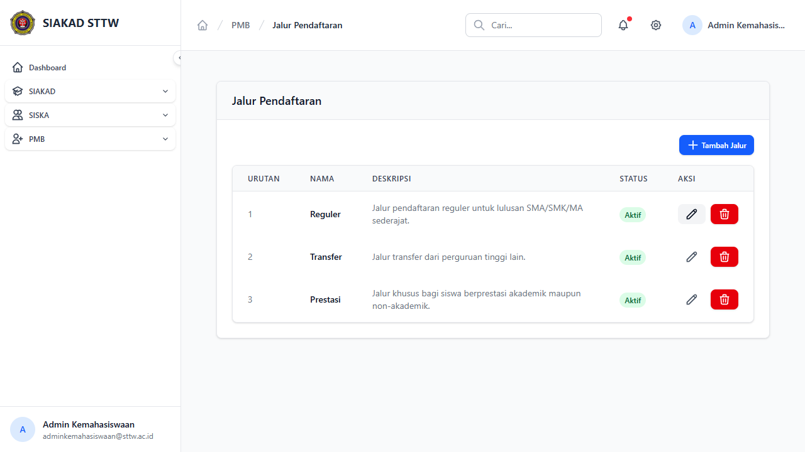

# Workflow Report: Jalur Pendaftaran PMB

**Tanggal**: 2026-04-13
**Role**: Admin Kemahasiswaan
**Modul**: PMB — Jalur Pendaftaran
**Status**: ✅ Berhasil

## Ringkasan

CRUD master data jalur pendaftaran mahasiswa baru — mengelola jenis jalur masuk (Reguler, Transfer, Prestasi).

## Langkah-langkah

### 1. Daftar Jalur Pendaftaran

Halaman index menampilkan tabel dengan kolom:
- Urutan, Nama, Deskripsi, Status, Aksi (edit/hapus)
- 3 jalur tersedia: Reguler, Transfer, Prestasi — semua berstatus Aktif

## Catatan

- Jalur pendaftaran menentukan kategori penerimaan mahasiswa baru
- Urutan menentukan tampilan di form pendaftaran
- Status aktif/nonaktif mengontrol ketersediaan jalur
