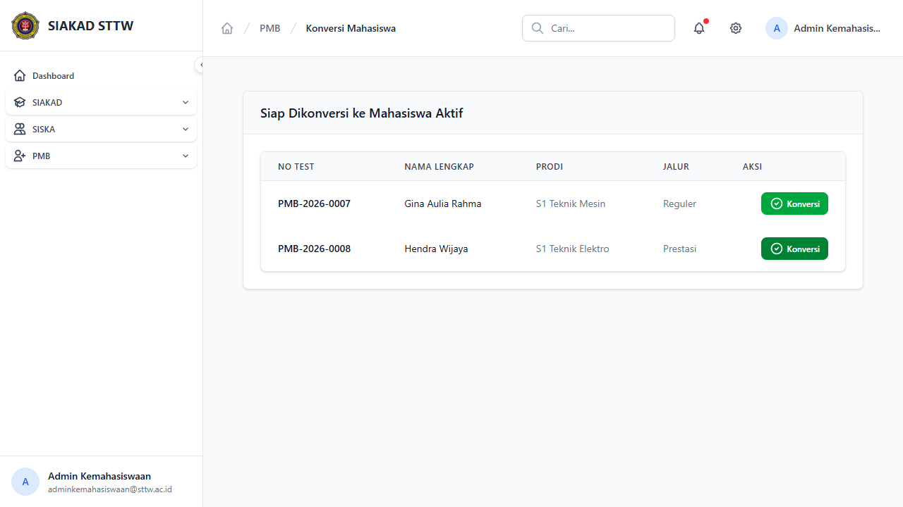
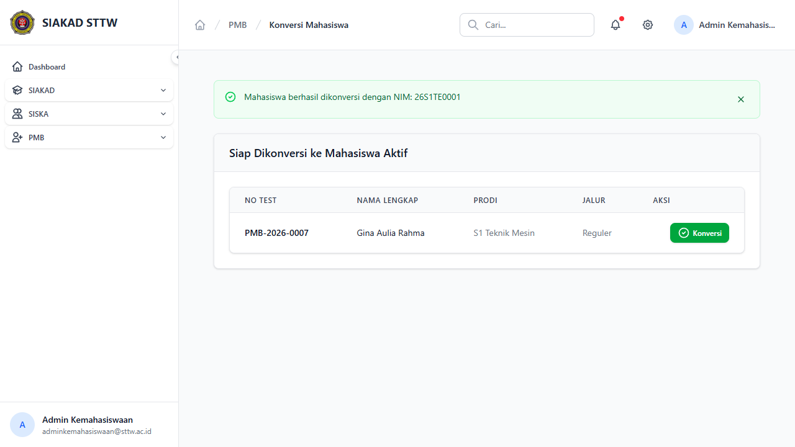

# Workflow Report: Konversi Mahasiswa Baru

**Tanggal**: 2026-04-13
**Role**: Admin Kemahasiswaan
**Modul**: PMB — Konversi
**Status**: ✅ Berhasil

## Ringkasan

Proses konversi calon mahasiswa menjadi mahasiswa aktif — termasuk generate NIM otomatis, perubahan status, dan role user.

## Langkah-langkah

### 1. Daftar Siap Konversi

Halaman menampilkan calon mahasiswa yang sudah selesai semua tahap (Tahap 6, status Registered):
- Kolom: No. Test, Nama Lengkap, Program Studi, Jalur, Aksi
- 2 pendaftar siap konversi:
  - **Gina Aulia Rahma** — S1 Teknik Mesin, Reguler
  - **Hendra Wijaya** — S1 Teknik Elektro, Prestasi
- Tombol "Konversi" (hijau) pada setiap baris

### 2. Konfirmasi & Hasil Konversi

Skenario konversi Hendra Wijaya:
1. Klik tombol "Konversi" → muncul dialog konfirmasi: "Yakin konversi mahasiswa ini? NIM akan digenerate."
2. Klik OK → proses konversi berjalan
3. Muncul pesan sukses: **"Mahasiswa berhasil dikonversi dengan NIM: 26S1TE0001"**
4. Hendra Wijaya hilang dari daftar, tersisa hanya Gina Aulia Rahma

Format NIM: `{YY}{KODE_PRODI}{0001}` → `26S1TE0001`

## Catatan

- NIM digenerate otomatis berdasarkan format: 2 digit tahun + kode prodi + 4 digit urutan
- Konversi mengubah status mahasiswa dari "Calon" menjadi "Aktif"
- Status pendaftaran berubah dari "registered" menjadi "converted"
- Hanya pendaftar Tahap 6 dengan status "Registered" yang muncul di halaman konversi
- Proses ini tidak bisa di-undo — pastikan data sudah benar sebelum konversi
