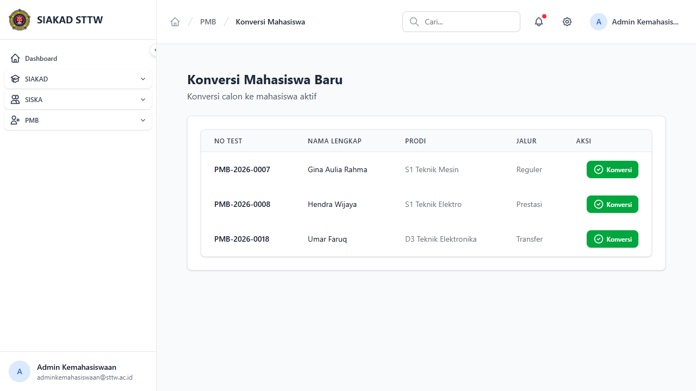

# Workflow Report: Konversi Mahasiswa PMB

**Tanggal**: 2026-04-13
**Role**: Admin Kemahasiswaan
**Modul**: PMB — Konversi Mahasiswa
**Status**: ✅ Berhasil

## Ringkasan

Halaman konversi mahasiswa baru menampilkan daftar calon mahasiswa yang telah menyelesaikan seluruh tahap pendaftaran (tahap 6 - Registered) dan siap dikonversi menjadi mahasiswa aktif.

## Langkah-langkah

### 1. Daftar Calon Mahasiswa Siap Konversi

Halaman index menampilkan tabel calon mahasiswa yang siap dikonversi dengan kolom No Test, Nama Lengkap, Prodi, Jalur, dan tombol Aksi (Konversi). Terdapat 3 calon dari berbagai jalur (Reguler, Prestasi, Transfer).

## Catatan

- 3 calon mahasiswa siap konversi: Gina Aulia Rahma (Reguler), Hendra Wijaya (Prestasi), Umar Faruq (Transfer)
- Tombol "Konversi" (hijau) akan mengubah status calon menjadi mahasiswa aktif
- Proses konversi meliputi: generate NIM, perubahan role dari mahasiswa-baru ke mahasiswa, dan update status
