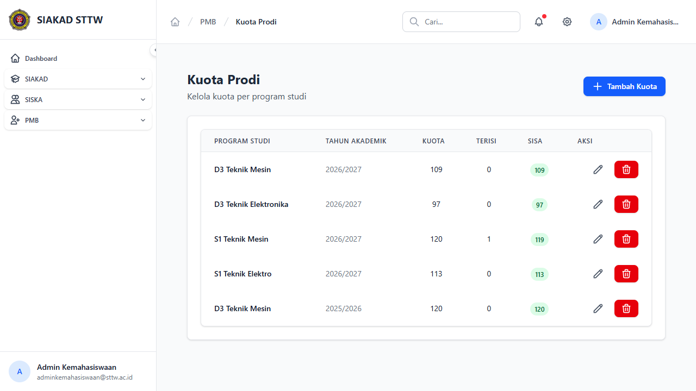
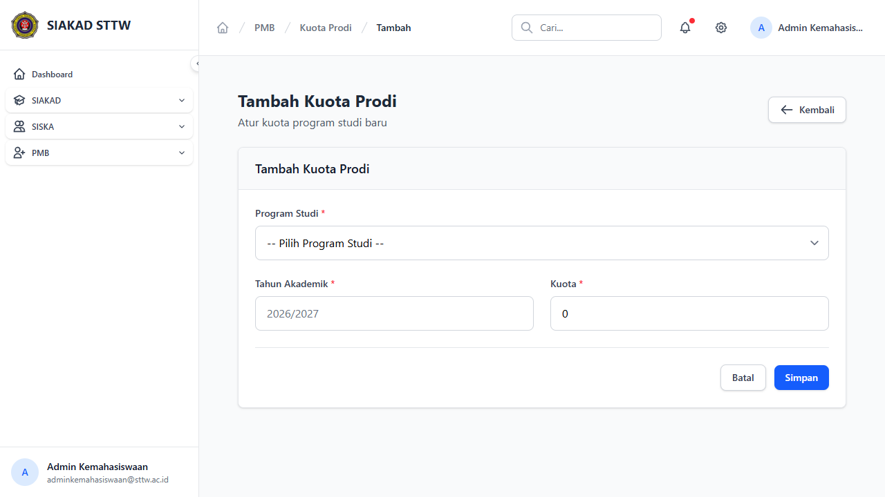
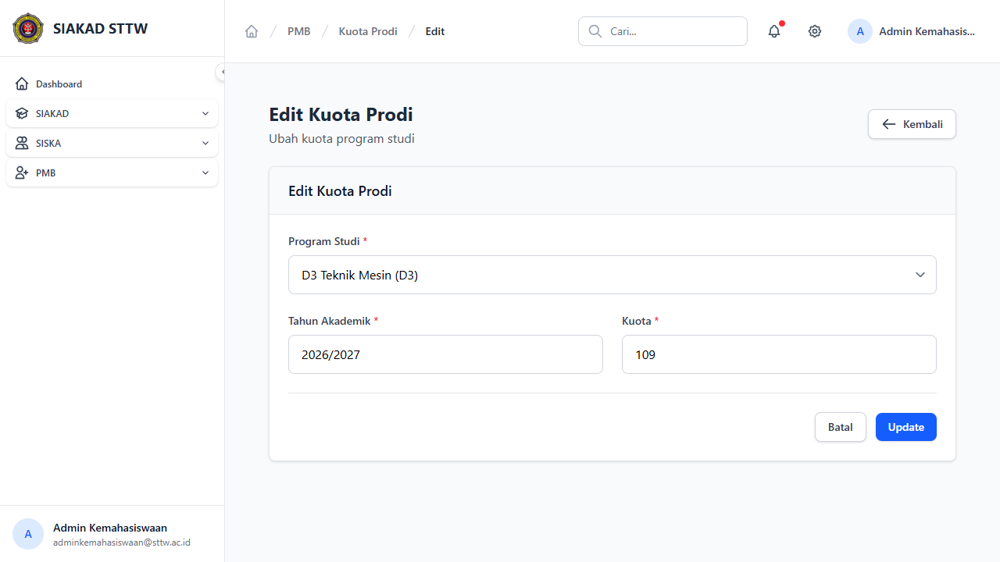

# Workflow Report: Kuota Prodi PMB

**Tanggal**: 2026-04-13
**Role**: Admin Kemahasiswaan
**Modul**: PMB — Kuota Prodi
**Status**: ✅ Berhasil

## Ringkasan

Halaman master data kuota per program studi untuk membatasi jumlah pendaftar yang diterima setiap prodi.

## Langkah-langkah

### 1. Daftar Kuota Prodi

Halaman index menampilkan tabel kuota dengan kolom Program Studi, Kuota, Terisi, Sisa, dan tombol Aksi. Terdapat tombol "Tambah Kuota" di header.

### 2. Form Tambah Kuota

Form create untuk menambah kuota prodi baru dengan field program studi dan jumlah kuota.

### 3. Form Edit Kuota

Form edit untuk mengubah jumlah kuota yang sudah ada.

## Catatan

- Kuota tersedia untuk semua prodi (D3 Teknik Mesin, D3 Teknik Elektronika, S1 Teknik Mesin, S1 Teknik Elektro, dll)
- Progress pengisian ditampilkan di dashboard PMB
