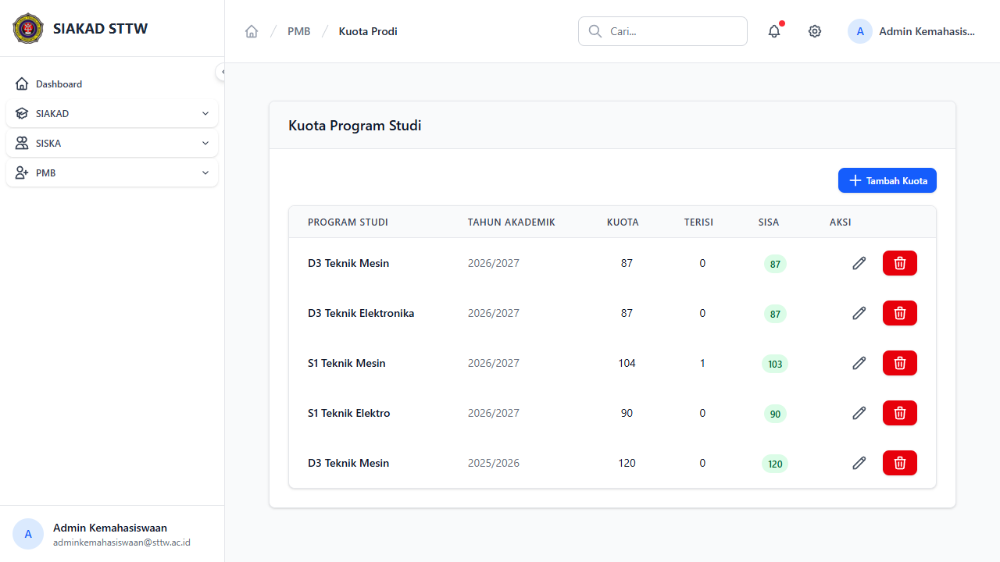

# Workflow Report: Kuota Prodi PMB

**Tanggal**: 2026-04-13
**Role**: Admin Kemahasiswaan
**Modul**: PMB — Kuota Program Studi
**Status**: ✅ Berhasil

## Ringkasan

CRUD master data kuota penerimaan per program studi per tahun akademik — mengelola batas jumlah mahasiswa baru.

## Langkah-langkah

### 1. Daftar Kuota Program Studi

Halaman index menampilkan tabel dengan kolom:
- Program Studi, Tahun Akademik, Kuota, Terisi, Sisa (badge), Aksi
- 5 kuota untuk 2 tahun akademik:
  - D3 Teknik Mesin: 87 (2026/2027), 120 (2025/2026)
  - D3 Teknik Elektronika: 87 (2026/2027)
  - S1 Teknik Mesin: 104, terisi 1, sisa 103 (2026/2027)
  - S1 Teknik Elektro: 90 (2026/2027)

## Catatan

- Sisa kuota ditampilkan dengan badge hijau/biru
- Kolom "Terisi" menghitung otomatis dari jumlah pendaftar yang sudah dikonversi
- S1 Teknik Mesin sudah terisi 1 karena konversi mahasiswa dari sesi testing
