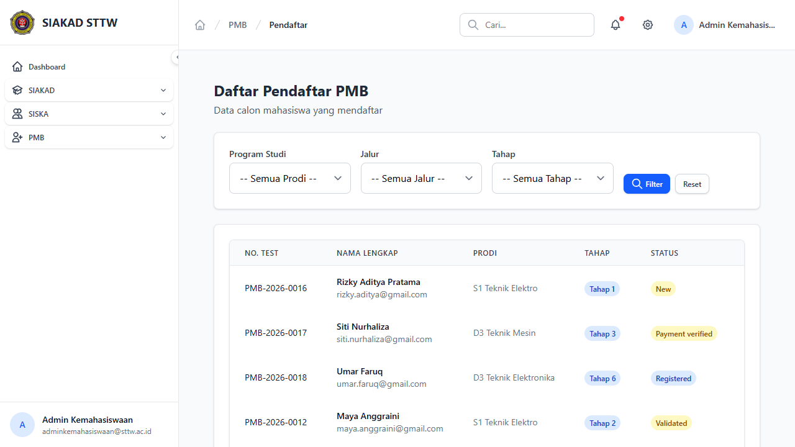
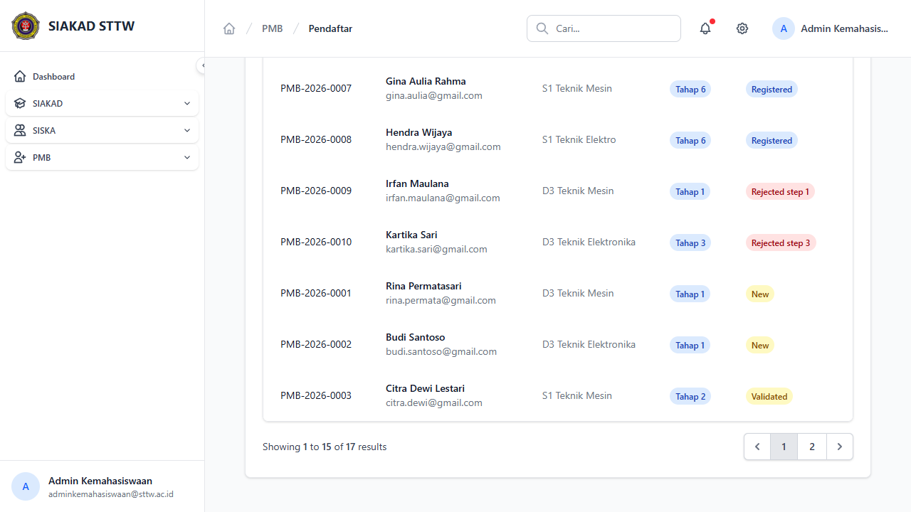
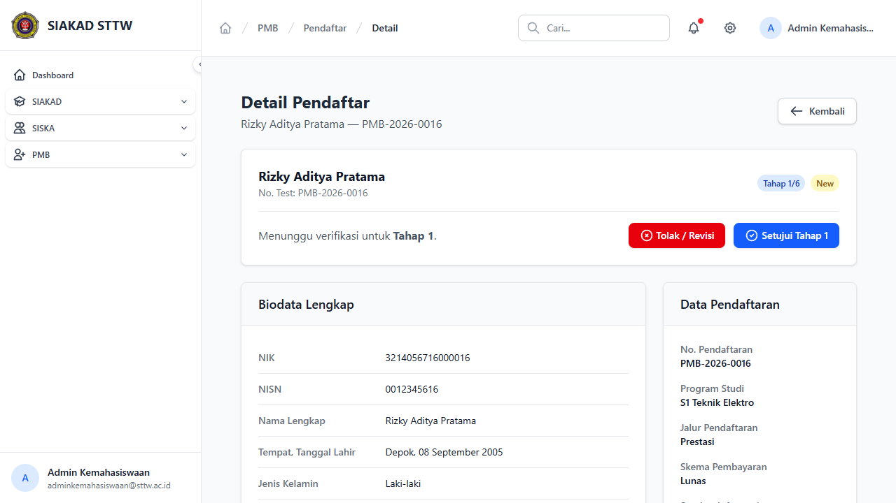
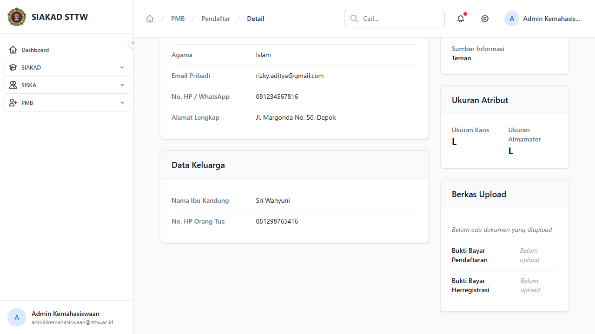

# Workflow Report: Pendaftar PMB

**Tanggal**: 2026-04-13
**Role**: Admin Kemahasiswaan
**Modul**: PMB — Pendaftar
**Status**: ✅ Berhasil

## Ringkasan

Halaman daftar pendaftar PMB menampilkan semua calon mahasiswa yang mendaftar, dengan filter berdasarkan program studi, jalur, dan tahap. Detail pendaftar menampilkan biodata lengkap, data pendaftaran, dan tombol aksi approval.

## Langkah-langkah

### 1. Daftar Pendaftar dengan Filter

Halaman index menampilkan filter (Program Studi, Jalur, Tahap) dan tabel pendaftar dengan kolom No. Test, Nama Lengkap, Prodi, Tahap, dan Status. Status ditampilkan sebagai badge berwarna (New, Validated, Payment verified, Registered).

### 2. Tabel Pendaftar (Scroll)

Tabel pendaftar menampilkan semua 17 calon mahasiswa dengan berbagai status dan tahap pendaftaran.

### 3. Detail Pendaftar — Header & Biodata

Detail pendaftar menampilkan info header (nama, no test, tahap, status), tombol aksi (Tolak/Revisi, Setujui Tahap), dan biodata lengkap (NIK, NISN, nama, TTL, jenis kelamin) serta data pendaftaran (no pendaftaran, prodi, jalur, skema pembayaran).

### 4. Detail Pendaftar — Data Lengkap (Scroll)

Bagian bawah detail menampilkan informasi tambahan seperti alamat, dokumen yang diunggah, dan riwayat verifikasi.

## Catatan

- 17 pendaftar dengan berbagai status: New, Validated, Payment verified, TPA passed, Herregistrasi verified, Registered
- 5 pendaftar dengan status Rejected (step 1-5)
- 1 pendaftar sudah dikonversi
- Filter mendukung pencarian berdasarkan prodi, jalur pendaftaran, dan tahap
- Detail menampilkan tombol "Tolak / Revisi" (merah) dan "Setujui Tahap X" (biru)
