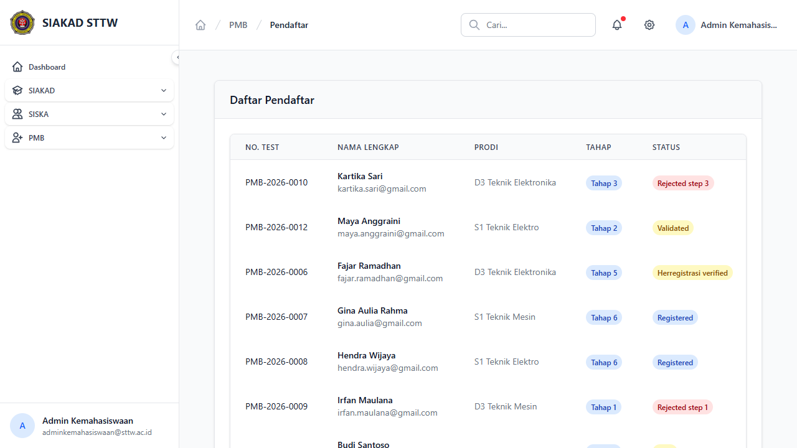
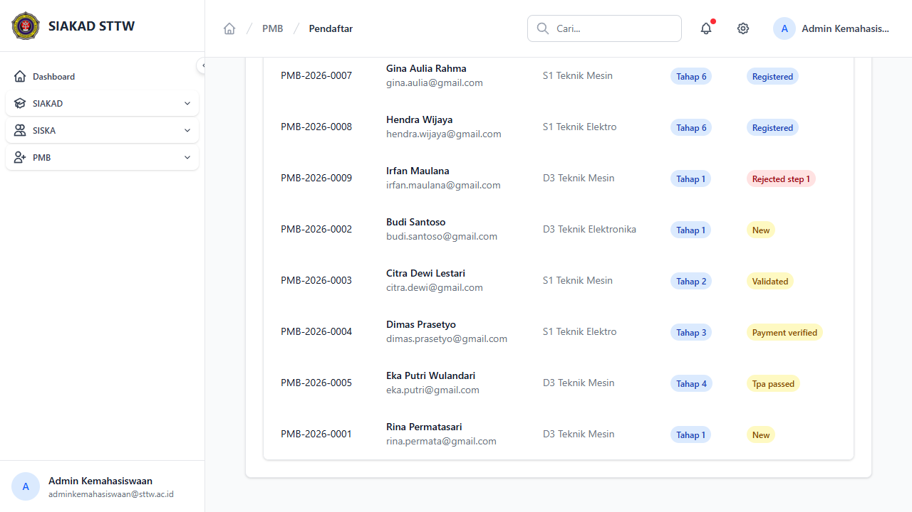
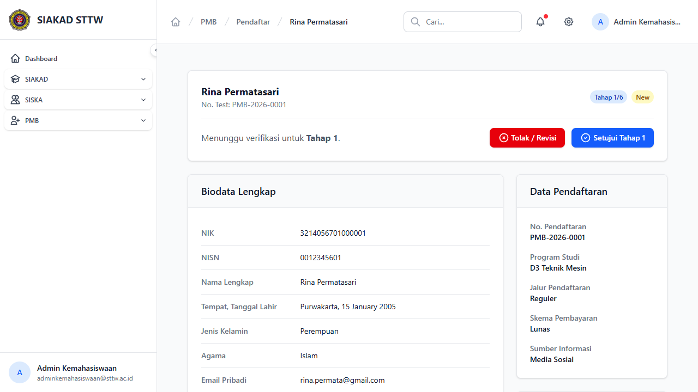
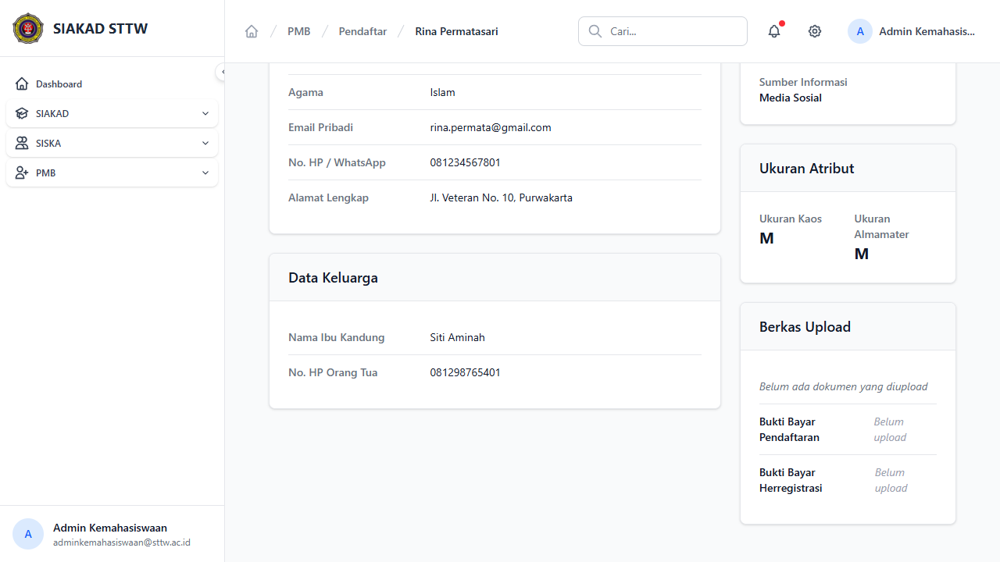
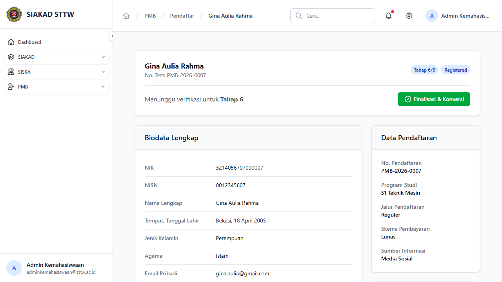
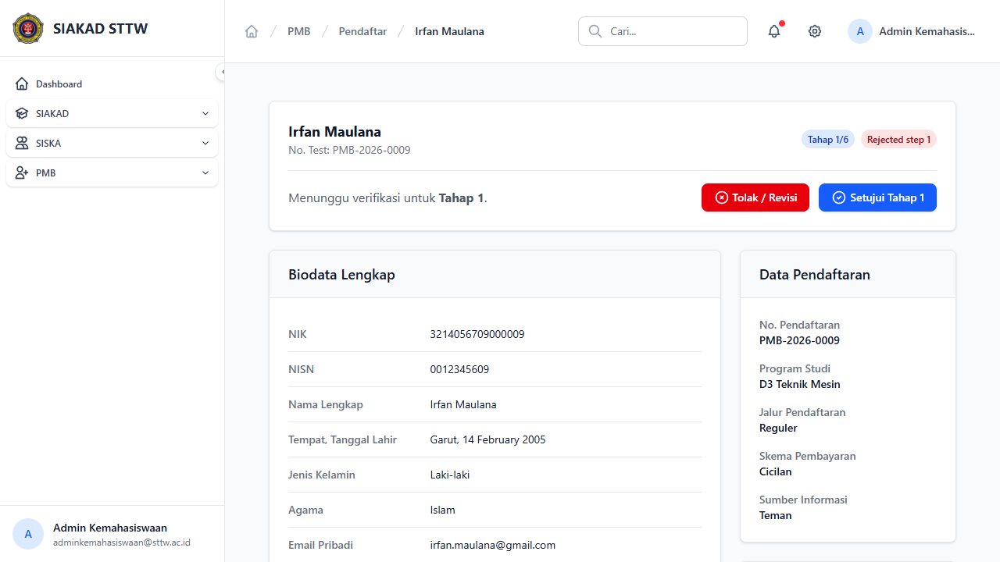

# Workflow Report: Pendaftar PMB

**Tanggal**: 2026-04-13
**Role**: Admin Kemahasiswaan
**Modul**: PMB — Daftar Pendaftar
**Status**: ✅ Berhasil

## Ringkasan

Halaman pengelolaan data pendaftar mahasiswa baru — menampilkan daftar semua calon mahasiswa dengan berbagai tahap dan status, serta detail biodata lengkap per pendaftar.

## Langkah-langkah

### 1. Daftar Pendaftar — Overview

Tabel daftar pendaftar menampilkan:
- No. Test, Nama Lengkap (+ email), Program Studi, Tahap (badge), Status (badge warna)
- 11 pendaftar dengan berbagai status: New, Validated, Payment Verified, TPA Passed, Herregistrasi Verified, Registered, Rejected Step 1/3

### 2. Daftar Pendaftar — Lanjutan

Scroll ke bawah menampilkan pendaftar tambahan dengan berbagai tahap.

### 3. Detail Pendaftar — Tahap 1 (New)

Detail Rina Permatasari (PMB-2026-0001):
- Header: Nama, No. Test, badge Tahap 1/6, status "New"
- Pesan: "Menunggu verifikasi untuk Tahap 1."
- Tombol aksi: **Tolak / Revisi** (merah) dan **Setujui Tahap 1** (hijau)
- Biodata Lengkap: NIK, NISN, Nama, Tempat/Tanggal Lahir, Jenis Kelamin, Agama
- Data Pendaftaran (sidebar): No. Pendaftaran, Program Studi, Jalur, Skema Pembayaran, Sumber Informasi

### 4. Detail Pendaftar — Bagian Bawah

Lanjutan detail menampilkan:
- Email Pribadi, No. HP/WhatsApp, Alamat Lengkap
- **Data Keluarga**: Nama Ibu Kandung, No. HP Orang Tua
- **Ukuran Atribut**: Ukuran Kaos, Ukuran Almamater
- **Berkas Upload**: Status upload dokumen (Bukti Bayar Pendaftaran, Bukti Bayar Herregistrasi)

### 5. Detail Pendaftar — Tahap 6 (Registered, Siap Konversi)

Detail Gina Aulia Rahma (PMB-2026-0007):
- Badge Tahap 6/6, status "Registered"
- Pesan: "Menunggu verifikasi untuk Tahap 6."
- Tombol aksi: **Finalisasi & Konversi** (hijau) — hanya muncul di tahap 6

### 6. Detail Pendaftar — Ditolak (Rejected)

Detail Irfan Maulana (PMB-2026-0009):
- Badge Tahap 1/6, status "Rejected step 1" (merah)
- Tombol aksi tetap tersedia: Tolak/Revisi dan Setujui Tahap 1 (untuk re-approve)

## Catatan

- Setiap pendaftar memiliki detail biodata lengkap termasuk data keluarga dan ukuran atribut
- Status badge menggunakan warna berbeda: New (kuning), Validated (biru), Registered (hijau), Rejected (merah)
- Tombol "Finalisasi & Konversi" hanya muncul untuk pendaftar di Tahap 6 dengan status Registered
- Pendaftar yang ditolak masih bisa di-approve ulang melalui tombol "Setujui Tahap"
