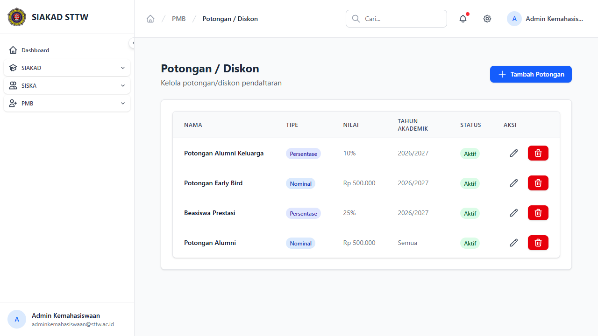
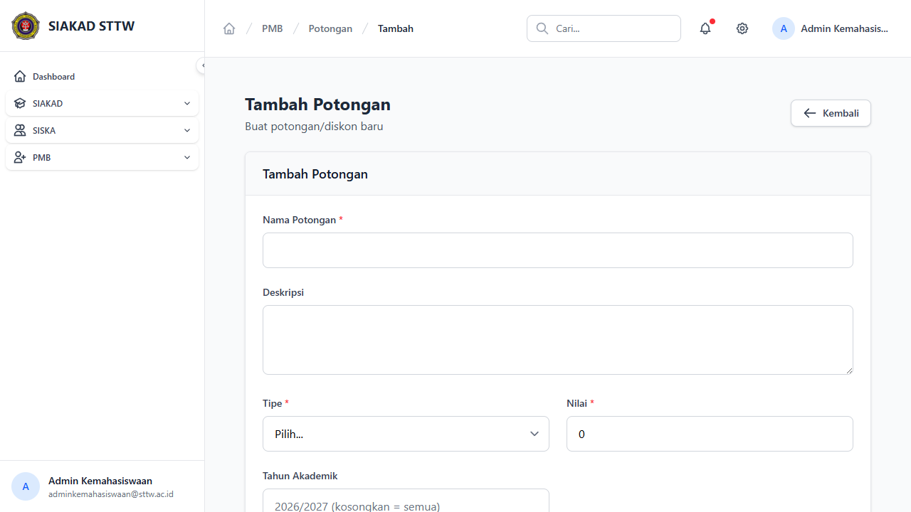
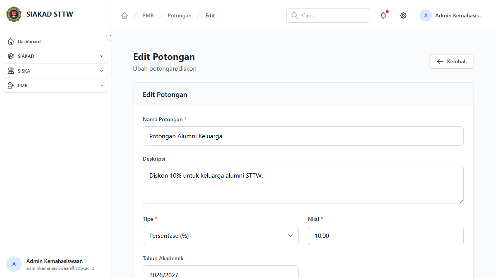

# Workflow Report: Potongan PMB

**Tanggal**: 2026-04-13
**Role**: Admin Kemahasiswaan
**Modul**: PMB — Potongan
**Status**: ✅ Berhasil

## Ringkasan

Halaman master data potongan/diskon biaya PMB untuk mengelola potongan berdasarkan jalur pendaftaran.

## Langkah-langkah

### 1. Daftar Potongan

Halaman index menampilkan tabel potongan dengan kolom Nama, Jalur, Jumlah/Persentase, dan tombol Aksi. Terdapat tombol "Tambah Potongan" di header.

### 2. Form Tambah Potongan

Form create untuk menambah potongan baru dengan field nama, jalur pendaftaran, jenis (nominal/persentase), dan nilai potongan.

### 3. Form Edit Potongan

Form edit untuk mengubah data potongan yang sudah ada.

## Catatan

- Data potongan terkait dengan jalur pendaftaran
- Mendukung potongan berbasis nominal atau persentase
