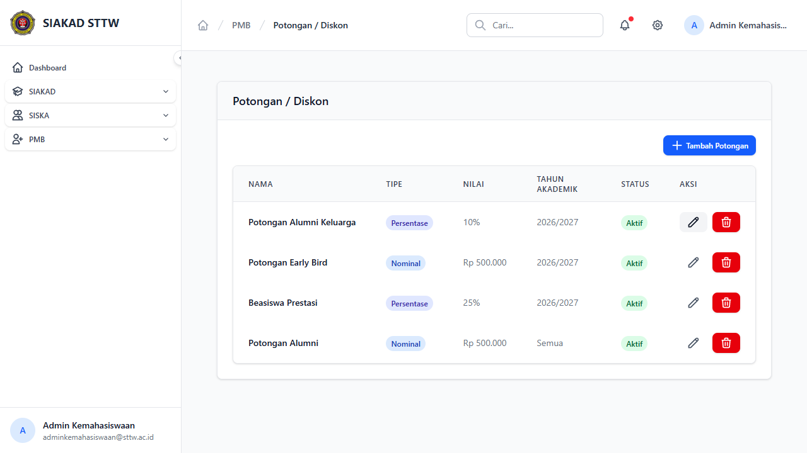

# Workflow Report: Potongan / Diskon PMB

**Tanggal**: 2026-04-13
**Role**: Admin Kemahasiswaan
**Modul**: PMB — Potongan / Diskon
**Status**: ✅ Berhasil

## Ringkasan

CRUD master data potongan/diskon biaya pendaftaran — mengelola potongan berdasarkan persentase atau nominal.

## Langkah-langkah

### 1. Daftar Potongan / Diskon

Halaman index menampilkan tabel dengan kolom:
- Nama, Tipe (badge Persentase/Nominal), Nilai, Tahun Akademik, Status, Aksi
- 4 potongan tersedia:
  - **Potongan Alumni Keluarga**: Persentase 10% (2026/2027)
  - **Potongan Early Bird**: Nominal Rp 500.000 (2026/2027)
  - **Beasiswa Prestasi**: Persentase 25% (2026/2027)
  - **Potongan Alumni**: Nominal Rp 500.000 (Semua periode)

## Catatan

- Tipe potongan bisa Persentase (%) atau Nominal (Rp) — ditampilkan dengan badge berwarna
- Potongan bisa berlaku untuk tahun akademik tertentu atau semua periode
- Semua potongan berstatus Aktif
