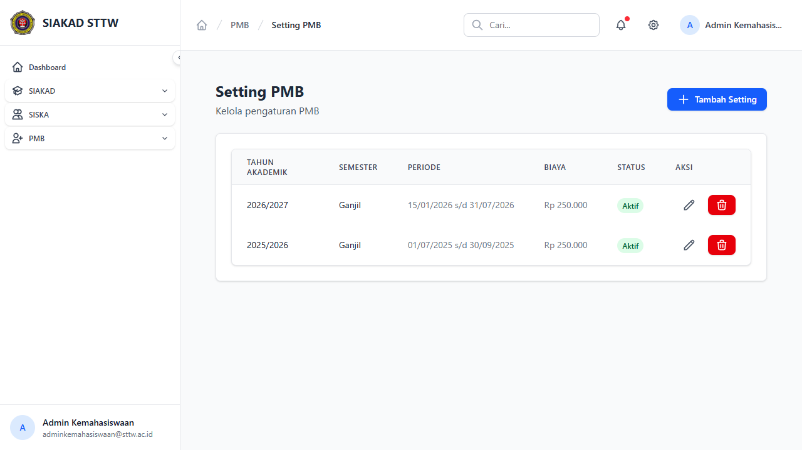
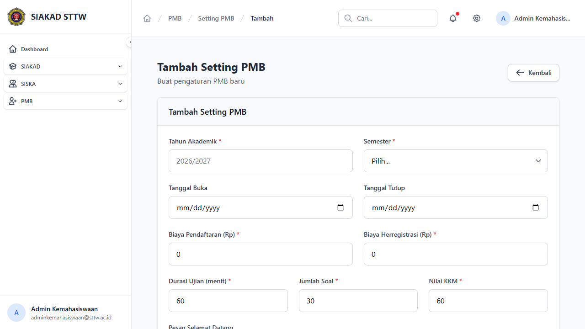
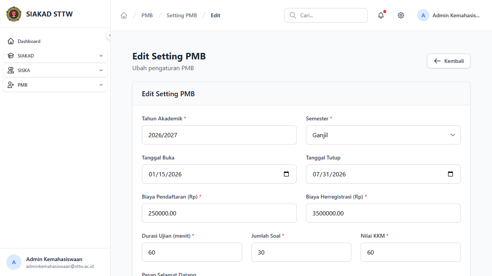

# Workflow Report: Setting PMB

**Tanggal**: 2026-04-13
**Role**: Admin Kemahasiswaan
**Modul**: PMB — Setting
**Status**: ✅ Berhasil

## Ringkasan

Halaman Setting PMB untuk mengelola pengaturan periode pendaftaran mahasiswa baru, termasuk tahun akademik, semester, tanggal buka/tutup, dan biaya pendaftaran.

## Langkah-langkah

### 1. Daftar Setting PMB

Halaman index menampilkan tabel setting dengan kolom Tahun Akademik, Semester, Periode, Biaya, Status, dan tombol Aksi (edit/hapus). Terdapat tombol "Tambah Setting" di header.

### 2. Form Tambah Setting

Form create untuk membuat setting PMB baru dengan field tahun akademik, semester, tanggal buka/tutup, biaya pendaftaran, biaya herregistrasi, durasi ujian, jumlah soal, dan nilai KKM.

### 3. Form Edit Setting

Form edit untuk mengubah setting yang sudah ada. Data sebelumnya terisi otomatis di form.

## Catatan

- 2 setting tersedia: 2026/2027 Ganjil dan 2025/2026 Ganjil
- Kedua setting berstatus "Aktif"
- Biaya pendaftaran: Rp 250.000
