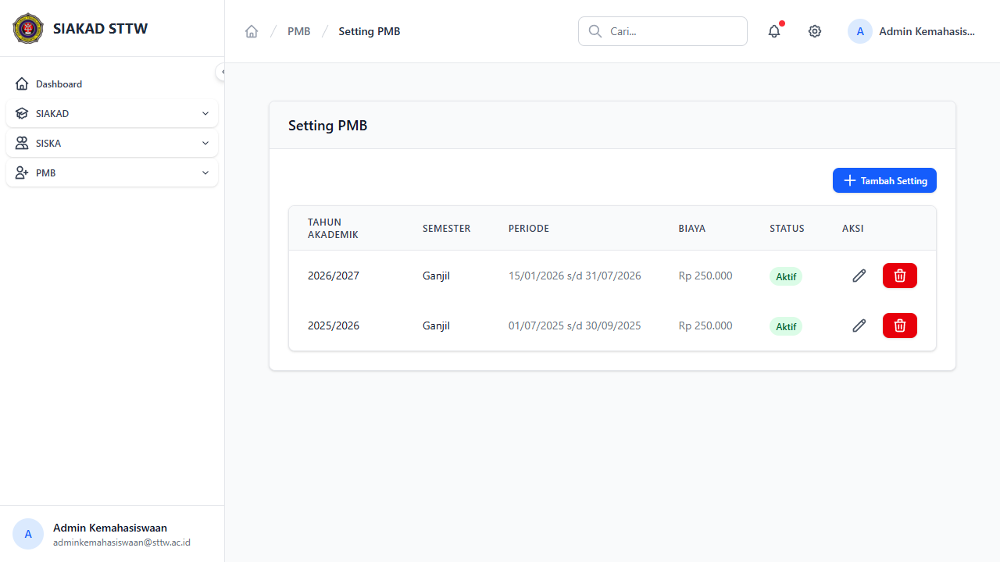
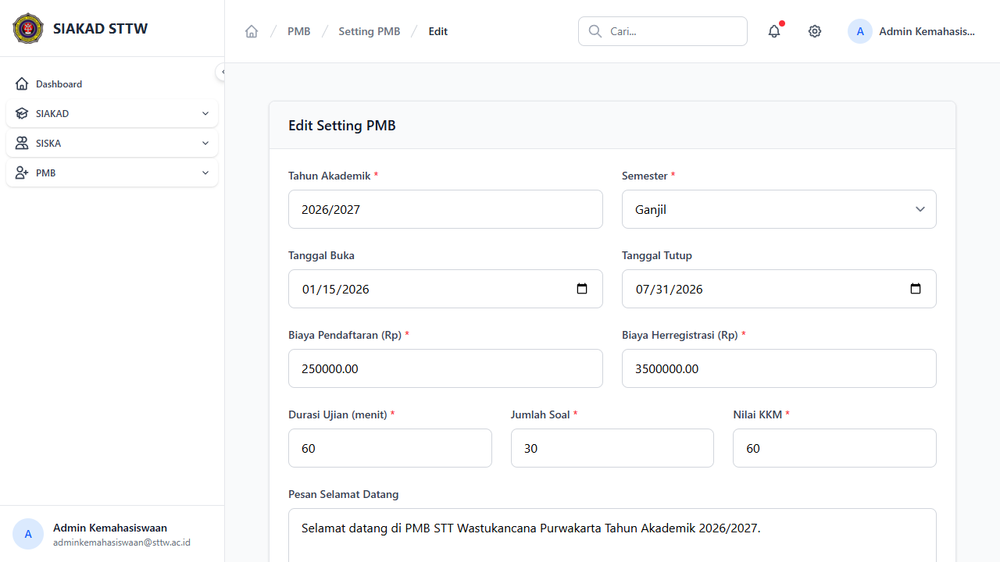
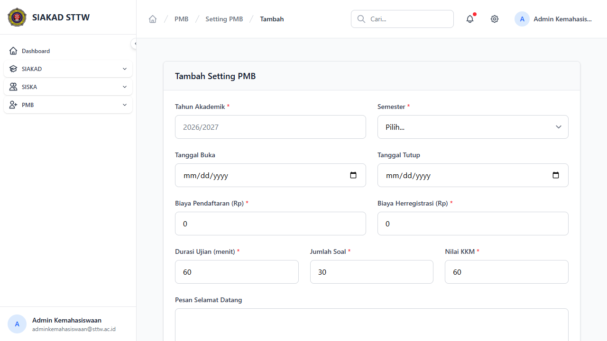

# Workflow Report: Setting PMB

**Tanggal**: 2026-04-13
**Role**: Admin Kemahasiswaan
**Modul**: PMB — Setting
**Status**: ✅ Berhasil

## Ringkasan

CRUD master data Setting PMB — mengelola periode pendaftaran, biaya, dan konfigurasi ujian TPA.

## Langkah-langkah

### 1. Daftar Setting PMB

Halaman index menampilkan tabel setting dengan kolom:
- Tahun Akademik, Semester, Periode (tanggal buka s/d tutup), Biaya, Status, Aksi (edit/hapus)
- 2 setting tersedia: 2026/2027 Ganjil (aktif) dan 2025/2026 Ganjil (aktif)

### 2. Edit Setting PMB

Form edit menampilkan field:
- Tahun Akademik, Semester (dropdown)
- Tanggal Buka & Tanggal Tutup (date picker)
- Biaya Pendaftaran & Biaya Herregistrasi (Rp)
- Durasi Ujian (menit), Jumlah Soal, Nilai KKM
- Pesan Selamat Datang (textarea)

### 3. Tambah Setting Baru

Form create dengan field yang sama seperti edit, namun kosong siap diisi.

## Catatan

- Setting bisa diaktifkan/dinonaktifkan untuk menentukan periode pendaftaran yang berlaku
- Biaya pendaftaran dan herregistrasi terpisah
- Konfigurasi TPA (durasi, jumlah soal, KKM) diatur per periode
