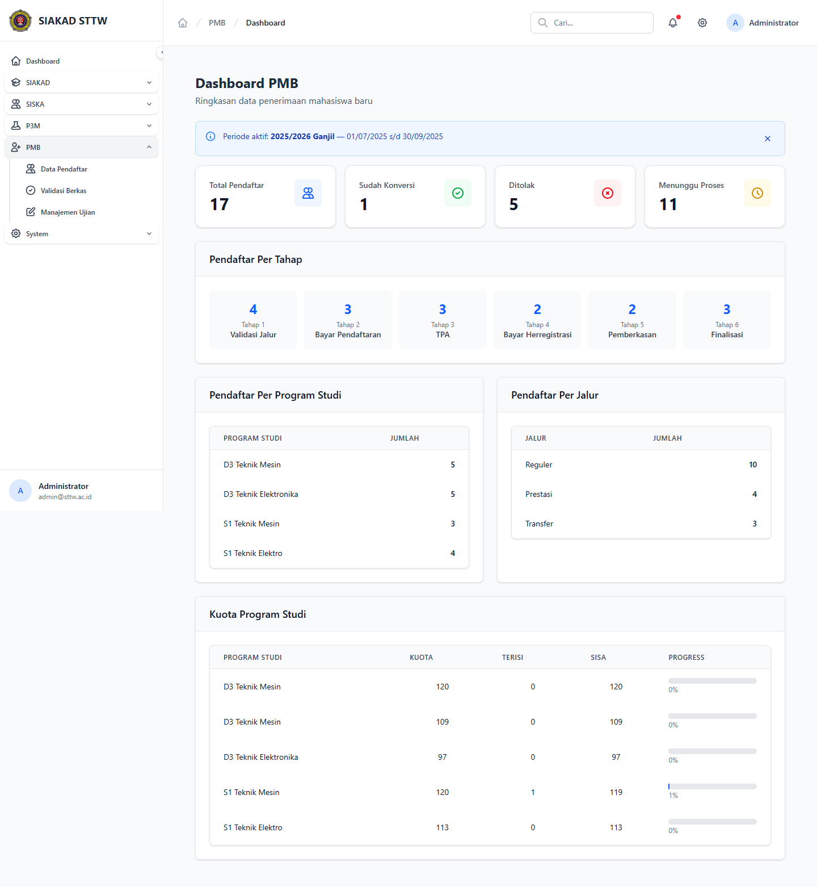

# Workflow Report: Overview Modul PMB

**Tanggal**: 2026-04-19
**Role**: Administrator (admin@sttw.ac.id)
**Modul**: PMB
**Fitur**: Overview Modul
**Status**: ⚠️ Partial

## Deskripsi Workflow

Dokumentasi ini merekam overview modul PMB dari perspektif administrator. Verifikasi dilakukan dengan membuka grup sidebar `PMB`, lalu meninjau dashboard PMB pada route `siska/kemahasiswaan/pmb` untuk melihat statistik pendaftar, distribusi per tahap, distribusi program studi, distribusi jalur, dan kuota program studi.

## Ringkasan

Dashboard PMB berhasil diakses dan menampilkan data ringkasan penerimaan mahasiswa baru dengan lengkap. Kendala utama terdapat pada navigasi sidebar PMB yang masih berisi link placeholder, sehingga dashboard dan fitur turunannya belum bisa dicapai secara normal melalui klik menu yang tampil.

## Langkah-langkah

### 1. Dashboard PMB

**Deskripsi**: Halaman `Dashboard PMB` menampilkan periode aktif, statistik total pendaftar, jumlah yang sudah dikonversi, jumlah ditolak, jumlah yang masih menunggu proses, distribusi per tahap pendaftaran, distribusi per program studi, distribusi per jalur, dan tabel kuota per program studi.

**URL**: `http://localhost:8000/siska/kemahasiswaan/pmb`

## Temuan & Masalah

| # | Halaman | URL | Kategori | Deskripsi | Screenshot | Prioritas |
|---|---------|-----|----------|-----------|------------|-----------|
| 1 | Sidebar PMB | `/siska/kemahasiswaan/pmb` | `missing-sidebar` | Submenu PMB yang tampil di sidebar (`Data Pendaftar`, `Validasi Berkas`, `Manajemen Ujian`) masih berupa link placeholder `#`, sehingga dashboard PMB harus dibuka lewat URL langsung. |  | High |

## Catatan

- Dashboard PMB memuat data dummy yang cukup lengkap untuk menggambarkan funnel pendaftaran.
- Jalur akses sidebar PMB perlu diperbaiki agar report berikutnya dapat direkam sepenuhnya melalui alur klik normal.
- Status report ditandai `Partial` karena ada temuan navigasi yang memengaruhi usability modul.
