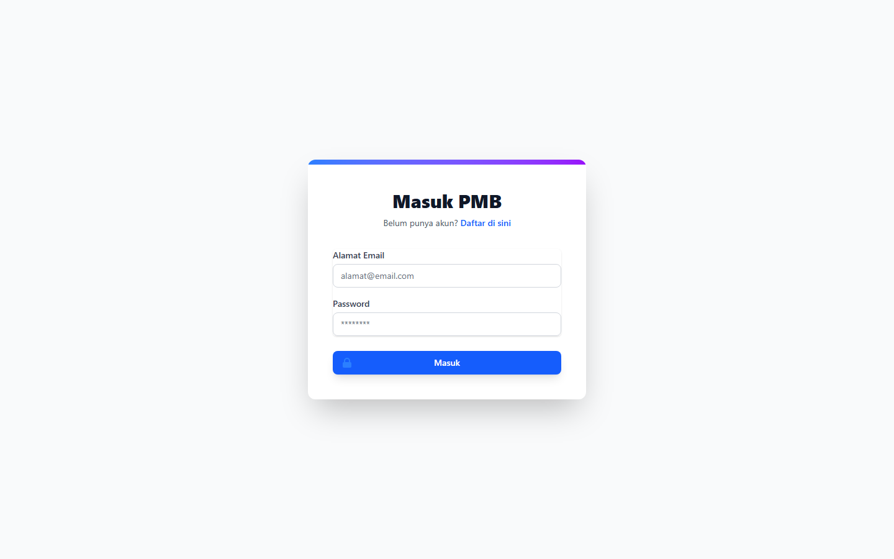
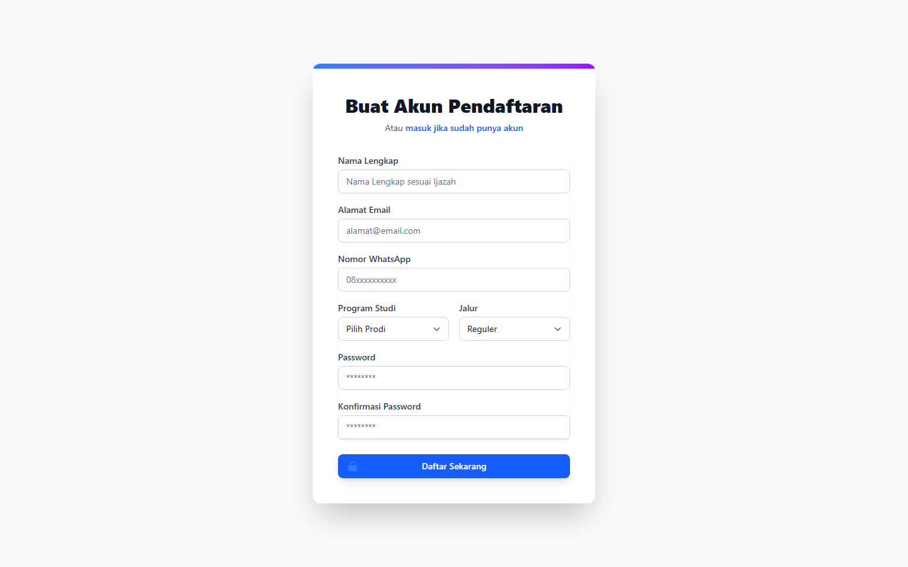

# PMB — Portal Public (Calon Mahasiswa)

- **Tanggal:** 2026-04-22
- **Role:** guest (no auth)
- **Modul:** PMB → Portal Calon Mahasiswa
- **Status:** ⚠️ Partial — portal publik PMB hanya berisi entry-point Login & Register

## Ringkasan

Portal publik PMB di codebase saat ini **hanya** memiliki dua entry-point publik:

- `/pmb/login` (form login calon mahasiswa)
- `/pmb/register` (form pendaftaran akun calon mahasiswa)

Selebihnya (`/pmb/dashboard`, `/pmb/ujian`) memerlukan login PMB. Tidak ditemukan halaman publik untuk:

- Informasi gelombang PMB / jadwal seleksi.
- Daftar program studi & syarat penerimaan.
- Brosur/biaya pendidikan.
- FAQ / kontak panitia PMB.

## Halaman

| # | Halaman | URL | Status |
|---|---|---|---|
| 1 | PMB Login | `/pmb/login` | 200 |
| 2 | PMB Register | `/pmb/register` | 200 |

## Screenshots

### 01 PMB Login

### 02 PMB Register

## Temuan & Masalah

### ⚠️ Informational — Portal publik PMB sangat minimal

Calon mahasiswa hanya melihat form login/register. Tidak ada landing-page yang menampilkan informasi gelombang/prodi/syarat sehingga onboarding bergantung pada saluran komunikasi eksternal (sosmed, brosur PDF). 

**Tidak diangkat sebagai bug** — kemungkinan by-design (informasi PMB dipublikasikan via situs resmi STTW lain). Namun ini perlu diklarifikasi product owner sebelum scan ulang dilakukan.

## Catatan Skenario

- Recorder dijalankan dengan `skipLogin: true`.
- Tidak ada error 5xx pada halaman publik yang ada.
