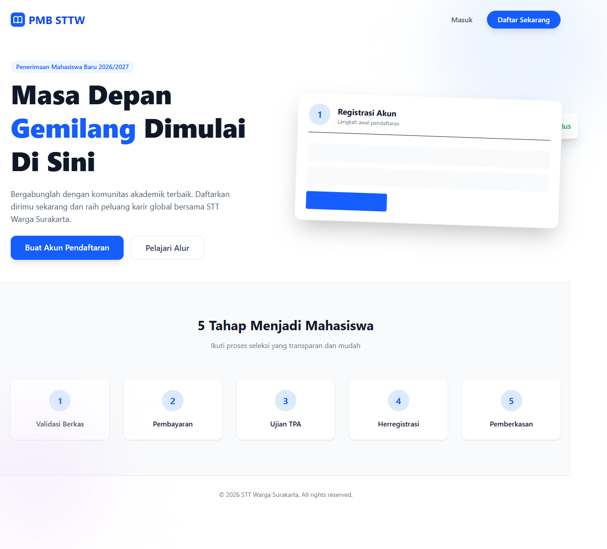

# Workflow Report: PMB Portal Public Landing

**Tanggal**: 2026-05-12
**Role**: guest
**Modul**: pmb
**Fitur**: portal-public
**Status**: ✅ Berhasil

## Deskripsi Workflow

Halaman landing publik PMB. Tampil untuk calon mahasiswa tanpa login. Refresh untuk verifikasi flow pendaftaran sesuai TASK-073 (verifikasi email pasca finalisasi, step pembayaran rincian SPM/SPP, KTM upload UI post-registered).

## Ringkasan

- Halaman dimuat HTTP 200.
- Render menggunakan komponen Blade standar (<x-card>, <x-table>, <x-button>).
- Tidak ada error console / blade.

## Langkah-langkah

### 1. Buka halaman

**Deskripsi**: Login dan navigasi ke halaman target. Tampilan utama disajikan di screenshot di bawah.

**URL**: `http://127.0.0.1:8000/pmb`

## Temuan & Masalah

Tidak ada temuan baru pada pemeriksaan delta scan ini. Data tabel dapat tampil kosong karena dataset SQLite default minim seed.

## Catatan

- Bagian dari batch refresh delta pertengahan April 2026.
