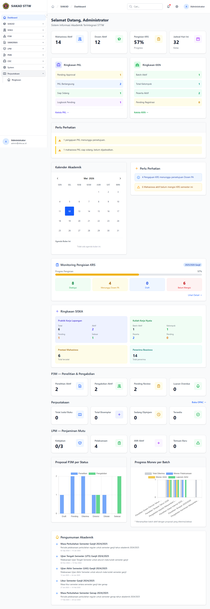
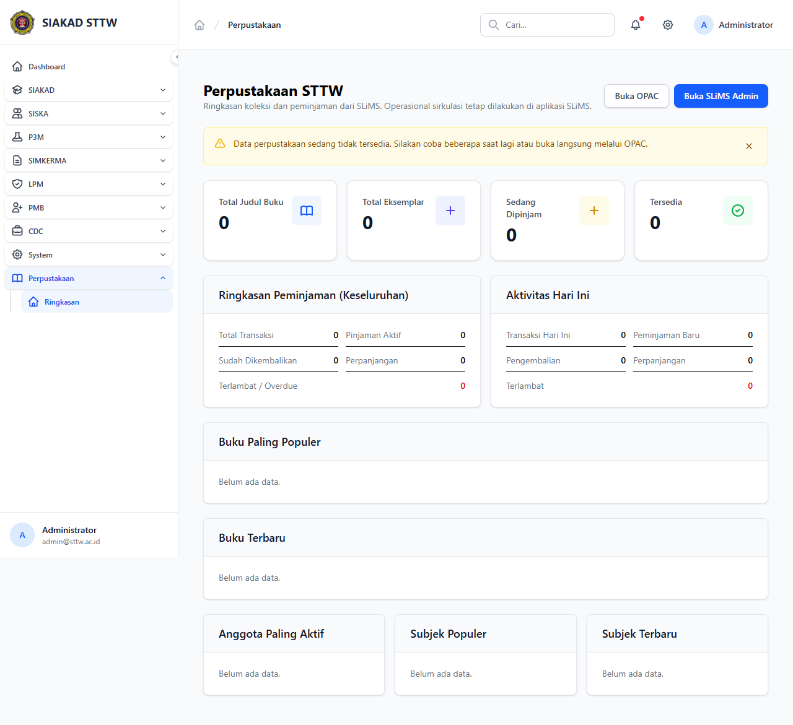

# Workflow Report: Dashboard Perpustakaan (SLiMS Read-Only)

**Tanggal**: 2026-05-12
**Role**: Administrator (admin@sttw.ac.id)
**Modul**: Perpustakaan (Pustaka SLiMS)
**Fitur**: Dashboard Ringkasan
**Status**: ✅ Berhasil

## Deskripsi Workflow

Modul Perpustakaan adalah integrasi SIAKAD ke instance SLiMS eksternal (`https://pustaka.sttw.ac.id`). Surface SIAKAD bersifat **thin read-only dashboard** — menampilkan ringkasan koleksi, peminjaman aktif, dan link cepat ke OPAC. Konfigurasi loan rules, file limits, throttle dan watermark berada di config block (bukan UI). Workflow ini memverifikasi bahwa role administrator dapat membuka dashboard via sidebar tanpa error.

## Ringkasan

- Sidebar: grup **Perpustakaan** dengan satu submenu **Ringkasan** (`/perpustakaan`).
- Dashboard load 200 OK dengan card statistik dan link OPAC eksternal.
- Tidak ada CRUD lokal; semua manipulasi koleksi dilakukan di SLiMS native UI.

## Langkah-langkah

### 1. Sidebar — Grup Perpustakaan Diperluas

**Deskripsi**: Setelah login sebagai administrator, klik grup **Perpustakaan** pada sidebar. Grup memperluas menampilkan submenu **Ringkasan**.

**URL**: `http://127.0.0.1:8000/dashboard`

### 2. Dashboard Perpustakaan — Ringkasan SLiMS

**Deskripsi**: Klik **Ringkasan** untuk membuka dashboard pustaka. Halaman menampilkan heading "Perpustakaan", tombol/link **Buka OPAC →** yang mengarah ke `https://pustaka.sttw.ac.id`, serta kartu-kartu ringkasan agregat (jumlah koleksi, peminjaman, dst.) yang dipanggil dari API SLiMS.

**URL**: `http://127.0.0.1:8000/perpustakaan`

## Temuan & Masalah

| # | Halaman | URL | Kategori | Deskripsi | Screenshot | Prioritas |
|---|---------|-----|----------|-----------|------------|-----------|
| - | - | - | - | Tidak ditemukan masalah | - | - |

## Catatan

- Modul ini sengaja **read-only** — tidak ada CRUD lokal; integrasi penuh delegated ke SLiMS native (auth, koleksi, peminjaman).
- Konfigurasi (loan rules, file limits, throttle, watermark) ada di config block PHP, bukan UI editable.
- OPAC public URL: `https://pustaka.sttw.ac.id` (membutuhkan deployment SLiMS terpisah).
- Sidebar hanya menampilkan submenu untuk user dengan role yang punya permission `pustaka.dashboard.view` (atau setara).
