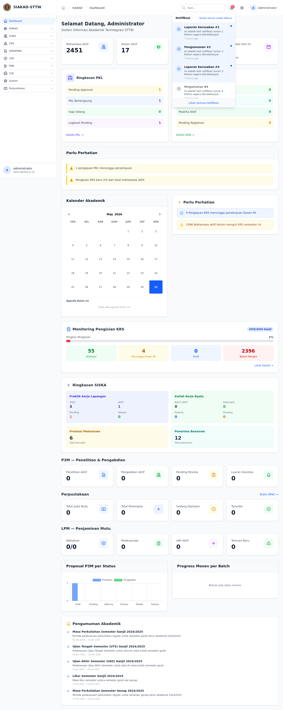

# Workflow Report: Scan Modul Sarpras (Admin)

**Tanggal**: 2026-05-31
**Role**: Admin (`admin@sttw.ac.id`)
**Modul**: Sarpras
**Fitur**: Sidebar admin Sarpras, dashboard, dan notifikasi
**Status**: ⚠️ Partial

## Deskripsi Workflow

Workflow ini memverifikasi akses admin ke dashboard, dropdown notifikasi bell, dan seluruh entry modul Sarpras yang seharusnya tersedia lewat sidebar. Sesuai aturan workflow-reporter, navigasi hanya dilakukan melalui login lalu observasi dashboard/sidebar tanpa direct URL ke halaman Sarpras. Fokus scan ini adalah memastikan dashboard tidak error, bell notifikasi tampil, lalu memetakan apakah menu Sarpras benar-benar tersedia untuk dijelajahi dari sidebar admin.

## Ringkasan

Login admin berhasil dan dashboard `/dashboard` tampil normal tanpa indikasi HTTP 500. Dropdown notifikasi bell tampil dengan test notifications yang sudah tersedia. Namun setelah sidebar discan dari bagian atas sampai bawah, tidak ditemukan satu pun menu/link Sarpras untuk `Kategori Aset`, `Aset`, `Laporan Kerusakan`, maupun `Peminjaman`, sehingga workflow modul Sarpras tidak dapat direkam lebih lanjut via sidebar.

## Langkah-langkah

### 1. Login admin dan membuka dashboard

**Deskripsi**: Admin login melalui form `input[name="login"]` dan `input[name="password"]`, lalu diarahkan ke dashboard. Halaman utama tampil normal dengan sidebar dan navbar aktif.

**URL**: `http://127.0.0.1:9090/dashboard`

### 2. Membuka notifikasi bell di navbar

**Deskripsi**: Dropdown notifikasi dibuka dari bell di navbar. Daftar notifikasi test terlihat, termasuk notifikasi bertema laporan kerusakan, sehingga komponen bell terpasang dan berfungsi untuk kebutuhan scan awal.

**URL**: `http://127.0.0.1:9090/dashboard`

### 3. Scan sidebar bagian atas

**Deskripsi**: Sidebar discan dari posisi awal setelah login untuk mencari grup atau item menu Sarpras. Area atas hanya menampilkan grup modul lain seperti SIAKAD dan SISKA, tanpa entry Sarpras.

**URL**: `http://127.0.0.1:9090/dashboard`

### 4. Scan sidebar bagian tengah

**Deskripsi**: Sidebar digulir ke bagian tengah untuk memastikan menu Sarpras tidak tersembunyi di antara grup navigasi lain. Hasil scan tetap tidak menampilkan item Sarpras.

**URL**: `http://127.0.0.1:9090/dashboard`

### 5. Scan sidebar bagian bawah

**Deskripsi**: Sidebar digulir sampai bagian bawah untuk menutup seluruh kemungkinan entry Sarpras berada di area akhir navigasi. Sampai akhir sidebar, tidak ada link Sarpras yang dapat diklik.

**URL**: `http://127.0.0.1:9090/dashboard`

## Skenario Alternatif

Tidak ada skenario alternatif yang bisa direkam karena seluruh halaman admin Sarpras gagal ditemukan dari sidebar utama. Scan dihentikan pada tahap discovery navigasi sesuai aturan "missing-sidebar".

## Temuan & Masalah

| # | Halaman | URL | Kategori | Deskripsi | Screenshot | Prioritas |
|---|---------|-----|----------|-----------|------------|-----------|
| 1 | Kategori Aset | `/sarpras/admin/kategori-aset` | `missing-sidebar` | Route admin Sarpras tersedia di `routes/sarpras.php`, tetapi item menu untuk membuka halaman ini tidak ditemukan saat scan sidebar dari atas sampai bawah. |  | High |
| 2 | Aset | `/sarpras/admin/aset` | `missing-sidebar` | Halaman index aset tidak memiliki entry sidebar yang bisa dipakai admin untuk navigasi sesuai SOP workflow-reporter. |  | High |
| 3 | Laporan Kerusakan | `/sarpras/admin/laporan` | `missing-sidebar` | Tidak ada link sidebar menuju monitoring laporan kerusakan admin walaupun route index tersedia. |  | High |
| 4 | Peminjaman | `/sarpras/admin/peminjaman` | `missing-sidebar` | Tidak ditemukan link sidebar untuk halaman peminjaman admin, sehingga scan halaman tidak dapat dilanjutkan tanpa melanggar aturan direct URL. |  | High |

## Catatan

- Scan dilakukan pada server `http://127.0.0.1:9090`.
- Evidence tambahan hasil enumerasi link sidebar disimpan di `screenshots/sidebar-links.json`.
- Dashboard dan bell notifikasi lolos scan awal, tetapi modul Sarpras tidak dapat direkam end-to-end karena tidak hadir di sidebar admin.
