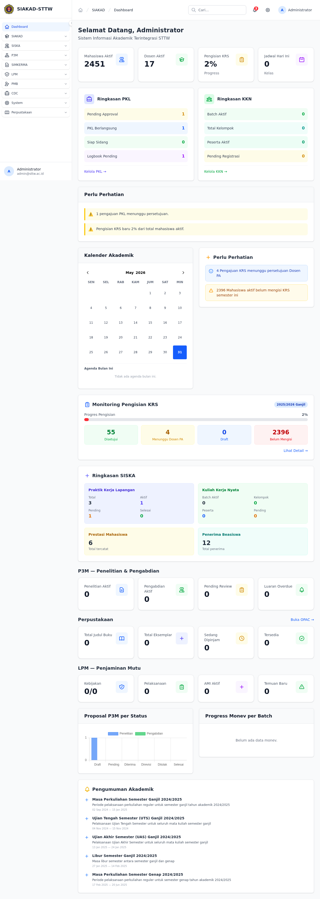
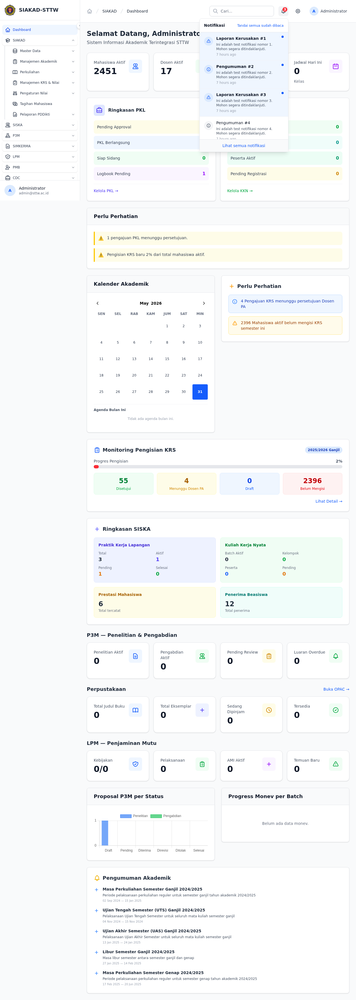
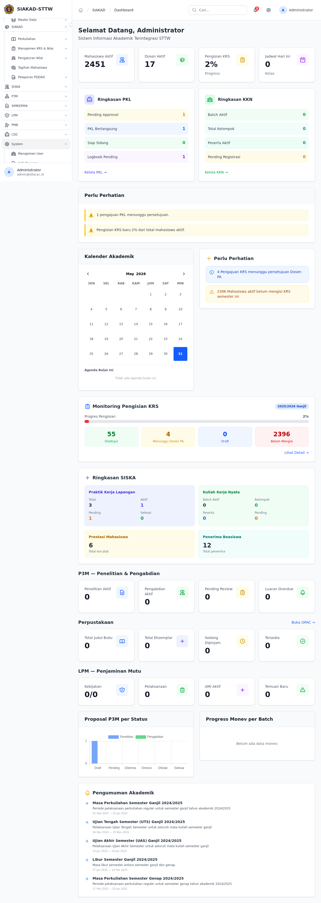

# Workflow Report: Scan Modul Sarpras (Admin)

**Tanggal**: 2026-05-31
**Role**: admin (`admin@sttw.ac.id`)
**Modul**: sarpras
**Fitur**: admin-sarpras
**Status**: ⚠️ Partial

## Deskripsi Workflow

Workflow ini melakukan scan dashboard terlebih dahulu untuk memastikan halaman utama tidak mengalami error 500, memverifikasi komponen notifikasi bell, lalu mencoba menemukan dan mengakses seluruh halaman Sarpras melalui sidebar sesuai aturan navigasi.  
Prekondisi yang digunakan: login admin aktif, dev server di `http://127.0.0.1:9090`, dan navigasi hanya melalui klik sidebar.

## Ringkasan

Login admin berhasil dan dashboard tampil normal tanpa 500. Notifikasi bell tampil dan dapat dibuka.  
Namun, menu/grup **Sarpras tidak muncul di sidebar** (baik pada grup SIAKAD maupun System), sehingga scan halaman Sarpras via sidebar tidak dapat dilanjutkan. Tidak dilakukan direct URL untuk menjaga kepatuhan instruksi navigasi.

## Langkah-langkah

### 1. Login ke dashboard admin

**Deskripsi**: Membuka halaman login, mengisi `input[name="login"]` dengan `admin@sttw.ac.id`, mengisi password, lalu submit hingga masuk ke dashboard.

**URL**: `http://127.0.0.1:9090/dashboard`

### 2. Verifikasi notifikasi bell

**Deskripsi**: Memastikan icon notifikasi bell di navbar tampil dan dapat diakses.

**URL**: `http://127.0.0.1:9090/dashboard`

### 3. Buka panel notifikasi

**Deskripsi**: Klik notifikasi bell untuk menampilkan daftar notifikasi dan memastikan komponen berjalan.

**URL**: `http://127.0.0.1:9090/dashboard`

### 4. Cek grup SIAKAD di sidebar

**Deskripsi**: Expand grup SIAKAD untuk mencari entry Sarpras. Entry Sarpras tidak ditemukan.

**URL**: `http://127.0.0.1:9090/dashboard`

### 5. Cek grup System di sidebar

**Deskripsi**: Expand grup System untuk memastikan Sarpras tidak berada di lokasi lain sidebar. Entry Sarpras tetap tidak ditemukan.

**URL**: `http://127.0.0.1:9090/dashboard`

## Skenario Alternatif

Tidak ada skenario alternatif yang bisa dijalankan karena seluruh alur Sarpras terblokir oleh tidak tersedianya menu sidebar Sarpras untuk role/login yang dipakai.

## Temuan & Masalah

| # | Halaman | URL | Kategori | Deskripsi | Screenshot | Prioritas |
|---|---------|-----|----------|-----------|------------|-----------|
| 1 | Sidebar modul | `/dashboard` | `missing-sidebar` | Menu/grup Sarpras tidak tersedia di sidebar sehingga workflow Sarpras tidak bisa dinavigasi sesuai aturan klik sidebar. |  | Critical |
| 2 | Sidebar modul | `/dashboard` | `missing-sidebar` | Pada grup System hanya ada Manajemen User, Activity Logs, Error Logs; tidak ada entry Sarpras. |  | High |
| 3 | Notifikasi bell | `/dashboard` | `incomplete-data` | Bell menampilkan 3 notifikasi saat konteks uji menyebut tersedia 5 notifikasi test. |  | Medium |

## Catatan

- Scan dijalankan dengan navigasi sidebar saja (tanpa direct URL ke route Sarpras) sesuai instruksi.
- Dashboard admin dapat diakses normal dan tidak ditemukan HTTP 500 pada langkah ini.
- Untuk melanjutkan scan penuh Sarpras, perlu menampilkan menu sidebar Sarpras untuk role admin yang digunakan (atau gunakan akun role yang memang memiliki menu Sarpras di sidebar).
