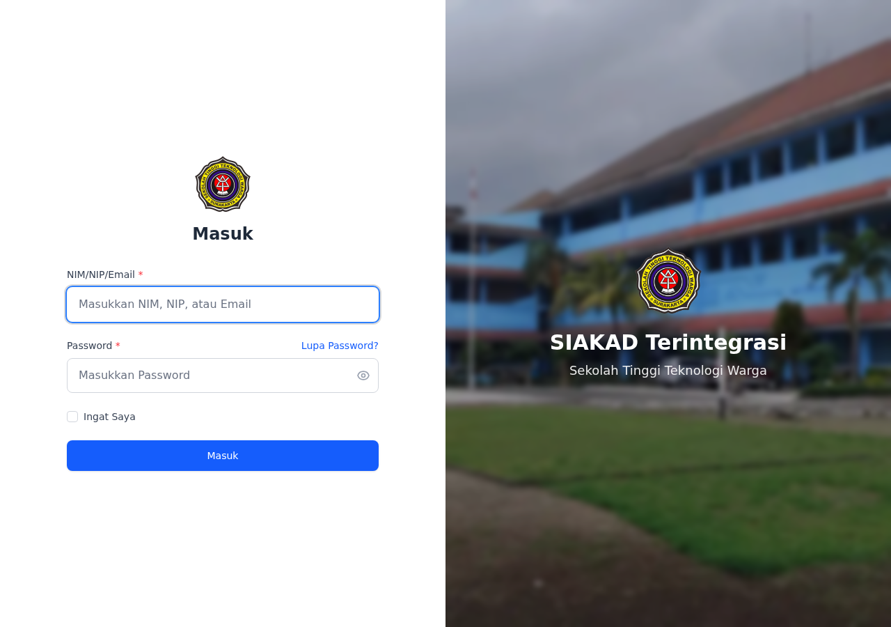
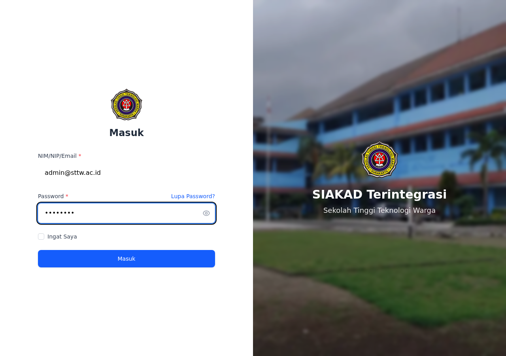
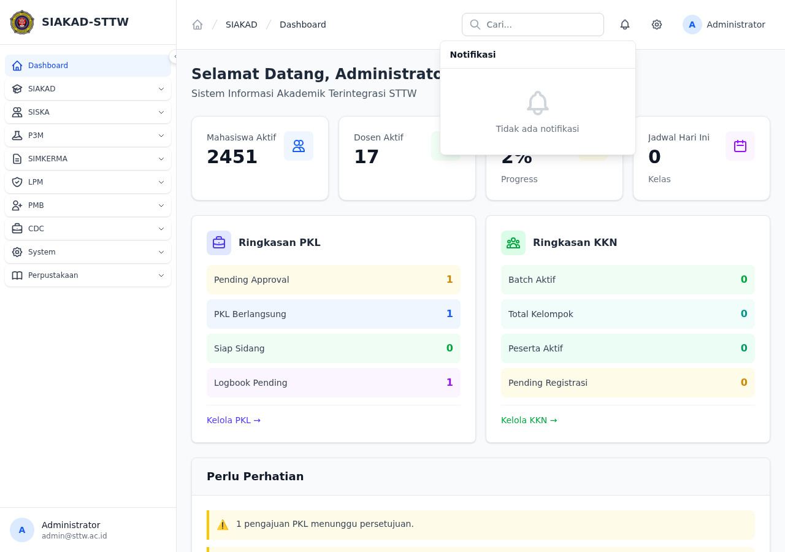
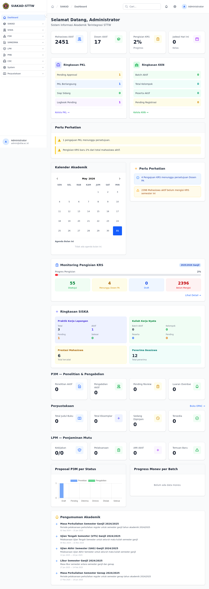
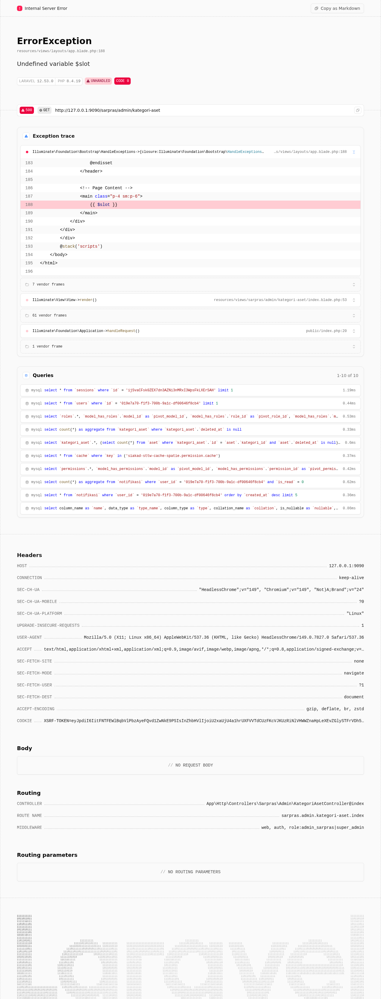
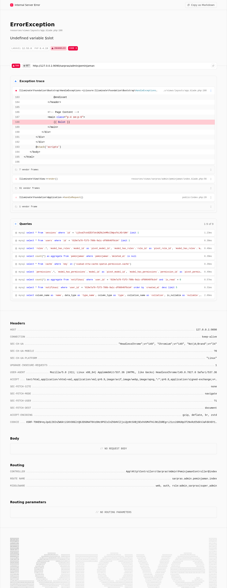
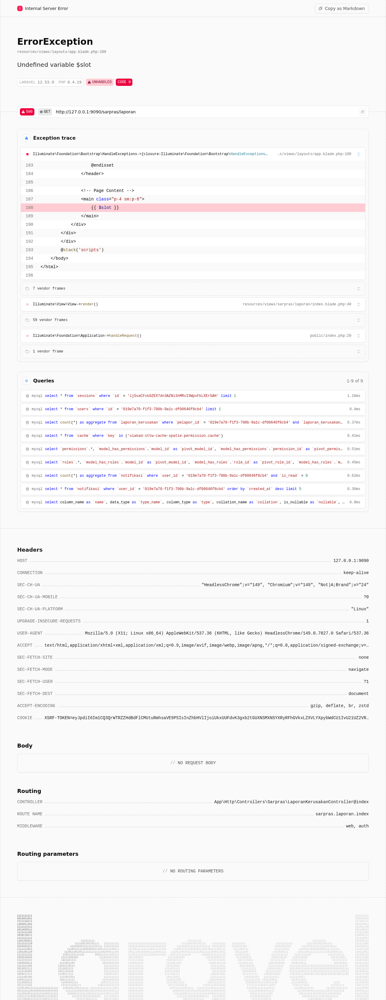
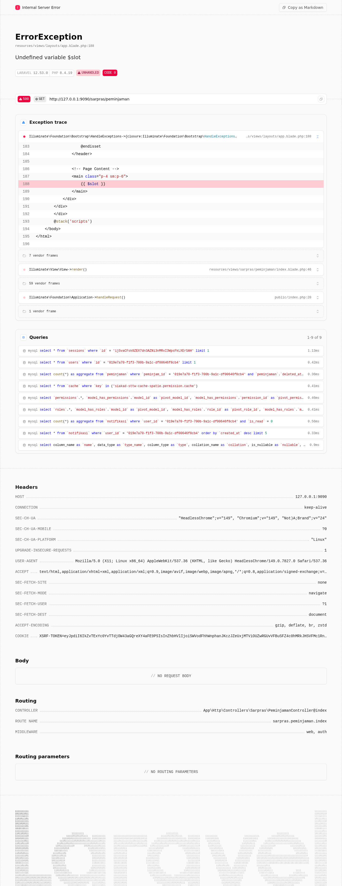

# Workflow Report: Sarpras Admin — Scan Lengkap Modul

**Tanggal**: 2026-05-31
**Role**: admin (admin_sarpras)
**Modul**: sarpras
**Fitur**: Admin Sarpras (Kategori Aset, Aset, Laporan Kerusakan, Peminjaman)
**Status**: ❌ Gagal

## Deskripsi Workflow

Scan seluruh modul Sarpras (Sarana Prasarana) di SIAKAD STTW dari sudut pandang admin dengan role `admin_sarpras`. Modul ini mencakup manajemen aset kampus meliputi: Kategori Aset, Data Aset, Laporan Kerusakan, dan Peminjaman Aset. Scan dilakukan mulai dari login, menjelajahi dashboard, menelusuri sidebar, hingga membuka semua halaman Sarpras.

## Ringkasan

Semua halaman modul Sarpras menghasilkan **HTTP 500 Internal Server Error** dengan pesan `Undefined variable $slot`. Penyebab: semua views Sarpras menggunakan pola lama `@extends('layouts.app')` + `@section('content')`, sedangkan `layouts/app.blade.php` hanya mendukung pola komponen `{{ $slot }}`. Selain itu, modul Sarpras tidak muncul sama sekali di sidebar navigasi, dan terdapat dua bug migrasi database. Modul ini **tidak dapat digunakan** dalam kondisi saat ini.

## Langkah-langkah

### 1. Halaman Login

**Deskripsi**: Mengakses halaman login SIAKAD di `/login`. Form login menggunakan `input[name="login"]` (bukan `input[name="email"]`). Halaman tampil normal tanpa error.

**URL**: `http://127.0.0.1:9090/login`

### 2. Isi Form Login sebagai Admin

**Deskripsi**: Mengisi form login dengan kredensial admin: `admin@sttw.ac.id` / `password`. Input login dan password terisi dengan benar sebelum submit.

**URL**: `http://127.0.0.1:9090/login`

### 3. Dashboard Setelah Login

**Deskripsi**: Setelah login berhasil, user diarahkan ke halaman Dashboard. Dashboard menampilkan statistik dan ringkasan sistem. Navbar menampilkan ikon notifikasi bell di pojok kanan atas.

**URL**: `http://127.0.0.1:9090/dashboard`

### 4. Notifikasi Bell di Navbar

**Deskripsi**: Klik ikon bell di navbar kanan atas untuk membuka dropdown notifikasi. Terdapat 5 notifikasi test yang sudah terpasang. Notifikasi bell berfungsi normal — dropdown terbuka dan menampilkan daftar notifikasi.

**URL**: `http://127.0.0.1:9090/dashboard`

### 5. Sidebar Utama — Tidak Ada Menu Sarpras

**Deskripsi**: Mengamati sidebar navigasi utama. Sidebar menampilkan grup menu: SIAKAD, SISKA, P3M, LPM, PMB, HRM, CDC, System, Perpustakaan. **Tidak ada grup atau menu Sarpras sama sekali** di sidebar. Ini berarti pengguna dengan role `admin_sarpras` tidak dapat menemukan atau mengakses modul Sarpras melalui navigasi normal.

**URL**: `http://127.0.0.1:9090/dashboard`

### 6. Akses Langsung: Kategori Aset (Error 500)

**Deskripsi**: Karena modul Sarpras tidak ada di sidebar, navigasi dilakukan langsung ke URL admin Sarpras. Semua halaman admin Sarpras — termasuk Kategori Aset, Aset, Laporan Kerusakan — menghasilkan **HTTP 500 Internal Server Error** dengan pesan `ErrorException: Undefined variable $slot`. Root cause: views Sarpras menggunakan `@extends('layouts.app')` + `@section('content')` tetapi `layouts/app.blade.php` hanya menggunakan `{{ $slot }}` (pola komponen), bukan `@yield('content')`.

**URL**: `http://127.0.0.1:9090/sarpras/admin/kategori-aset`

### 7. Akses Langsung: Peminjaman Admin (Error 500)

**Deskripsi**: Halaman Peminjaman (admin) juga menghasilkan error 500 yang sama. Selain itu, tabel `peminjaman` tidak ada di database meskipun migrasi tercatat sebagai "Ran" (batch 100). Migrasi gagal karena kolom `foreignId('peminjam_id')` membuat tipe `bigint unsigned` tetapi `users.id` bertipe `char(36)` (UUID), menyebabkan FK constraint error 1005 (errno 150).

**URL**: `http://127.0.0.1:9090/sarpras/admin/peminjaman`

### 8. Akses Langsung: Laporan Kerusakan User (Error 500)

**Deskripsi**: Halaman laporan kerusakan sisi user (`/sarpras/laporan`) juga error 500 dengan penyebab yang sama. Views `sarpras/laporan-kerusakan/index.blade.php` menggunakan `@extends('layouts.app')` yang tidak kompatibel.

**URL**: `http://127.0.0.1:9090/sarpras/laporan`

### 9. Akses Langsung: Peminjaman User (Error 500)

**Deskripsi**: Halaman peminjaman sisi user (`/sarpras/peminjaman`) mengalami error yang sama persis. Seluruh modul Sarpras — baik sisi admin maupun user — tidak dapat diakses.

**URL**: `http://127.0.0.1:9090/sarpras/peminjaman`

## Temuan & Masalah

| # | Halaman | URL | Kategori | Deskripsi | Screenshot | Prioritas |
|---|---------|-----|----------|-----------|------------|-----------|
| 1 | Seluruh Modul Sarpras | `/sarpras/*` | `missing-sidebar` | Tidak ada grup atau item menu Sarpras di sidebar navigasi. Role `admin_sarpras` tidak dapat menemukan modul ini via UI normal. `app/View/Components/Sidebar.php` tidak memiliki grup Sarpras sama sekali. | `05_sidebar-main.png` | **High** |
| 2 | Kategori Aset, Aset, Laporan (Admin) | `/sarpras/admin/*` | `server-error` | HTTP 500 — `ErrorException: Undefined variable $slot` di `layouts/app.blade.php:188`. Semua views Sarpras menggunakan `@extends('layouts.app')` + `@section('content')` tetapi layout hanya mendukung `{{ $slot }}` (komponen). Fix: konversi semua views ke `<x-app-layout>`. | `err_01_kategori-aset-500.png` | **Critical** |
| 3 | Peminjaman Admin | `/sarpras/admin/peminjaman` | `server-error` | HTTP 500 — sama dengan issue #2. Ditambah, tabel `peminjaman` tidak ada di database meski migrasi ditandai "Ran". Migrasi gagal: `foreignId('peminjam_id')` membuat `bigint unsigned` tapi `users.id` adalah `char(36)` (UUID) → FK constraint error 1005 errno 150. | `err_02_peminjaman-admin-500.png` | **Critical** |
| 4 | Laporan Kerusakan (User) | `/sarpras/laporan` | `server-error` | HTTP 500 — sama dengan issue #2. View user-side juga menggunakan pola `@extends` lama. | `err_03_laporan-user-500.png` | **Critical** |
| 5 | Peminjaman (User) | `/sarpras/peminjaman` | `server-error` | HTTP 500 — sama dengan issue #2. | `err_04_peminjaman-user-500.png` | **Critical** |
| 6 | Laporan Kerusakan (data) | N/A | `data-bug` | Factory `LaporanKerusakanFactory` gagal di-seed karena kolom `pelapor_id` bertipe `bigint` tetapi `users.id` adalah UUID (`char(36)`). Tipe tidak kompatibel → data truncation error. | — | **High** |

## Catatan

- **Seluruh modul Sarpras tidak bisa digunakan** karena semua halaman error 500.
- **Root cause utama**: Views Sarpras menggunakan pola lama `@extends('layouts.app')` + `@section('content')`, sedangkan layout aktif hanya mendukung `{{ $slot }}` (Blade component). Perbaikan: konversi semua views ke `<x-app-layout>` + `<x-slot name="header">`.
- **Dua migration bug**: `peminjaman` dan `laporan_kerusakan` menggunakan `foreignId()` yang menghasilkan `bigint unsigned`, tapi `users.id` adalah UUID (`char(36)`). Harus diubah ke `string('peminjam_id', 36)` + `->references('id')->on('users')`.
- **Tidak ada sidebar**: Semua menu Sarpras harus ditambahkan ke `app/View/Components/Sidebar.php`.
- Data aset (`kategori_aset`: 20 records, `aset`: 15 records) berhasil di-seed.
- Navigasi via sidebar tidak dapat dilakukan untuk modul ini karena menu tidak ada — navigasi dilakukan via URL langsung sebagai pengecualian (issue sudah di-log sebagai `missing-sidebar`).
