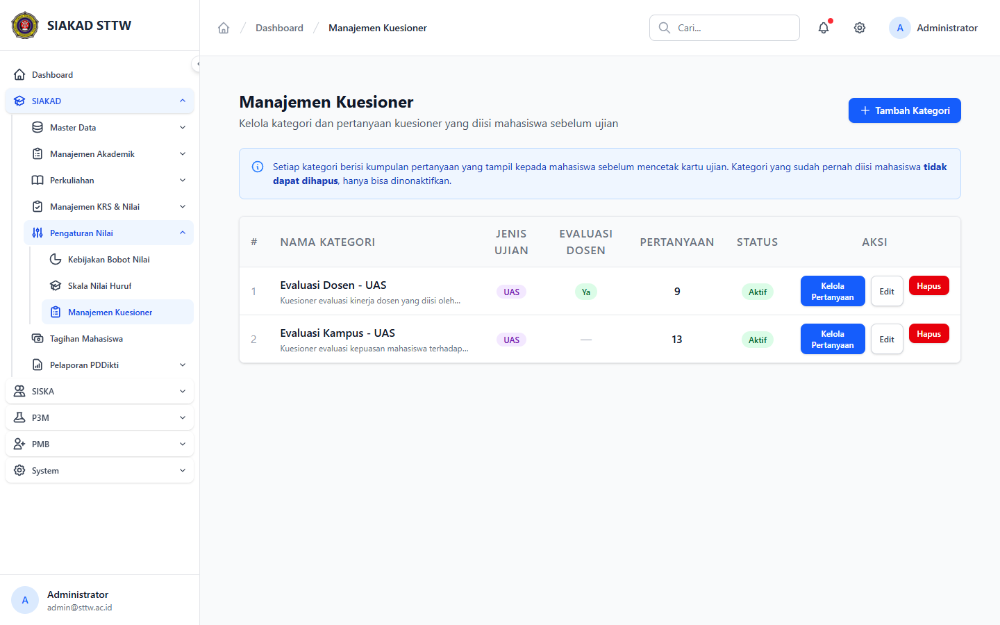
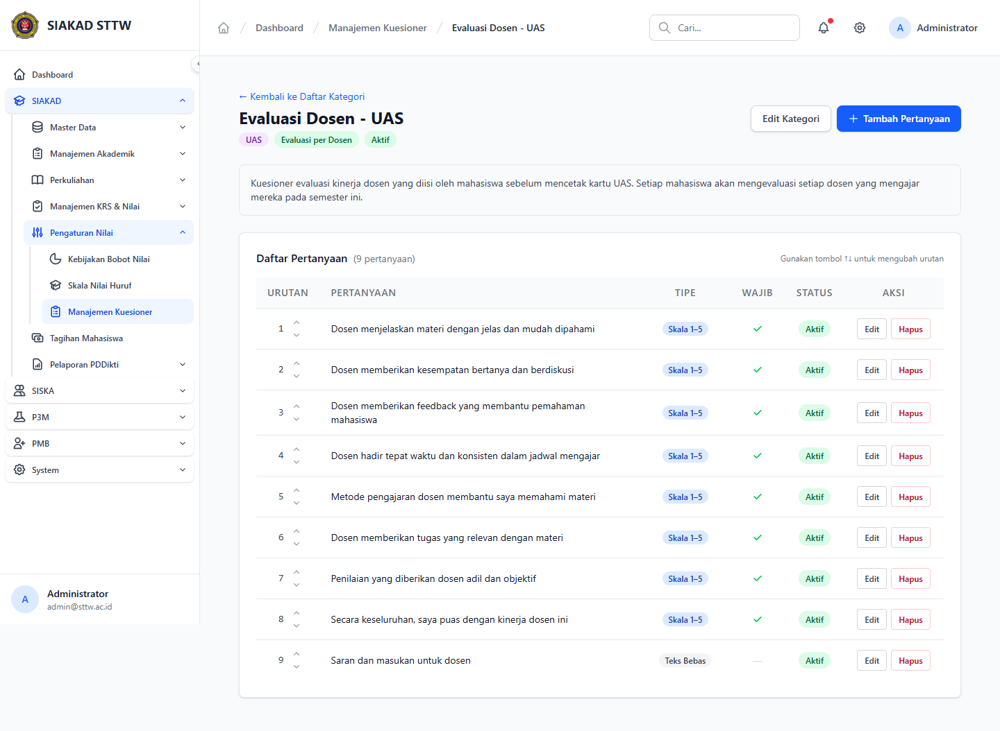
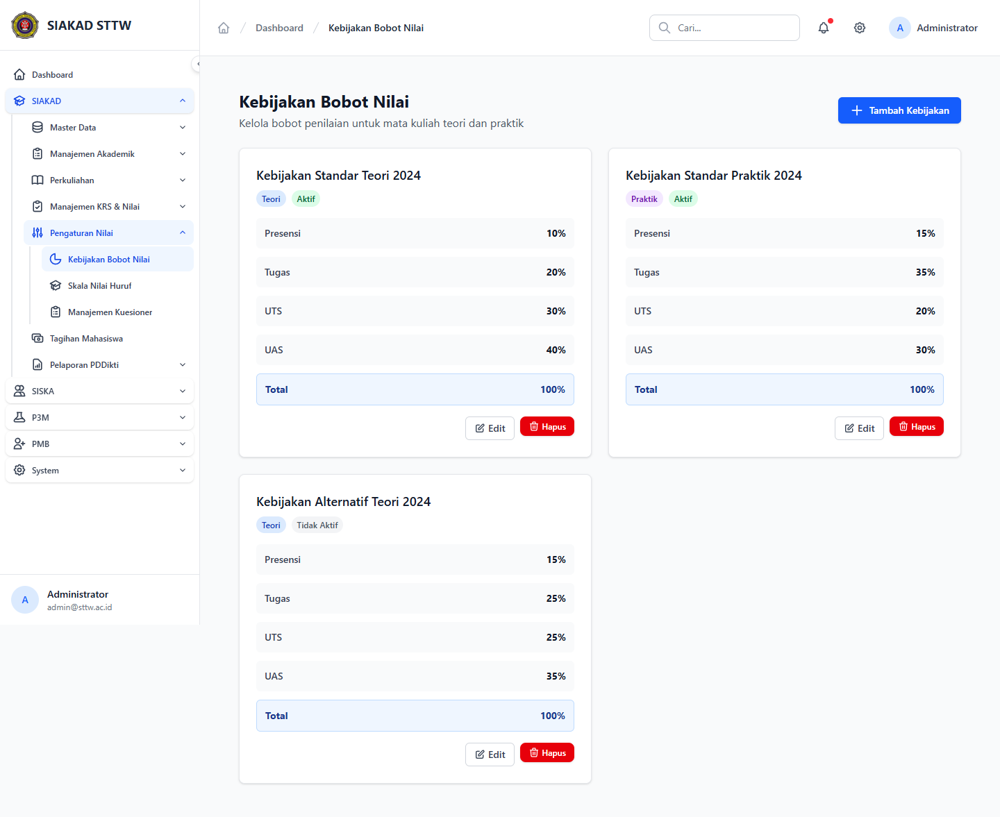
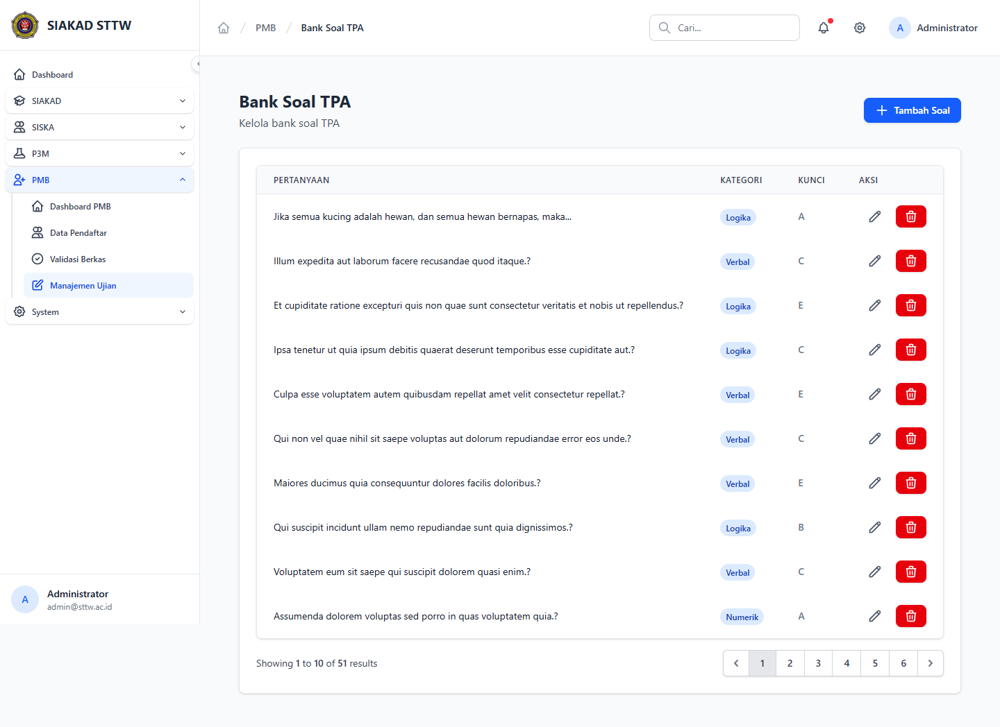

# SIAKAD — Admin: Bank Soal, Bobot Nilai, & Kuesioner

**Modul:** SIAKAD (Pengaturan Nilai & Kuesioner) + PMB (Bank Soal TPA)
**Aktor:** Administrator (`admin@sttw.ac.id`)
**Tanggal:** 2026-04-22
**Pelaksana:** Workflow Reporter (Session B)

## Skenario

Mengonfirmasi bahwa tiga sub-modul administratif terkait penilaian dapat diakses oleh admin:

1. **Kuesioner** (Waket1 + Admin) — kategori kuesioner mahasiswa & pertanyaannya.
2. **Bobot Nilai** (Waket1 + Admin) — bobot konversi nilai (UTS, UAS, Tugas, dll).
3. **Bank Soal TPA** (Admin Kemahasiswaan / PMB) — soal seleksi mahasiswa baru.

## Langkah Pengujian

1. Buka **`/siakad/kuesioner`** — halaman *Manajemen Kuesioner* berisi daftar kategori (`kuesioner_kategori`) dengan tombol **Tambah Kategori** dan link `Show / Edit / Tambah Pertanyaan` per kategori.
   

2. Klik salah satu kategori (`/siakad/kuesioner/1`) — halaman detail menampilkan daftar pertanyaan dalam kategori tersebut beserta aksi reorder/edit/hapus.
   

3. Buka **`/siakad/bobot-nilai`** — admin/Waket1 dapat melihat daftar bobot komponen nilai. Bobot ini dipakai oleh dosen di halaman input nilai (`/siakad/dosen/mata-kuliah/{id}/nilai`).
   

4. Buka **`/siska/kemahasiswaan/pmb/bank-soal`** — *Bank Soal TPA* untuk seleksi PMB. Tersedia tombol **Tambah Soal** + tabel soal existing.
   

## Fitur Yang Diuji

| Fitur | Endpoint | Status |
|---|---|---|
| Kuesioner — index kategori | `siakad.kuesioner.index` | ✅ |
| Kuesioner — detail + manage pertanyaan | `siakad.kuesioner.show` + `…pertanyaan.*` | ✅ |
| Bobot Nilai — index | `siakad.bobot-nilai.index` | ✅ |
| Bank Soal TPA — index | `siska.kemahasiswaan.pmb.bank-soal.index` | ✅ |

## Temuan & Masalah

Tidak ada error halaman pada sesi ini. CRUD pertanyaan kuesioner & bank soal hanya divalidasi pada level keberadaan tombol/route, tidak melakukan create/update aktual untuk menjaga data MySQL bersih.

## Catatan

- Sesi ini menutup **TASK-008** (admin Bank Soal/Nilai/Kuesioner) yang sebelumnya berstatus ⚠️ Partial pada plan `2026-04-21-process-workflow-reporter-all-modules-1.md`.
- Alur input nilai oleh dosen dijalankan pada laporan terpisah (`siakad/dosen-jadwal-presensi-nilai/`).
- Distribusi & analisis hasil kuesioner mengikuti modul HRM/SIAKAD masing-masing (di luar scope sub-area ini).
