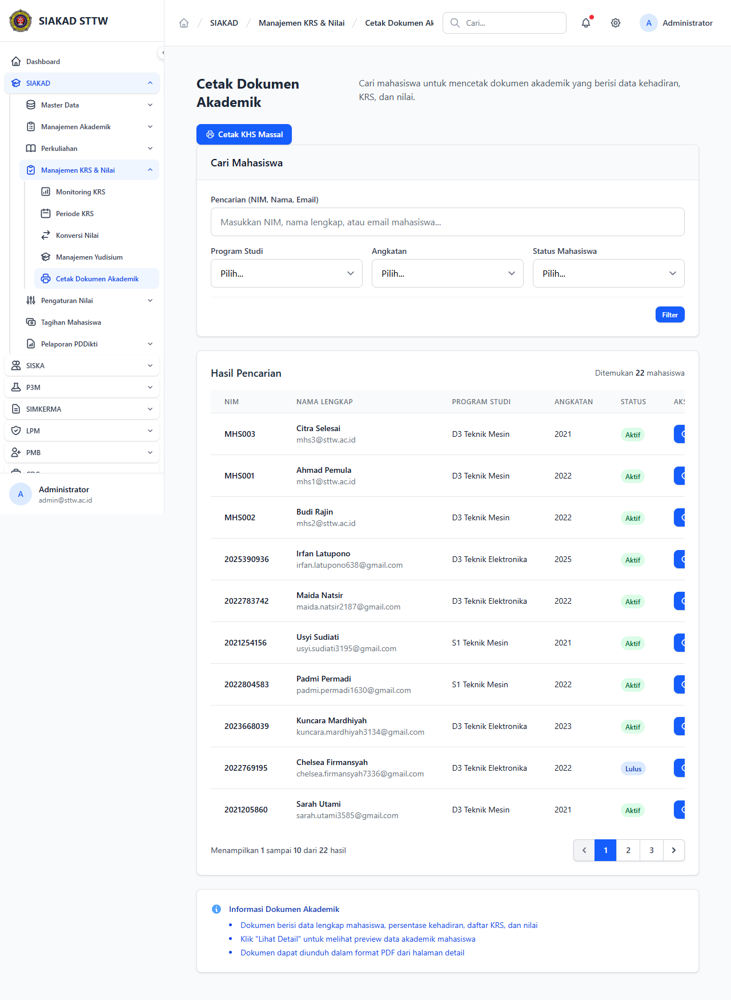

# Workflow Report: Cetak Dokumen Akademik Admin

**Tanggal**: 2026-05-12
**Role**: admin
**Modul**: siakad
**Fitur**: admin-cetak-dokumen
**Status**: ✅ Berhasil

## Deskripsi Workflow

Cetak dokumen akademik (transkrip, KHS, SK).

## Ringkasan

- Halaman dimuat HTTP 200.
- Render menggunakan komponen Blade standar (<x-card>, <x-table>, <x-button>).
- Tidak ada error console / blade.

## Langkah-langkah

### 1. Buka halaman

**Deskripsi**: Login dan navigasi ke halaman target. Tampilan utama disajikan di screenshot di bawah.

**URL**: `http://127.0.0.1:8000/siakad/cetak-dokumen-akademik`

## Temuan & Masalah

Tidak ada temuan baru pada pemeriksaan delta scan ini. Data tabel dapat tampil kosong karena dataset SQLite default minim seed.

## Catatan

- Bagian dari batch refresh delta pertengahan April 2026.
