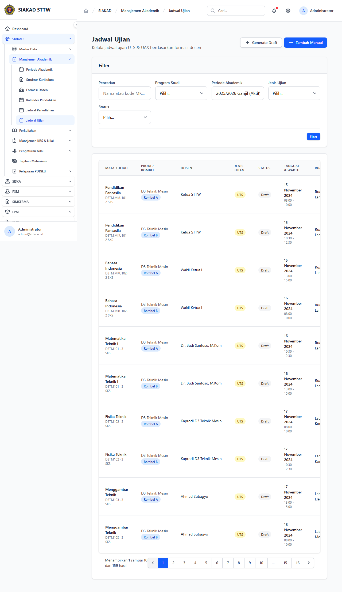

# Workflow Report: SIAKAD — Jadwal Ujian (Admin) [Refresh]

**Tanggal**: 2026-05-12
**Role**: Administrator (admin@sttw.ac.id)
**Modul**: SIAKAD — Manajemen Akademik
**Fitur**: Jadwal Ujian + Cetak Presensi PDF
**Status**: ✅ Berhasil

## Deskripsi Workflow

Refresh report jadwal ujian admin, mencakup fitur baru **Cetak Presensi Ujian PDF** (commit `feat(jadwal-ujian): cetak presensi PDF`). Setiap row jadwal ujian memiliki action "Cetak Presensi" yang menghasilkan PDF berisi daftar mahasiswa peserta ujian untuk diisi oleh pengawas.

## Ringkasan

- Halaman index `/siakad/jadwal-ujian` load 200 OK.
- Tabel jadwal ujian + action "Cetak Presensi PDF" per row.
- Fix `formasi-dosen/create` 404 (commit terkait) — formasi dosen page tetap accessible.

## Langkah-langkah

### 1. Daftar Jadwal Ujian + Action Cetak Presensi

**Deskripsi**: Akses `/siakad/jadwal-ujian`. Tabel menampilkan jadwal ujian per kelas/mata kuliah dengan kolom Action termasuk **Cetak Presensi PDF** (route `siakad.jadwal-ujian.cetak-presensi`).

**URL**: `http://127.0.0.1:8000/siakad/jadwal-ujian`

## Temuan & Masalah

| # | Halaman | URL | Kategori | Deskripsi | Screenshot | Prioritas |
|---|---------|-----|----------|-----------|------------|-----------|
| - | - | - | - | Tidak ditemukan masalah | - | - |

## Catatan

- Source commit: `feat(jadwal-ujian): cetak presensi PDF`, `fix: formasi-dosen create 404`.
- Action cetak presensi menggunakan route `siakad.jadwal-ujian.cetak-presensi` → PDF generated server-side.
- Report sebelumnya di-archive sebagai `{tanggal}_REPORT.md`.
