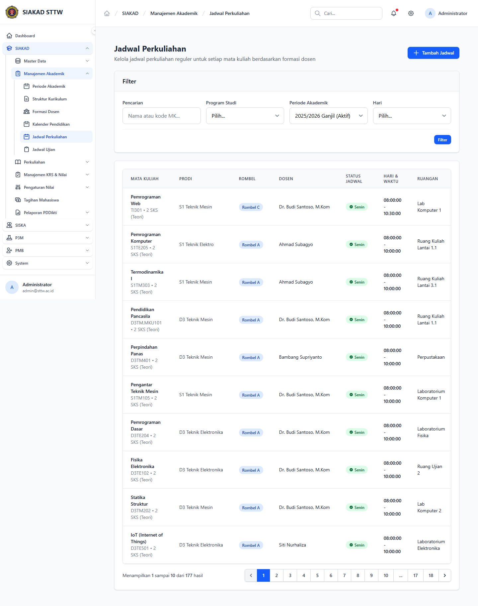
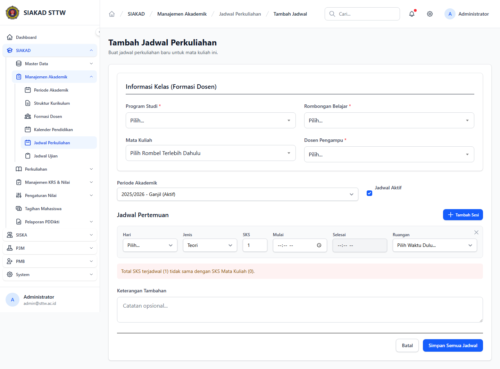
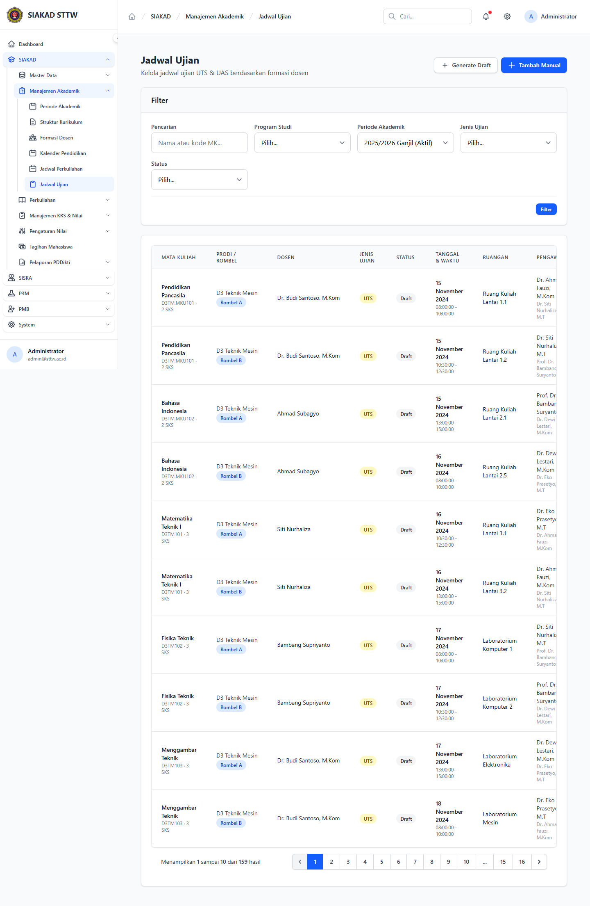
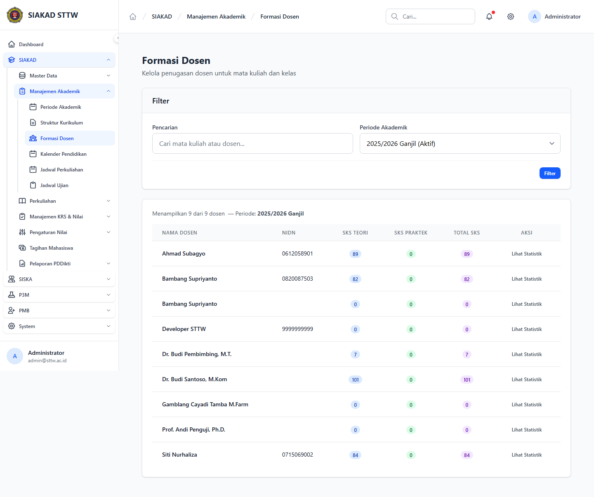
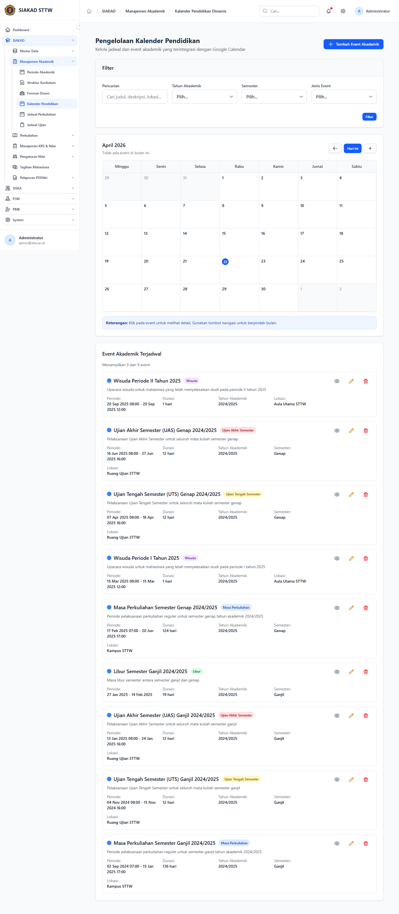
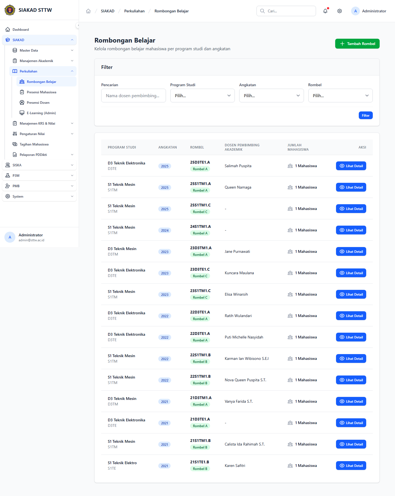

# SIAKAD — Admin Jadwal (Admin)

- **Tanggal:** 2026-04-22
- **Role:** admin (`admin@sttw.ac.id`)
- **Modul:** SIAKAD → Jadwal & Penugasan
- **Status:** ⚠️ Partial (1 informational 404 — `formasi-dosen/create` not routed)

## Ringkasan

Scan untuk submodul jadwal akademik di area Admin: penjadwalan kuliah, jadwal ujian, formasi dosen, kalender pendidikan, dan rombongan belajar. Semua halaman index render tanpa error 5xx. Form **Jadwal Perkuliahan / Create** dan **Jadwal Ujian / Create** dapat dibuka (Jadwal Ujian Create me-redirect ke index ketika data prasyarat kurang, behavior wajar). Formasi Dosen Create memberikan 404 — endpoint tidak terdaftar (lihat Temuan).

## Halaman

| # | Halaman | URL | Status |
|---|---|---|---|
| 1 | Jadwal Perkuliahan — Index | `/siakad/jadwal-perkuliahan` | 200 |
| 2 | Jadwal Perkuliahan — Create | `/siakad/jadwal-perkuliahan/create` | 200 |
| 3 | Jadwal Ujian — Index | `/siakad/jadwal-ujian` | 200 |
| 4 | Jadwal Ujian — Create | `/siakad/jadwal-ujian/create` | 200 (redirect ke index) |
| 5 | Formasi Dosen — Index | `/siakad/formasi-dosen` | 200 |
| 6 | Formasi Dosen — Create | `/siakad/formasi-dosen/create` | **404** |
| 7 | Kalender Pendidikan — Index | `/siakad/kalender-pendidikan` | 200 |
| 8 | Rombongan Belajar — Index | `/siakad/rombongan-belajar` | 200 |

## Screenshots

### 03 Jadwal Perkuliahan — Index

### 04 Jadwal Perkuliahan — Create

### 05 Jadwal Ujian — Index

### 07 Formasi Dosen — Index

### 09 Kalender Pendidikan — Index

### 10 Rombongan Belajar — Index

## Temuan & Masalah

### ⚠️ Informational — `/siakad/formasi-dosen/create` returns 404

Index halaman menampilkan tombol "Tambah Formasi" / serupa, namun tidak ada route `formasi-dosen/create`. Kemungkinan modul ini menggunakan UI inline (modal / quick-add) atau form berada di sub-path lain (misal `/siakad/formasi-dosen/import`). Verifikasi flow tambah-data manual diperlukan agar tombol UI tidak menyesatkan pengguna admin.

**Tidak diangkat sebagai bug** sampai dikonfirmasi apakah memang by-design (mungkin formasi dosen di-generate dari kurikulum/jadwal-perkuliahan).

## Catatan Skenario

- Recorder berjalan dengan akun `admin@sttw.ac.id`, full-page screenshot 1440×900.
- Tidak ditemukan error 5xx di seluruh modul jadwal admin.
