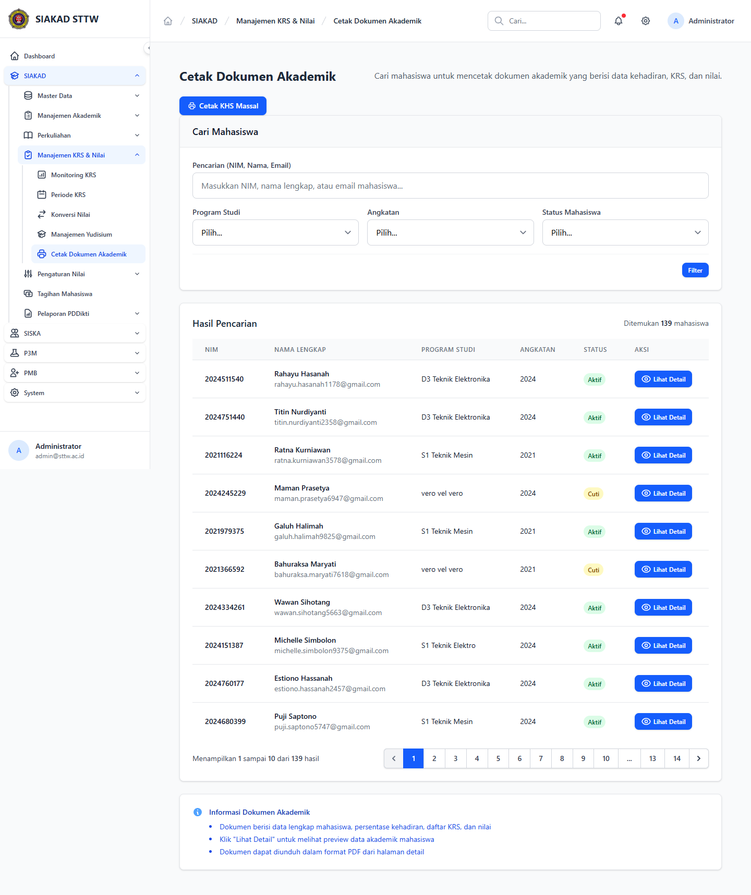
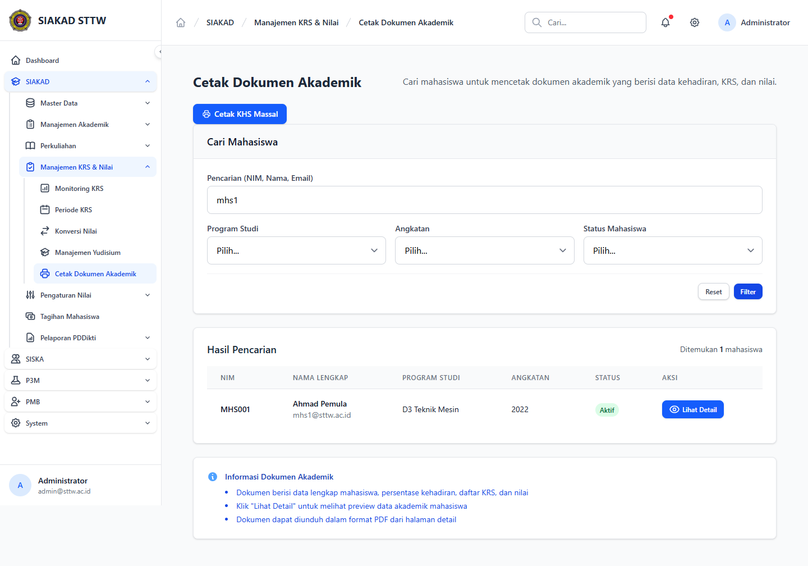
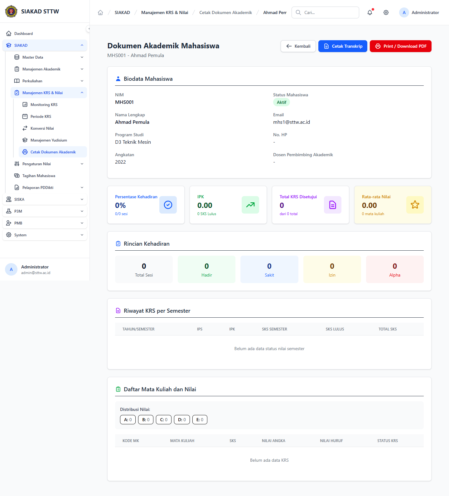
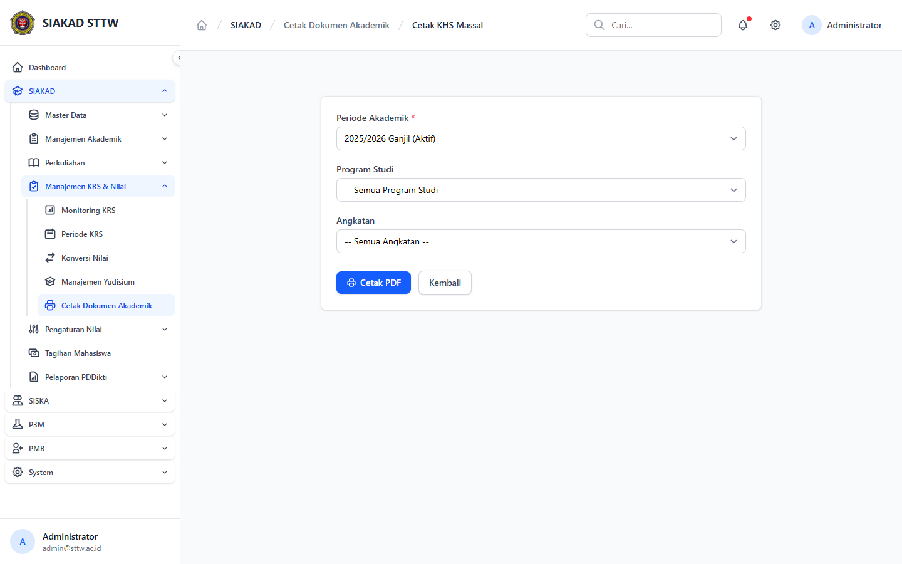

# SIAKAD — Admin: Cetak Dokumen Akademik (KHS / Transkrip)

**Modul:** SIAKAD → Manajemen KRS & Nilai → Cetak Dokumen Akademik
**Aktor:** Administrator (`admin@sttw.ac.id`)
**Tanggal:** 2026-04-22
**Pelaksana:** Workflow Reporter (Session B)

## Skenario

Admin mencari mahasiswa, melihat detail dokumen akademik (kehadiran, KRS, nilai), lalu mencetak KHS / Transkrip / dokumen ringkas dalam format PDF — baik per mahasiswa maupun massal.

## Langkah Pengujian

1. Login sebagai admin lalu buka sidebar **SIAKAD → Manajemen KRS & Nilai**.
   Sub-menu yang tersedia: Monitoring KRS, Periode KRS, Konversi Nilai, Manajemen Yudisium, **Cetak Dokumen Akademik**.
   

2. Klik **Cetak Dokumen Akademik**. Halaman index menampilkan:
   - Tombol pintas **Cetak KHS Massal** (`/siakad/cetak-dokumen-akademik/bulk-khs`).
   - Form pencarian mahasiswa: input NIM/Nama/Email + filter Program Studi.
   - Card "Informasi Dokumen Akademik" sebagai panduan singkat.
   

3. Cari mahasiswa dengan kata kunci `mhs1` lalu klik **Filter**. Hasil muncul dalam tabel kolom: NIM, Nama Lengkap (+ email), Program Studi, Angkatan, Status, Aksi (Lihat Detail).
   

4. Klik **Lihat Detail** pada mahasiswa terpilih → halaman `/siakad/cetak-dokumen-akademik/{id}` menampilkan biodata mahasiswa lengkap dengan dua aksi cetak utama:
   - **Cetak Transkrip** → `/siakad/cetak-dokumen-akademik/{id}/transkrip`
   - **Print / Download PDF** → `/siakad/cetak-dokumen-akademik/{id}/export` (dokumen akademik gabungan: kehadiran, KRS, nilai).
   

5. Kembali ke index lalu klik **Cetak KHS Massal**. Halaman bulk menyediakan tiga combobox filter (mis. Periode, Program Studi, Angkatan) dan tombol **Cetak PDF** untuk menghasilkan dokumen massal sesuai filter.
   

## Fitur Yang Diuji

| Fitur | Status | Catatan |
|---|---|---|
| Akses menu via sidebar | ✅ | Permission `siakad.cetak.access` aktif untuk admin |
| Pencarian mahasiswa (NIM/Nama/Email + Prodi) | ✅ | Filter mengembalikan baris yang relevan |
| Detail dokumen akademik per mahasiswa | ✅ | Biodata + tombol cetak tampil |
| Cetak Transkrip per mahasiswa | ✅ (link) | Endpoint `.../transkrip` tersedia (PDF stream tidak dibuka pada sesi rekam) |
| Cetak / Download PDF dokumen akademik | ✅ (link) | Endpoint `.../export` tersedia |
| Cetak KHS Massal | ✅ | Filter + tombol Cetak PDF tersedia |

## Temuan & Masalah

Tidak ditemukan error atau bug fungsional pada sesi ini. Tombol cetak PDF dibuka via stream — sesi pengujian hanya memvalidasi keberadaan tombol & route, tidak men-download isi PDF.

## Catatan

- Sesi ini menutup **TASK-006** (admin KHS / cetak dokumen akademik) yang sebelumnya berstatus ⚠️ Partial pada plan `2026-04-21-process-workflow-reporter-all-modules-1.md`.
- Halaman ini juga jadi referensi alur cetak KHS untuk peran Akademik & Waket2 ketika dibutuhkan.
