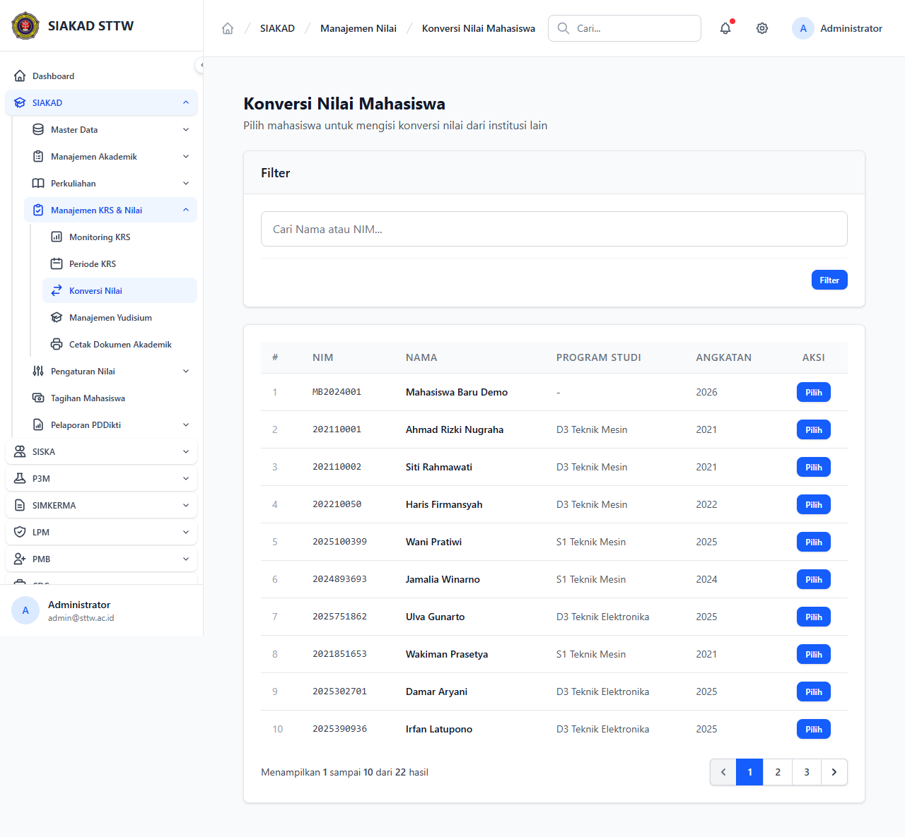

# Workflow Report: SIAKAD — Konversi Nilai (Admin) [Refresh]

**Tanggal**: 2026-05-12
**Role**: Administrator (admin@sttw.ac.id)
**Modul**: SIAKAD — Manajemen Akademik
**Fitur**: Konversi Nilai Mahasiswa + Transfer Kredit (cross-institution)
**Status**: ✅ Berhasil

## Deskripsi Workflow

Refresh report konversi nilai sejak commit `feat(konversi-nilai): transfer kredit`. Form konversi sekarang mendukung mapping dari nilai mata kuliah eksternal (institusi asal) ke mata kuliah internal — fitur cross-institution credit mapping untuk mahasiswa transfer.

## Ringkasan

- Halaman index `/siakad/konversi-nilai` load 200 OK.
- Form konversi memiliki field tambahan: nama institusi asal, kode MK asal, SKS asal → mapping ke MK internal.
- Mendukung skenario mahasiswa transfer dari PT lain.

## Langkah-langkah

### 1. Daftar & Form Konversi Nilai (dengan Transfer Kredit)

**Deskripsi**: Akses `/siakad/konversi-nilai`. Halaman menampilkan daftar konversi yang sudah dibuat plus tombol Tambah; form konversi mencakup field transfer kredit (institusi asal, kode MK asal, nilai asal) yang di-mapping ke MK internal.

**URL**: `http://127.0.0.1:8000/siakad/konversi-nilai`

## Temuan & Masalah

| # | Halaman | URL | Kategori | Deskripsi | Screenshot | Prioritas |
|---|---------|-----|----------|-----------|------------|-----------|
| - | - | - | - | Tidak ditemukan masalah | - | - |

## Catatan

- Source commit: `feat(konversi-nilai): transfer kredit`.
- Berguna untuk mahasiswa pindahan dari PT lain — nilai eksternal di-konversi menjadi MK internal dengan mapping bobot SKS.
- Report sebelumnya di-archive sebagai `{tanggal}_REPORT.md`.
