# SIAKAD — Master Data (Administrator)

> **Tanggal**: 2026-04-22
> Role: **Administrator** (`admin@sttw.ac.id`)
> Modul: **SIAKAD → Master Data**
> Mode rekam: workflow-reporter Mode 2 (Module Scan)
> Status: ⚠️ Berhasil dengan 1 temuan (P1)

## Ringkasan

Scan halaman index untuk seluruh entri menu **Master Data** pada sidebar admin SIAKAD: Program Studi, Mata Kuliah, Struktur Kurikulum, Periode Akademik, Alokasi Ruang & Waktu, Data Dosen & Struktural, Data Staf, Jabatan Staf, dan Data Mahasiswa. Tujuan: memastikan setiap halaman dapat dimuat oleh role admin tanpa error 4xx/5xx dan menampilkan tabel/listing yang diharapkan.

Hasil: 8 dari 9 halaman OK. **Halaman Data Dosen & Struktural mengembalikan HTTP 500** karena query mencoba mengurutkan `periode_krs` berdasarkan kolom yang tidak ada (`tahun_akademik`).

## Halaman

| # | Halaman | URL | Status |
|---|---------|-----|--------|
| 01 | Login | `/login` | ✅ OK |
| 02 | Dashboard (post-login) | `/dashboard` | ✅ OK |
| 03 | Program Studi — Index | `/siakad/program-studi` | ✅ 200 |
| 04 | Mata Kuliah — Index | `/siakad/mata-kuliah` | ✅ 200 |
| 05 | Struktur Kurikulum — Index | `/siakad/kurikulum` | ✅ 200 |
| 06 | Periode Akademik — Index | `/siakad/periode-akademik` | ✅ 200 |
| 07 | Alokasi Ruang & Waktu — Index | `/siakad/ruangan` | ✅ 200 |
| 08 | Data Dosen & Struktural — Index | `/siakad/dosen` | ❌ 500 |
| 09 | Data Staf — Index | `/siakad/staf` | ✅ 200 |
| 10 | Jabatan Staf — Index | `/siakad/jabatan-staf` | ✅ 200 |
| 11 | Data Mahasiswa — Index | `/siakad/mahasiswa` | ✅ 200 |

## Screenshots

### 1. Login
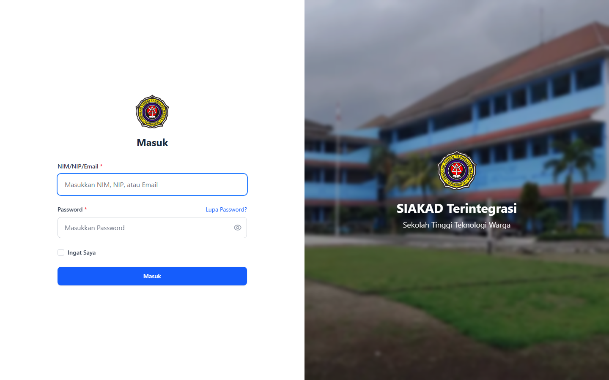

### 2. Dashboard (post-login)
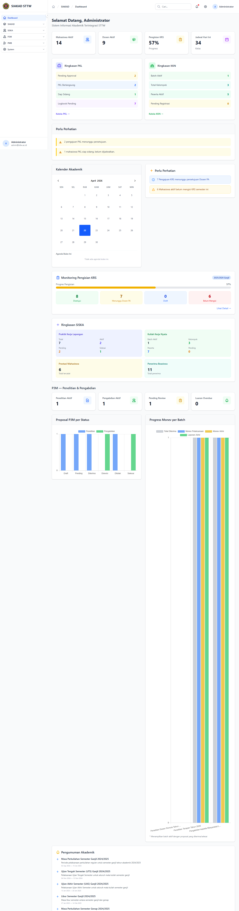

### 3. Program Studi
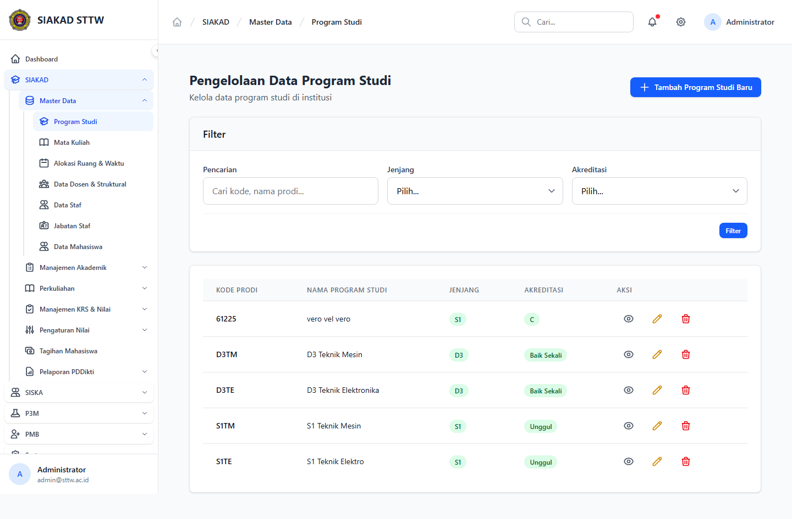

### 4. Mata Kuliah
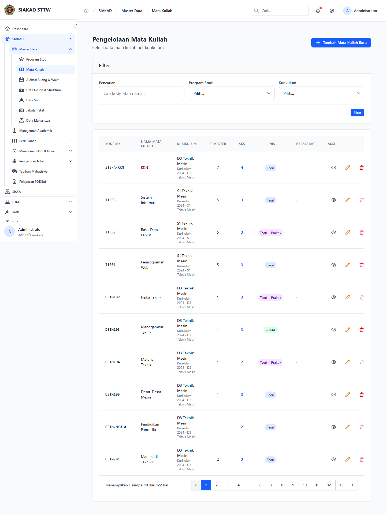

### 5. Struktur Kurikulum
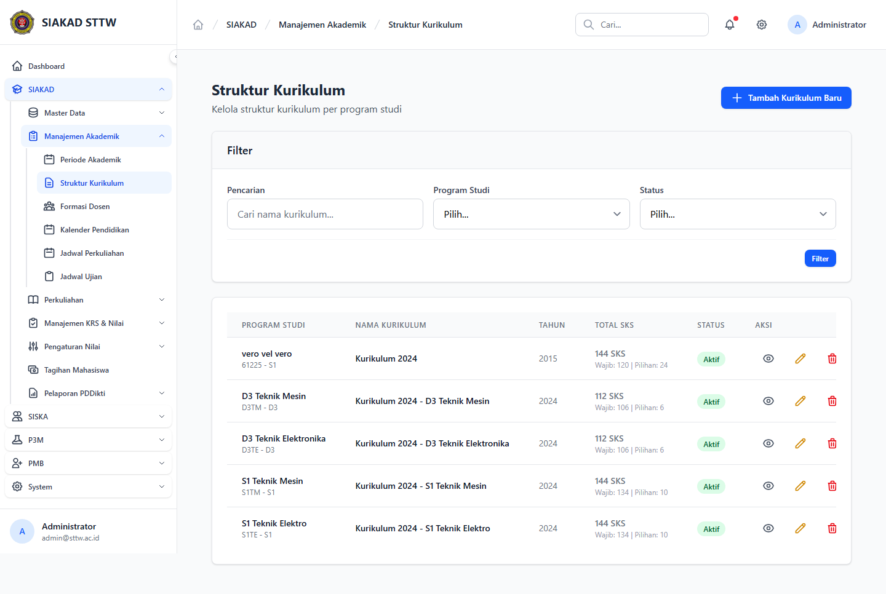

### 6. Periode Akademik
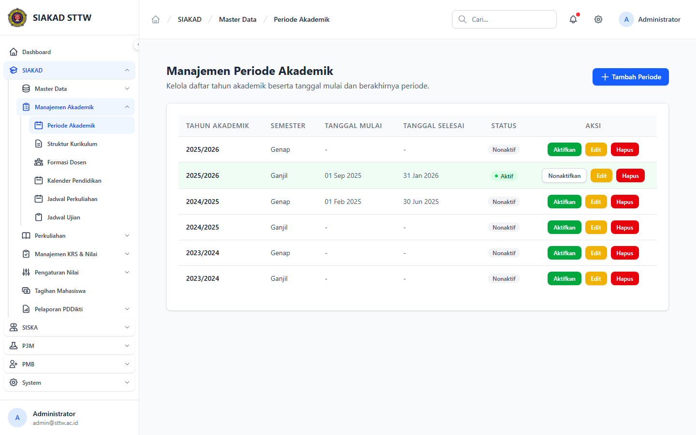

### 7. Alokasi Ruang & Waktu
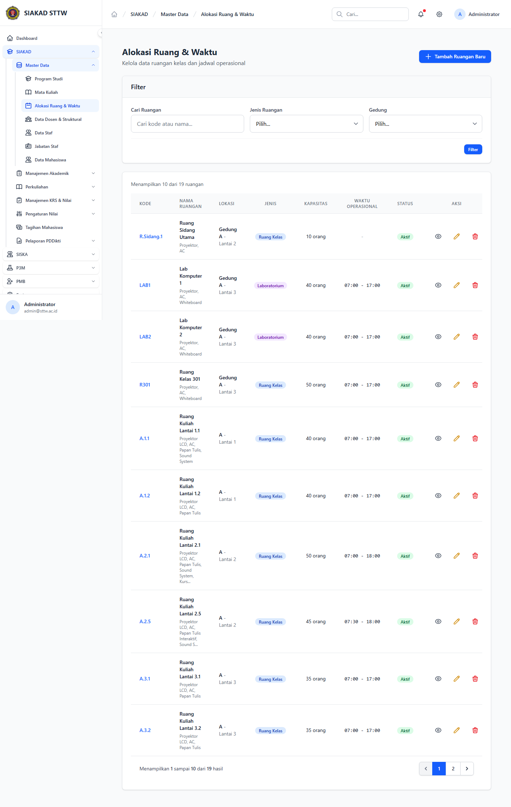

### 8. Data Dosen & Struktural — ❌ 500
Halaman menampilkan halaman error Laravel (Whoops). Lihat **Temuan & Masalah** di bawah.
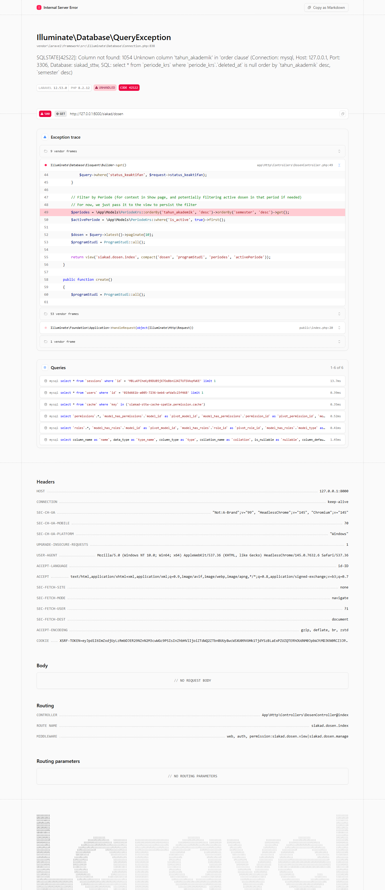

### 9. Data Staf
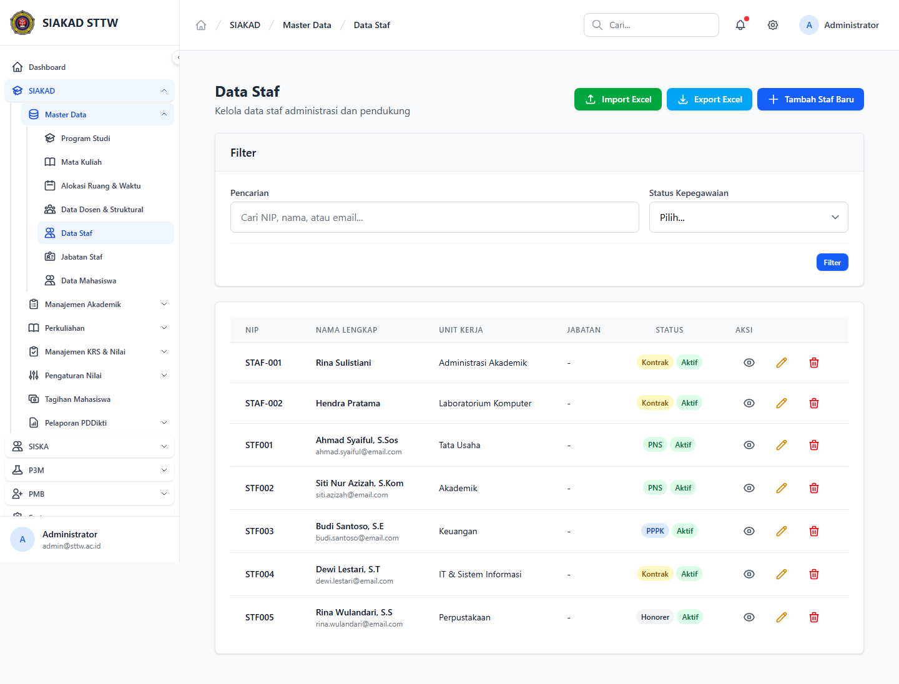

### 10. Jabatan Staf
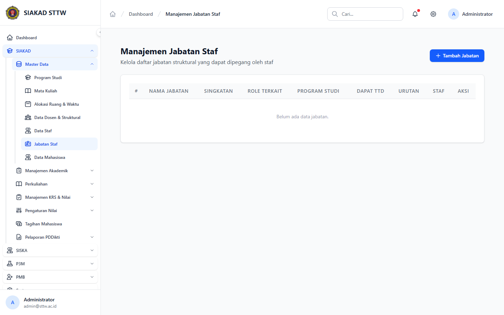

### 11. Data Mahasiswa
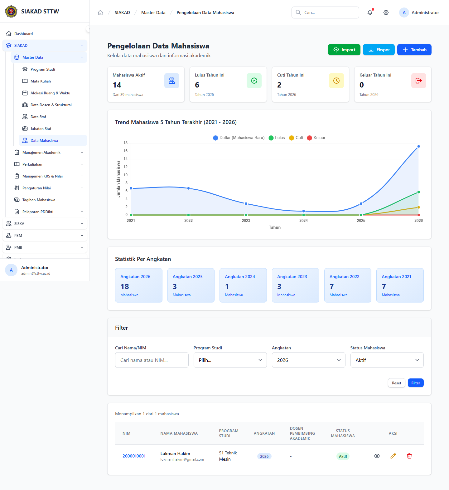

## Temuan & Masalah

### 🔴 P1 — `/siakad/dosen` HTTP 500: Unknown column `tahun_akademik` in `periode_krs`

- **Endpoint**: `GET /siakad/dosen` → `App\Http\Controllers\DosenController@index`
- **Lokasi kode**: `app/Http/Controllers/DosenController.php:49`
- **Query yang gagal**:
  ```sql
  select * from `periode_krs`
  where `periode_krs`.`deleted_at` is null
  order by `tahun_akademik` desc, `semester` desc
  ```
- **Root cause**: Tabel `periode_krs` **tidak punya** kolom `tahun_akademik` maupun `semester`. Kolom tersebut ada di tabel `periode_akademik` yang di-relasikan via `periode_krs.periode_akademik_id`.
- **Schema aktual `periode_krs`**: `id, periode_akademik_id, tanggal_mulai_pengisian, tanggal_selesai_pengisian, tanggal_mulai_perubahan, tanggal_selesai_perubahan, is_active, keterangan, created_at, updated_at, deleted_at`.
- **Saran fix**:
  ```php
  $periodes = \App\Models\PeriodeKrs::with('periodeAkademik')
      ->join('periode_akademik', 'periode_krs.periode_akademik_id', '=', 'periode_akademik.id')
      ->orderBy('periode_akademik.tahun_akademik', 'desc')
      ->orderBy('periode_akademik.semester', 'desc')
      ->select('periode_krs.*')
      ->get();
  ```
  atau lebih sederhana, urutkan dengan relasi `latest()` di `periodeAkademik` lalu `sortByDesc` di collection.
- **Dampak**: admin **tidak bisa** membuka halaman manajemen dosen sama sekali.
- **Issue**: https://github.com/ricomuh/siakad-sttw/issues/137 (label: `workflow-reporter`, `bug`)

## Catatan Skenario

- Hanya halaman index yang di-scan untuk pilot ini. Form create/edit per entitas tidak termasuk.
- Recording dilakukan via Playwright Chromium 1.58.2 headless, viewport 1440×900, locale `id-ID`.
- Sumber data: hasil seeder default (`php artisan migrate:fresh --seed`).
