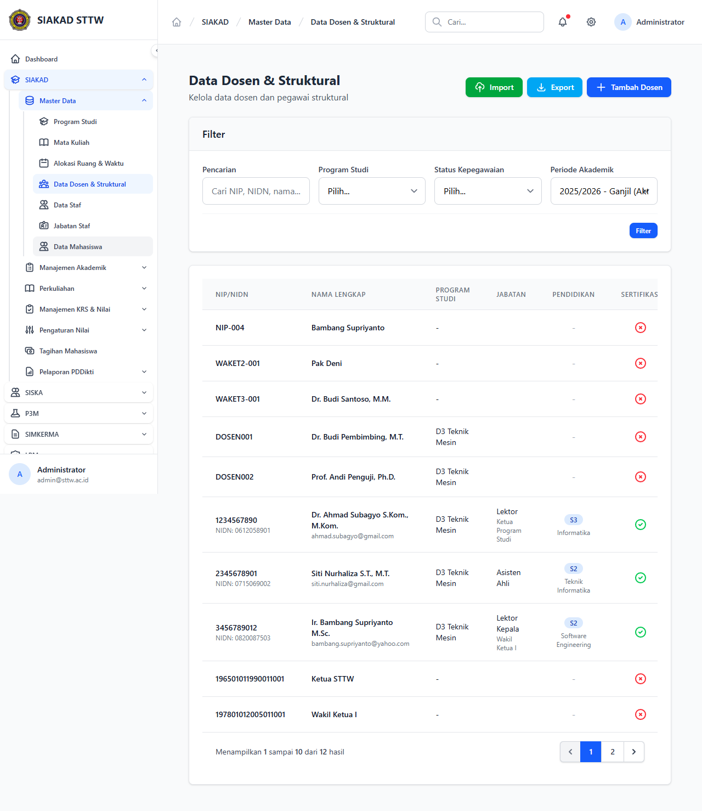

# Workflow Report: Master Data Dosen — Bugfix Verification

**Tanggal**: 2026-05-12
**Role**: Administrator (admin@sttw.ac.id)
**Modul**: SIAKAD — Master Data
**Fitur**: Daftar Data Dosen & Struktural (`/siakad/dosen`)
**Status**: ✅ Berhasil (bugfix verified)

## Deskripsi Workflow

Verifikasi **bugfix #137** — sebelum fix, halaman `/siakad/dosen` melempar HTTP 500 karena ordering Eloquent menggunakan kolom yang sudah dipindah ke join table `periode_akademik`. Fix: `fix(siakad/dosen): order via periode_akademik join`. Workflow ini memastikan halaman load tanpa exception.

## Ringkasan

- HTTP 500 sebelum fix → kini load 200 OK dengan render tabel master data dosen.
- Ordering tetap konsisten (terurut berdasarkan periode akademik aktif).
- Sidebar grup **SIAKAD → Master Data → Data Dosen & Struktural** ter-highlight.

## Langkah-langkah

### 1. Halaman Daftar Dosen — Fixed (200 OK)

**Deskripsi**: Klik sidebar **SIAKAD → Master Data → Data Dosen & Struktural**. Halaman load sukses dengan tabel master data dosen, tidak ada exception MySQL/SQL ordering.

**URL**: `http://127.0.0.1:8000/siakad/dosen`

## Temuan & Masalah

| # | Halaman | URL | Kategori | Deskripsi | Screenshot | Prioritas |
|---|---------|-----|----------|-----------|------------|-----------|
| - | - | - | - | Tidak ada — bug #137 sudah resolved | - | - |

## Catatan

- Source fix: commit `fix(siakad/dosen): order via periode_akademik join` (referenced GitHub issue #137).
- Re-scan ini bagian dari **Phase 3 bugfix verification** plan `2026-05-12-process-workflow-reporter-mid-april-delta-1.md`.
