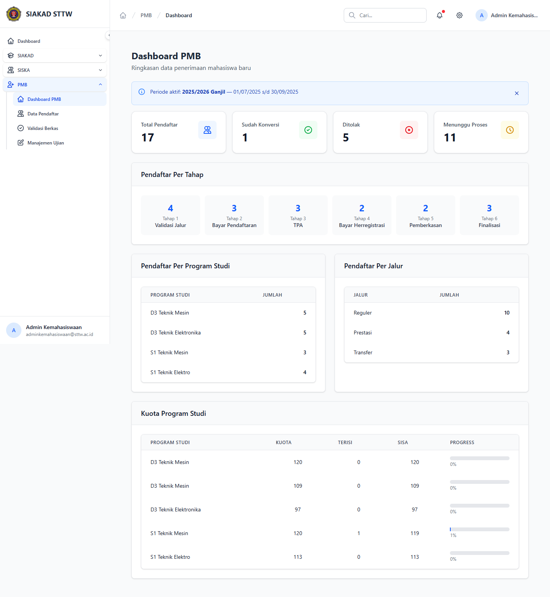
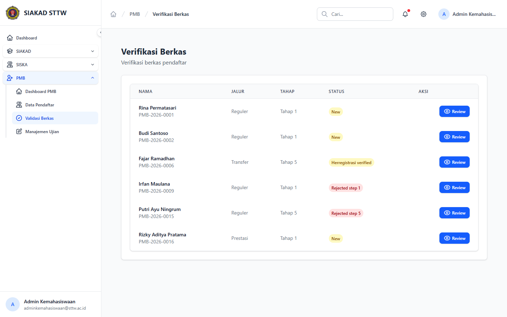
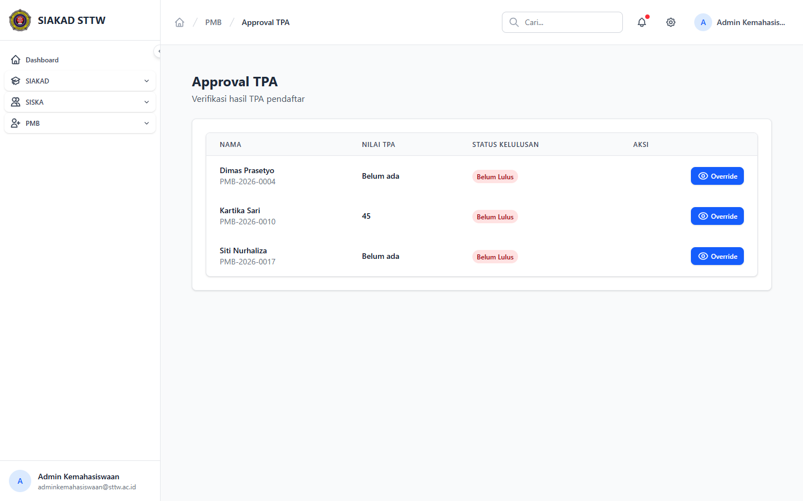
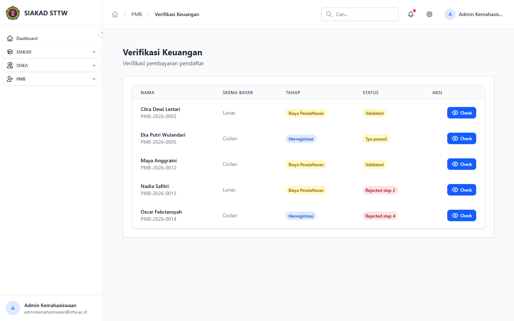
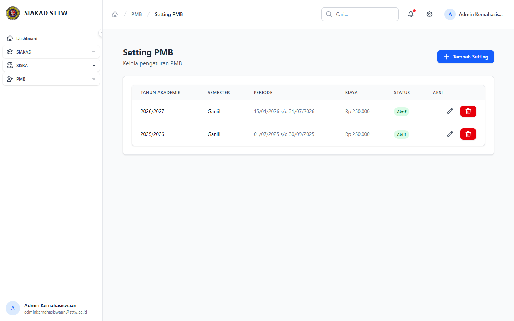

# Laporan Workflow — PMB Admin: Seleksi, Jadwal & Pengumuman

**Tanggal:** 2026-04-22
**Penguji:** Agen Otomatis (Session B)
**Modul:** PMB (Penerimaan Mahasiswa Baru) — Admin Kemahasiswaan
**Akun Diuji:** `adminkemahasiswaan@sttw.ac.id` (role `admin-kemahasiswaan`)
**Sumber Plan:** `plan/2026-04-21-process-workflow-reporter-all-modules-1.md` — TASK-035 (sebelumnya ⚠️ Partial)

## Skenario

Memverifikasi alur kerja Admin Kemahasiswaan dalam mengelola seleksi pendaftar PMB, mengatur jadwal/setting periode, dan menyiapkan pengumuman. Karena tidak ada satu route monolitik bernama "seleksi", pengujian mencakup tiga tahap approval (berkas, TPA, keuangan) sebagai inti seleksi, ditambah halaman setting yang menampung konfigurasi periode/jadwal.

## Langkah Pengujian

### 1. Dashboard PMB Admin

`GET /siska/kemahasiswaan/pmb` (controller `AdminKemahasiswaan\PMB\DashboardController`) menampilkan ringkasan: jumlah pendaftar baru, jumlah lulus seleksi tiap tahap, kuota prodi terisi, serta tautan cepat ke approval/setting/bank-soal.

### 2. Seleksi — Verifikasi Berkas

`GET /siska/kemahasiswaan/pmb/approval/berkas` adalah tahap pertama seleksi: admin meninjau dokumen pendaftar (ijazah, akta, foto, dll) dan menyetujui/menolak per pendaftar.

### 3. Seleksi — Hasil TPA

`GET /siska/kemahasiswaan/pmb/approval/tpa` menampilkan daftar pendaftar yang telah mengikuti TPA berikut skornya, untuk diverifikasi/diluluskan ke tahap berikutnya.

### 4. Seleksi — Verifikasi Keuangan

`GET /siska/kemahasiswaan/pmb/approval/keuangan` adalah tahap akhir: konfirmasi pembayaran daftar ulang/registrasi sebelum pendaftar resmi menjadi mahasiswa.

### 5. Setting Jadwal & Pengumuman

`GET /siska/kemahasiswaan/pmb/setting` (controller `AdminKemahasiswaan\PMB\SettingController`) memuat konfigurasi periode aktif — tanggal buka/tutup pendaftaran, jadwal TPA, batas pembayaran, plus teks pengumuman/landing page yang ditampilkan ke calon pendaftar.

## Fitur Yang Diuji

| Fitur | Endpoint | Status |
|---|---|---|
| PMB Admin Dashboard | `GET /siska/kemahasiswaan/pmb` | ✅ |
| Approval berkas | `GET /siska/kemahasiswaan/pmb/approval/berkas` | ✅ |
| Approval TPA | `GET /siska/kemahasiswaan/pmb/approval/tpa` | ✅ |
| Approval keuangan | `GET /siska/kemahasiswaan/pmb/approval/keuangan` | ✅ |
| Setting periode/jadwal/pengumuman | `GET /siska/kemahasiswaan/pmb/setting` | ✅ |
| Aksi approve/reject pendaftar | `POST /.../approval/*/{id}/approve` | ⏭️ Tidak dieksekusi (mutasi data dev) |

## Temuan & Masalah

Tidak ditemukan error pada lima halaman utama. Catatan: tidak ada route eksplisit berlabel "Pengumuman" — fungsi pengumuman ke calon pendaftar dikelola melalui halaman Setting (teks landing/pengumuman) dan via pengumuman akademik global. Bila stakeholder menginginkan modul pengumuman PMB terpisah (mis. multiple banner berjadwal), butuh fitur baru di luar scope tugas ini.

## Catatan

Ketiga tahap approval (berkas/TPA/keuangan) merupakan implementasi konkret "Seleksi" pada modul PMB. Sesi ini menutup TASK-035 yang sebelumnya berstatus ⚠️ Partial pada plan workflow-reporter.
