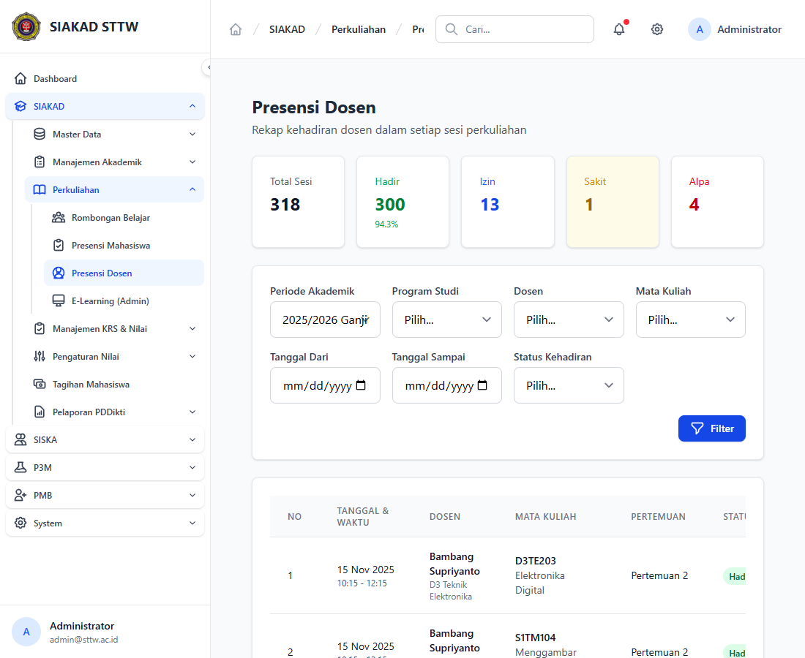
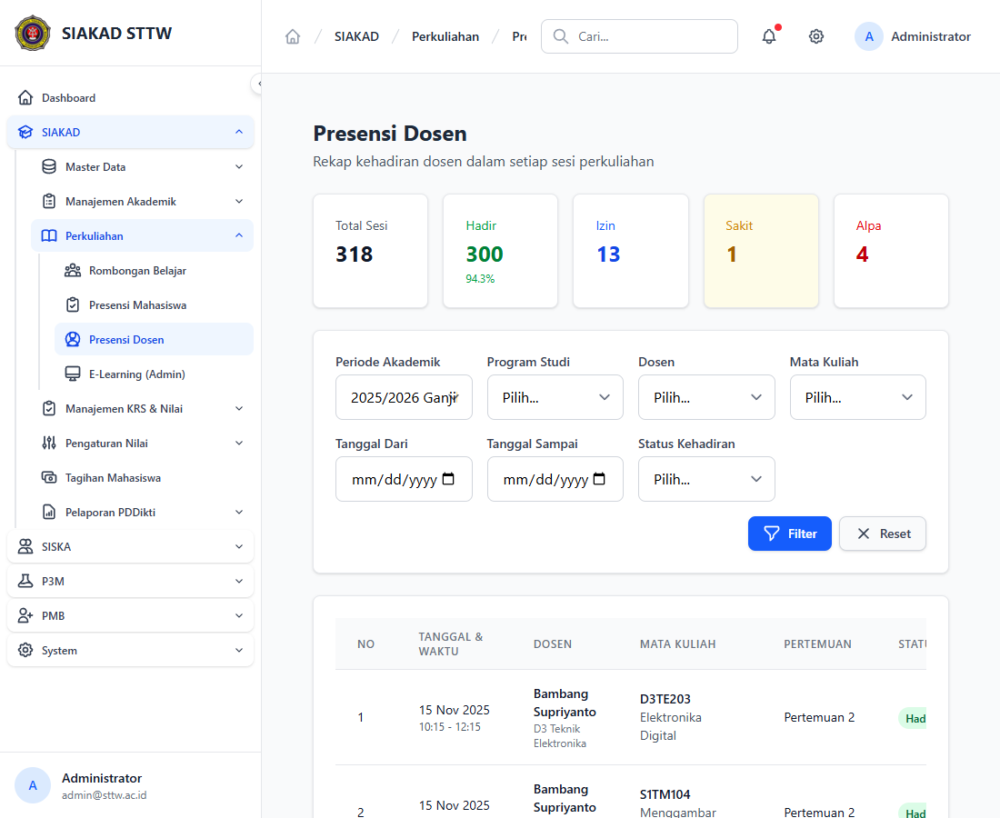

# Workflow Report: Presensi Dosen (Admin)

**Tanggal**: 2026-04-18
**Role**: Admin
**Modul**: SIAKAD
**Fitur**: Presensi Dosen
**Status**: Berhasil

## Deskripsi Workflow

Verifikasi halaman rekap presensi dosen setelah penyesuaian daftar periode akademik. Fokus pengujian adalah memastikan dropdown periode memuat label dari relasi periode akademik dengan urutan yang benar, serta filter mengirim parameter `periode_akademik_id`.

## Ringkasan

Halaman `Presensi Dosen` berhasil dibuka melalui sidebar `SIAKAD -> Perkuliahan`. Dropdown periode menampilkan label semester terbaru lebih dahulu, dan ketika filter dipilih halaman merefresh dengan query string `periode_akademik_id`.

## Langkah-langkah

### 1. Login Admin

**Deskripsi**: Menggunakan akun admin untuk mengakses rekap presensi dosen.

**URL**: `http://127.0.0.1:8000/login`

### 2. Buka Sidebar Perkuliahan

**Deskripsi**: Sidebar `SIAKAD` dibuka lalu submenu `Perkuliahan` diekspansi agar menu `Presensi Dosen` terlihat aktif di hirarki navigasi.

**URL**: `http://127.0.0.1:8000/dashboard`

### 3. Buka Halaman Presensi Dosen

**Deskripsi**: Admin masuk ke halaman `Presensi Dosen`. Halaman menampilkan statistik, filter, daftar presensi, dan dropdown periode dengan label berbasis `nama` periode akademik.

**URL**: `http://127.0.0.1:8000/siakad/presensi-dosen`

### 4. Filter Berdasarkan Periode Akademik

**Deskripsi**: Admin memilih salah satu periode pada dropdown lalu menekan tombol `Filter`. Halaman refresh dengan parameter `periode_akademik_id`, menandakan filter tidak lagi bergantung pada pasangan `tahun_akademik` dan `semester` manual di query string.

**URL**: `http://127.0.0.1:8000/siakad/presensi-dosen?periode_akademik_id=1&program_studi_id=&dosen_id=&mata_kuliah_id=&tanggal_dari=&tanggal_sampai=&status_kehadiran=`

## Temuan & Masalah

Tidak ada temuan terbuka pada flow ini setelah perbaikan diterapkan.

## Catatan

- Validasi visual ini mengonfirmasi dropdown periode memakai label relasi `PeriodeAkademik` dan filter memakai `periode_akademik_id`.
- Screenshot diambil per viewport karena full-page capture Chromium gagal pada environment Windows saat ini.
- Verifikasi tambahan ditutup oleh test `tests/Feature/Admin/PresensiDosenTest.php`.
