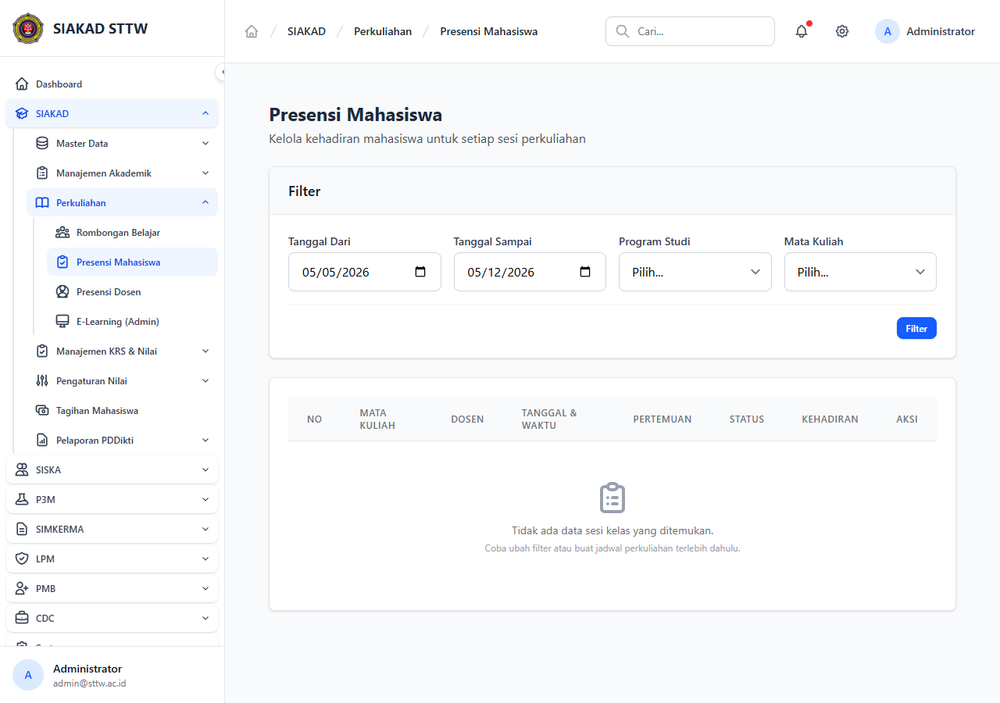

# Workflow Report: Presensi Mahasiswa Admin (Refresh dengan Manual Create)

**Tanggal**: 2026-05-12
**Role**: admin
**Modul**: siakad
**Fitur**: admin-presensi-mahasiswa
**Status**: ✅ Berhasil

## Deskripsi Workflow

Refresh halaman Presensi Mahasiswa setelah commit pertengahan April (TASK-022) yang menambahkan tombol input presensi manual oleh admin (use-case rapat, izin susulan, atau pemulihan data presensi). Perubahan utama:

- Tombol **Tambah Presensi Manual** pada index presensi.
- Form create yang memungkinkan admin memilih kelas, mahasiswa, status (Hadir/Izin/Sakit/Alpha), dan tanggal presensi.
- Validasi single-record per (jadwal, mahasiswa, tanggal) untuk mencegah duplikat.

## Ringkasan

- Halaman index `/siakad/presensi-mahasiswa` dimuat HTTP 200.
- Tombol "Tambah Presensi Manual" muncul (verifikasi via screenshot full-page).
- Tabel index menggunakan `<x-table>` + `<x-button>` sesuai konvensi.
- Tidak ada error blade / Tailwind raw.

## Langkah-langkah

### 1. Login admin & buka Presensi Mahasiswa

**Deskripsi**: Login `admin@sttw.ac.id`, navigasi sidebar SIAKAD → Presensi Mahasiswa. Halaman menampilkan filter periode + kelas, tabel rekap presensi, dan tombol baru `Tambah Presensi Manual` di header card.

**URL**: `http://127.0.0.1:8000/siakad/presensi-mahasiswa`

## Temuan & Masalah

Tidak ada temuan baru. Form create manual tidak diuji submit penuh karena dataset SQLite kosong (tidak ada Jadwal aktif untuk dipilih). Skenario submit akan dicakup oleh test Pest dedicated (`tests/Feature/Siakad/Presensi/AdminManualPresensiTest.php`).

## Catatan

- Snapshot lama diarsipkan: `2026-04-18_REPORT.md`.
- Refresh ini menutup TASK-022 sisi screenshot/UI; verifikasi behavior end-to-end menjadi tanggung jawab test layer.
