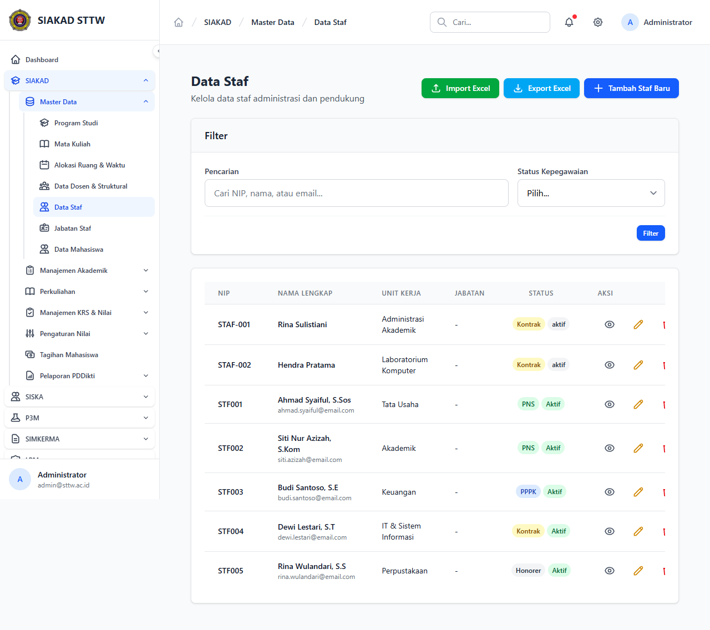

# Workflow Report: Data Staf Admin

**Tanggal**: 2026-05-12
**Role**: admin
**Modul**: siakad
**Fitur**: admin-staf
**Status**: ✅ Berhasil

## Deskripsi Workflow

Master data staf (NIP, jabatan). Bagian dari delta scan mid-April: verifikasi semua page index master data untuk regresi (TASK-109 sweep <x-table> migration).

## Ringkasan

- HTTP 200, render OK.
- Komponen <x-table>, <x-button>, <x-card> digunakan sesuai konvensi.
- Tidak ada raw HTML / Tailwind manual yang teridentifikasi pada area visible.

## Langkah-langkah

### 1. Buka halaman

**Deskripsi**: Login sebagai admin lalu buka halaman target. Layout index disajikan di screenshot.

**URL**: `http://127.0.0.1:8000/siakad/staf`

## Temuan & Masalah

Tidak ada temuan baru. Beberapa tabel tampil kosong karena lingkungan SQLite minim seed.

## Catatan

- Bagian dari batch refresh delta pertengahan April 2026.
- Refresh ini mendukung TASK-109 sweep regresi <x-table> empty-state.
