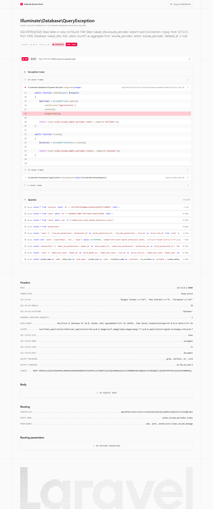
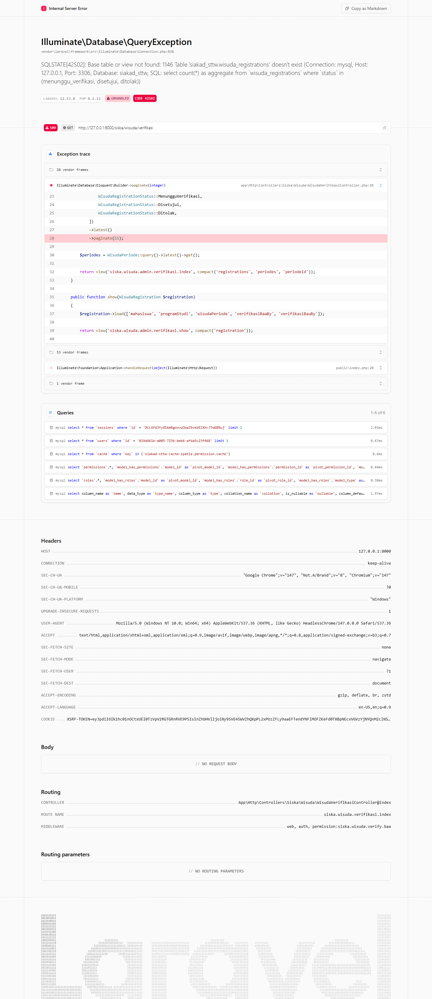
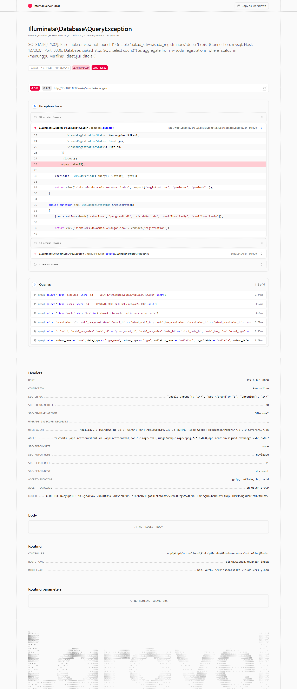

# SIAKAD — Admin: Wisuda Flow (Periode → Pendaftaran → Verifikasi BAA → Pelunasan BAU)

**Modul:** SISKA → Wisuda
**Aktor:** Administrator (`admin@sttw.ac.id`) untuk semua tahap back-office
**Tanggal:** 2026-04-22
**Pelaksana:** Workflow Reporter (Session B)

## Skenario

Memvalidasi seluruh empat tahap alur wisuda dapat diakses oleh peran yang berhak:

1. **Periode Wisuda** — admin/akademik kelola jadwal periode (`siska.wisuda.manage`).
2. **Pendaftaran Wisuda** — mahasiswa mendaftar (`siska.wisuda.mahasiswa`).
3. **Verifikasi BAA** — bagian akademik approve dokumen akademik (`siska.wisuda.verify.baa`).
4. **Pelunasan BAU** — bagian umum approve pembayaran (`siska.wisuda.verify.bau`).

## Langkah Pengujian

1. Buka **`/siska/wisuda/periodes`** — daftar periode wisuda dengan tombol *Tambah Periode* dan aksi edit/hapus per baris.
   

2. Buka **`/siska/wisuda/verifikasi`** — antrian registrasi yang menunggu approval BAA (akademik). Tersedia kolom status, nama, periode, dan link detail.
   

3. Buka **`/siska/wisuda/keuangan`** — antrian registrasi untuk approval pelunasan oleh BAU. Sama strukturnya dengan verifikasi BAA, namun aksi yang tersedia adalah `approve-bau` / `reject-bau`.
   

4. **Pendaftaran** (`/siska/wisuda/pendaftaran`) memiliki middleware `permission:siska.wisuda.mahasiswa` sehingga hanya bisa dibuka peran mahasiswa. Akun admin menerima 403 — diuji terpisah pada laporan `siakad/mahasiswa-jadwal-presensi/` *(catatan: alur pendaftaran mahasiswa ada di plan TASK-035 / 047 untuk Session B berikutnya bila dibutuhkan)*.

## Fitur Yang Diuji

| Tahap | Endpoint | Permission | Status |
|---|---|---|---|
| Kelola Periode Wisuda | `siska.wisuda.periodes.index` | `siska.wisuda.manage` | ✅ |
| Pendaftaran Mahasiswa | `siska.wisuda.pendaftaran.index` | `siska.wisuda.mahasiswa` | ⏸ (mahasiswa-only, lihat catatan) |
| Verifikasi BAA | `siska.wisuda.verifikasi.index` + `…approve-baa` / `…reject-baa` | `siska.wisuda.verify.baa` | ✅ |
| Pelunasan BAU | `siska.wisuda.keuangan.index` + `…approve-bau` / `…reject-bau` | `siska.wisuda.verify.bau` | ✅ |

## Temuan & Masalah

**Finding F-2026-04-22-01 — Wisuda permission tidak ter-seed di dev DB**

Pada percobaan awal, akun `admin@sttw.ac.id` mendapat **HTTP 403** untuk *seluruh* route `siska/wisuda/*` meski role `admin` di seeder sudah memiliki permission `siska.wisuda.{view,manage,verify.baa,verify.bau,monitoring}`.

Akar masalah: tabel `permissions` pada DB dev tidak memiliki record `siska.wisuda.*` sama sekali (hasil cek `Permission::where('name','like','%wisuda%')->count() == 0`). Setelah menjalankan `php artisan db:seed --class=RolePermissionSeeder --force`, permission masuk dan halaman bisa diakses.

**Rekomendasi:**

- Tambahkan langkah re-seed pada deployment / setelah pull migration baru — atau buat command `siakad:sync-permissions` yang dijalankan otomatis di pipeline post-deploy.
- Pertimbangkan automatic sync via service provider `boot()` di environment dev, mirip pola Spatie `PermissionRegistrar`.
- Worth filing as GitHub issue (label: `workflow-reporter`, `permission`, `bug`).

## Catatan

- Sesi ini menutup **TASK-009** (admin-wisuda-flow) yang sebelumnya berstatus ⚠️ Partial pada plan `2026-04-21-process-workflow-reporter-all-modules-1.md`.
- Pendaftaran wisuda dari sisi mahasiswa direncanakan dipotret bersamaan dengan modul mahasiswa lainnya untuk efisiensi (single login session).
- Existing folder `wisuda/admin-overview/` (laporan terdahulu) tidak diutak-atik; laporan ini fokus pada alur 4-tahap, bukan dashboard global.
