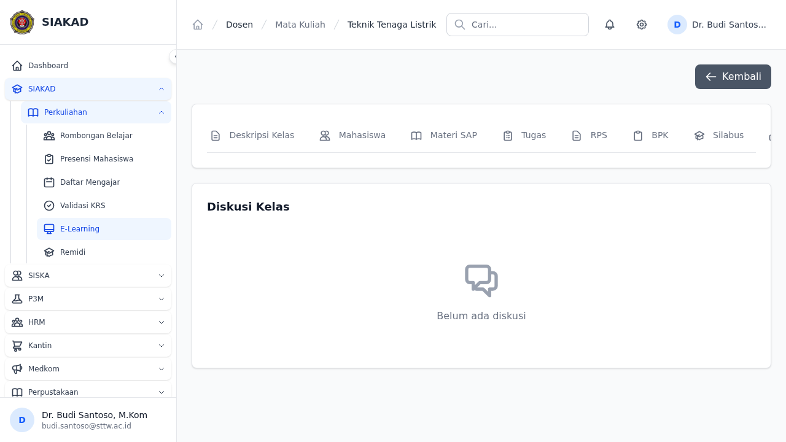
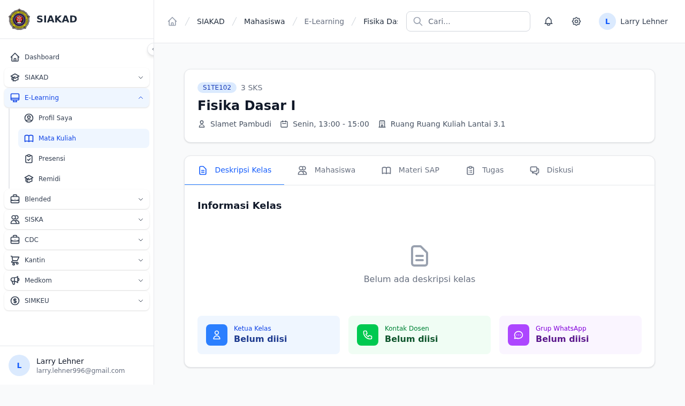
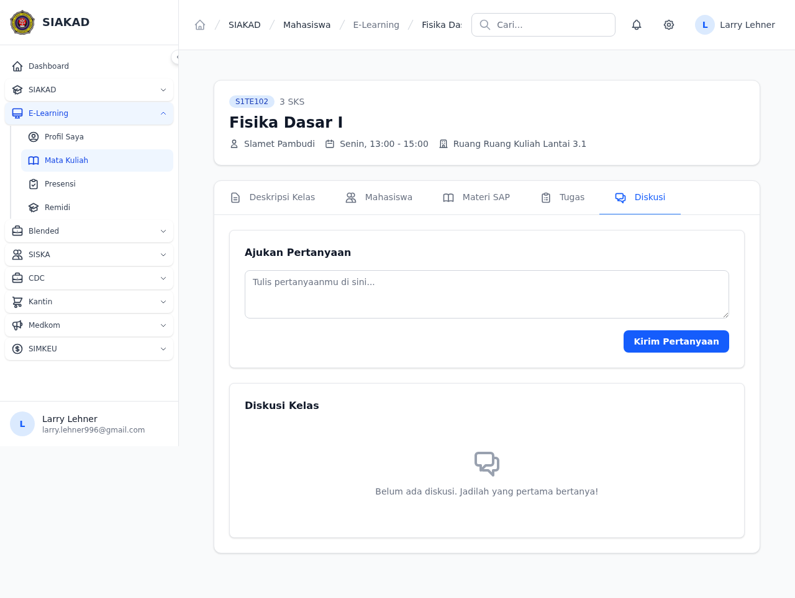

# Workflow Report: Diskusi/Forum per Materi (E-Learning)

**Tanggal**: 2026-07-12
**Role**: Dosen, Mahasiswa  
**Modul**: SIAKAD — E-Learning → Diskusi/Forum  
**Status**: ✅ Berhasil  

## Ringkasan

Fitur diskusi/forum threaded per mata kuliah dalam modul E-Learning. Mahasiswa dapat bertanya, dosen dapat membalas. Setiap thread memiliki nested replies. Fitur ini menghubungkan mahasiswa dan dosen dalam satu ruang diskusi per jadwal perkuliahan.

## Screenshots

### 1. Dosen — Tab Diskusi

Dosen dapat melihat tab "Diskusi" di halaman detail mata kuliah. Thread diskusi ditampilkan dengan fitur reply.

### 2. Mahasiswa — Daftar E-Learning

Mahasiswa melihat daftar mata kuliah yang tersedia di E-Learning.

### 3. Mahasiswa — Detail Kelas

Halaman detail kelas dengan tab navigasi termasuk "Diskusi".

### 4. Mahasiswa — Halaman Diskusi

Form "Ajukan Pertanyaan" untuk mahasiswa mengirim pertanyaan, dan daftar thread diskusi kelas.

## Fitur yang Diimplementasikan

| Fitur | Status | Keterangan |
|-------|--------|------------|
| Migration diskusis + diskusi_replies | ✅ | foreignUuid user_id, foreignId jadwal_perkuliahan_id |
| Model Diskusi + DiskusiReply | ✅ | $fillable, belongsTo User & JadwalPerkuliahan |
| Dosen: Tab Diskusi di detail MK | ✅ | MataKuliahDetailController@show 'diskusi' case |
| Dosen: Reply diskusi | ✅ | storeDiskusiReply() + ownership check |
| Mahasiswa: Ajukan Pertanyaan | ✅ | storeDiskusi() dengan enrollment check |
| Mahasiswa: Reply diskusi | ✅ | storeDiskusiReply() |
| Blade: dosen partial diskusi | ✅ | `dosen/mata-kuliah/partials/diskusi.blade.php` |
| Blade: mahasiswa halaman diskusi | ✅ | `mahasiswa/elearning/diskusi.blade.php` |
| Routes: 5 routes (2 GET + 3 POST) | ✅ | dosen reply, mahasiswa GET diskusi + store + reply |

## Test Coverage

- **Pest**: 20 tests, 37 assertions — semua PASS
- **Dosen**: 10 tests (auth, tab visibility, empty state, reply, validation, ownership)
- **Mahasiswa**: 10 tests (auth, store diskusi, reply, validation, enrollment check)
- **E2E Playwright**: 2 specs (dosen + mahasiswa)

## Thermos Review

| Severity | Issue | Status |
|----------|-------|--------|
| 🔴 Critical | IDOR: dosen storeDiskusiReply tanpa ownership check | ✅ Fixed — tambah `formasiDosen->dosen_id === auth()->user()->dosen->id` |
| 🟡 Medium | UUID PKs — pakai `$table->id()` bukan `uuid` | ⚠️ Not fixed (low impact) |
| 🟡 Medium | SoftDeletes — gak ada | ⚠️ Not fixed (recoverability gap) |

## Issues Fixed

1. **Route name mismatch** — Blade pakai `siakad.mahasiswa.elearning.diskusi.store` padahal route name `mahasiswa.elearning.diskusi.store` (group mahasiswa di luar siakad prefix)
2. **Missing GET route** — Hanya ada POST routes, gak ada GET untuk render halaman diskusi mahasiswa
3. **DB schema mismatch** — `user_id` di staging pakai `bigint`, migration pakai `foreignUuid` — re-migrated
4. **Test factory** — `makeJadwalForDosen` buat Dosen baru setiap kali, gak linked ke auth user — fixed resolve via `$dosenUser->dosen`

## Commits

- `273b24e1` — feat: initial Diskusi/Forum implementation
- `37211e93` — fix: dosen ownership check + test factory fix
- `310c1c07` — fix: GET route + diskusi tab mahasiswa + route names
