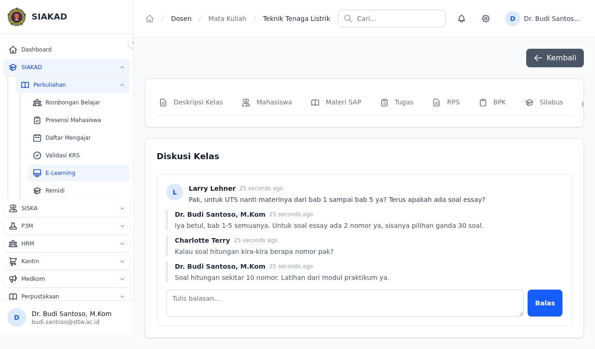
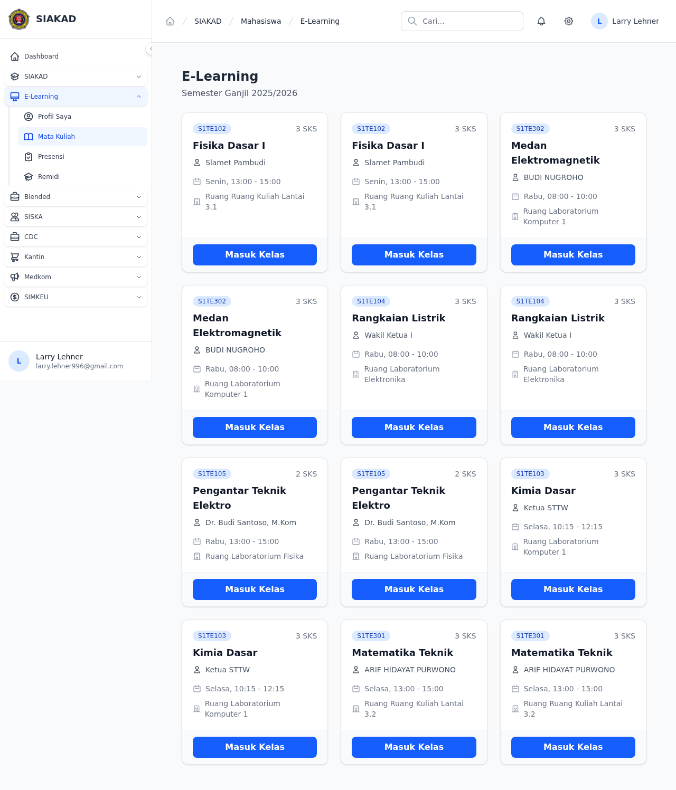
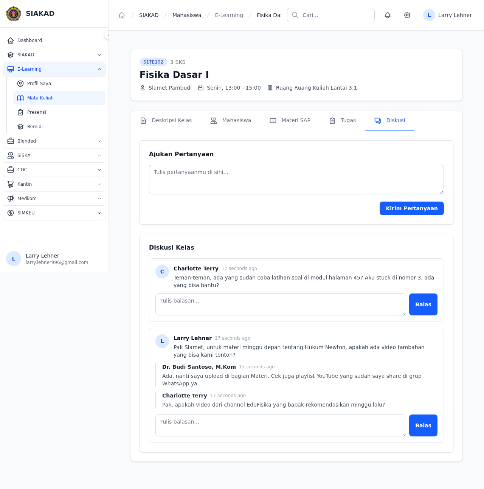
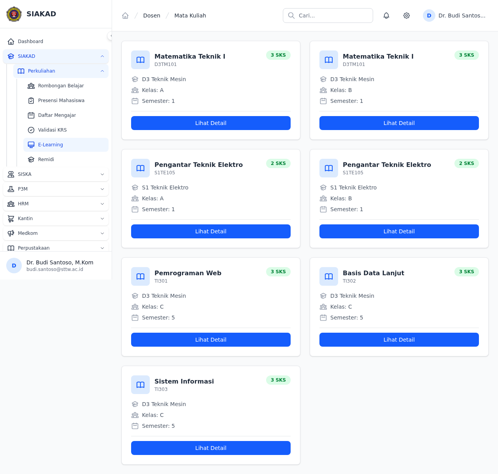

# Workflow Report: Diskusi/Forum per Materi (E-Learning)

**Tanggal**: 2026-07-12
**Role**: Dosen, Mahasiswa  
**Modul**: SIAKAD — E-Learning → Diskusi/Forum  
**Status**: ✅ Berhasil  

## Ringkasan

Fitur diskusi/forum threaded per mata kuliah dalam modul E-Learning. Mahasiswa dapat bertanya, dosen dapat membalas. Setiap thread memiliki nested replies dari dosen dan mahasiswa lain. Semua user dalam kelas yang sama dapat berpartisipasi.

## Screenshots

### 1. Dosen — Diskusi Kelas (Thread Aktif)

Dosen melihat thread diskusi dari mahasiswa beserta replies. Dosen dapat membalas langsung dari halaman ini.

### 2. Mahasiswa — Daftar E-Learning

Mahasiswa melihat daftar mata kuliah yang tersedia di E-Learning.

### 3. Mahasiswa — Halaman Diskusi (Thread Aktif)

Form "Ajukan Pertanyaan" + daftar thread diskusi dengan replies dari dosen dan mahasiswa lain.

### 4. Dosen — Daftar Mata Kuliah

Dosen melihat daftar mata kuliah yang diajar.

## Fitur yang Diimplementasikan

| Fitur | Status | Keterangan |
|-------|--------|------------|
| Migration diskusis + diskusi_replies | ✅ | foreignUuid user_id, foreignId jadwal_perkuliahan_id |
| Model Diskusi + DiskusiReply | ✅ | $fillable, belongsTo User & JadwalPerkuliahan |
| Dosen: Tab Diskusi di detail MK | ✅ | MataKuliahDetailController@show 'diskusi' case |
| Dosen: Reply diskusi | ✅ | storeDiskusiReply() + ownership check (jadwal ownership) |
| Mahasiswa: Ajukan Pertanyaan | ✅ | storeDiskusi() dengan enrollment check (KRS disetujui) |
| Mahasiswa: Reply diskusi | ✅ | storeDiskusiReply() |
| Mahasiswa: GET halaman diskusi | ✅ | diskusi() method + dedicated route |
| Blade: dosen partial diskusi | ✅ | `dosen/mata-kuliah/partials/diskusi.blade.php` |
| Blade: mahasiswa halaman diskusi | ✅ | `mahasiswa/elearning/diskusi.blade.php` |
| Routes: 5 routes (2 GET + 3 POST) | ✅ | dosen reply, mahasiswa GET diskusi + store + reply |

## Skenario yang Diuji

| # | Skenario | Role | Hasil |
|---|----------|------|-------|
| 1 | Dosen membuka tab Diskusi di detail MK | Dosen | ✅ Thread + replies tampil |
| 2 | Dosen membalas diskusi mahasiswa | Dosen | ✅ Reply tersimpan, tampil nested |
| 3 | Dosen tidak bisa reply ke jadwal dosen lain | Dosen | ✅ 403 forbidden (ownership check) |
| 4 | Mahasiswa melihat daftar E-Learning | Mahasiswa | ✅ List MK tampil |
| 5 | Mahasiswa membuka halaman Diskusi kelas | Mahasiswa | ✅ Thread + form tampil |
| 6 | Mahasiswa mengajukan pertanyaan | Mahasiswa | ✅ Tersimpan + redirect + flash |
| 7 | Mahasiswa membalas diskusi | Mahasiswa | ✅ Reply tersimpan |
| 8 | Mahasiswa tidak terdaftar tidak bisa posting | Mahasiswa | ✅ 403 / redirect |
| 9 | Validasi isi kosong | Dosen & Mhs | ✅ Error validasi tampil |
| 10 | Validasi isi > 5000 karakter | Dosen & Mhs | ✅ Error validasi tampil |

## Test Coverage

- **Pest**: 20 tests, 37 assertions — semua PASS
- **DosenDiskusiTest**: 10 tests (auth, tab visibility, empty state, reply, validation, ownership)
- **MahasiswaDiskusiTest**: 10 tests (auth, store diskusi, reply, validation, enrollment check)
- **E2E Playwright**: 2 specs (dosen + mahasiswa)

## Thermos Review

| Severity | Issue | Status |
|----------|-------|--------|
| 🔴 Critical | IDOR: dosen storeDiskusiReply tanpa ownership check | ✅ Fixed — tambah `formasiDosen->dosen_id === auth()->user()->dosen->id` |
| 🟡 Medium | UUID PKs — pakai `$table->id()` bukan `uuid` | ⚠️ Not fixed (low impact) |
| 🟡 Medium | SoftDeletes — gak ada | ⚠️ Not fixed (recoverability gap) |

## Issues Fixed

1. **Route name mismatch** — Blade pakai `siakad.mahasiswa.elearning.diskusi.store` padahal route name `mahasiswa.elearning.diskusi.store` (group mahasiswa di luar siakad prefix)
2. **Missing GET route** — Hanya ada POST routes, gak ada GET untuk render halaman diskusi mahasiswa
3. **DB schema mismatch** — `user_id` di staging pakai `bigint`, migration pakai `foreignUuid` — re-migrated
4. **Test factory** — `makeJadwalForDosen` buat Dosen baru setiap kali, gak linked ke auth user — fixed resolve via `$dosenUser->dosen`

## Commits

- `273b24e1` — feat: initial Diskusi/Forum implementation (models, migrations, controllers, views)
- `37211e93` — fix: dosen ownership check + test factory fix
- `310c1c07` — fix: GET route + diskusi tab mahasiswa + route names
