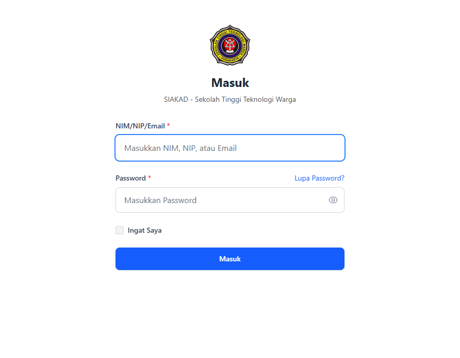
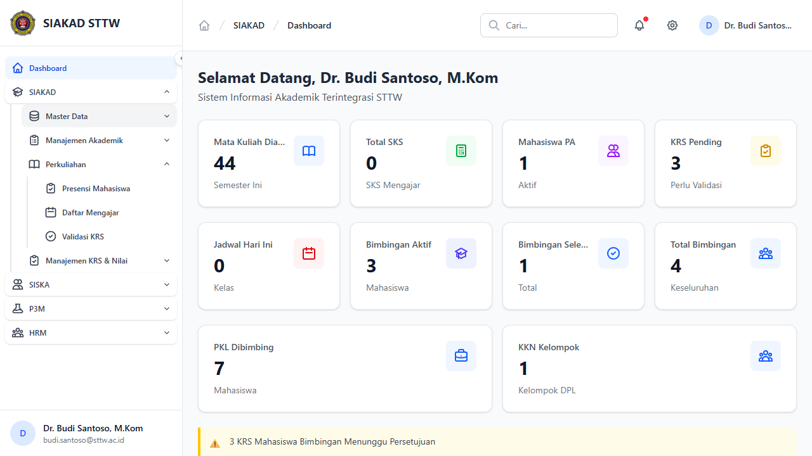
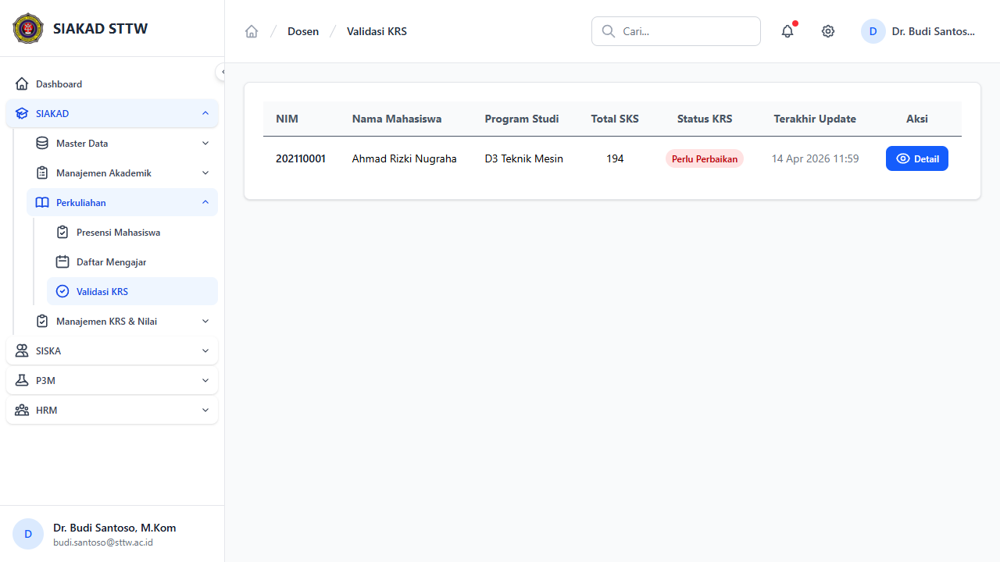
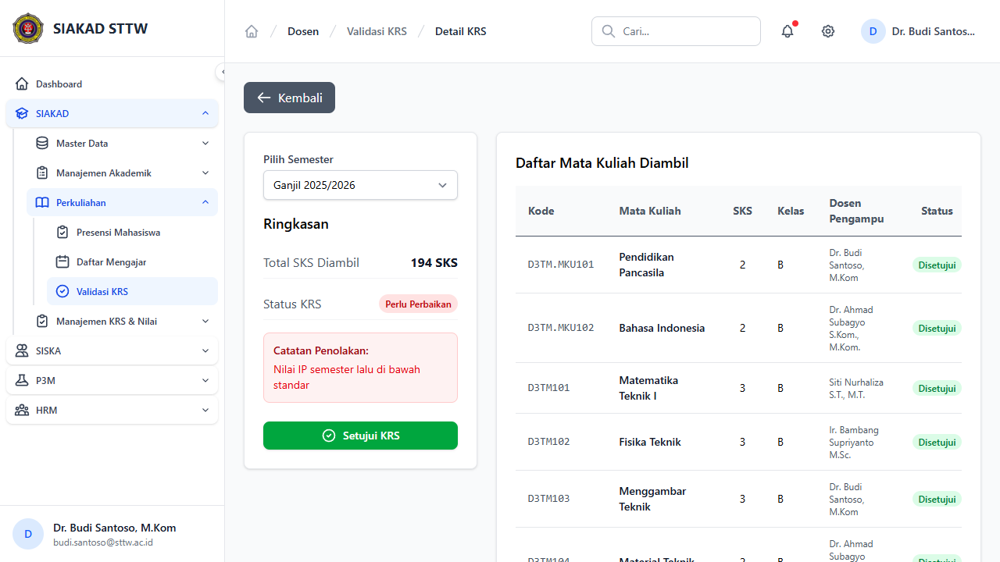
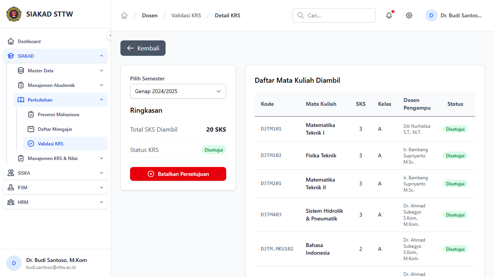

# Workflow Report: Validasi KRS (Dosen)

**Tanggal**: 2026-04-18
**Role**: Dosen
**Modul**: SIAKAD
**Fitur**: Validasi KRS
**Status**: Berhasil

## Deskripsi Workflow

Verifikasi alur dosen saat membuka daftar mahasiswa bimbingan untuk validasi KRS dan berpindah semester pada halaman detail. Fokus pengujian adalah memastikan dropdown periode pada halaman detail menggunakan `periode_akademik_id` dan reload halaman dengan parameter baru yang benar.

## Ringkasan

Flow `Validasi KRS` berhasil dibuka dari sidebar dosen. Halaman daftar mahasiswa tampil normal, detail mahasiswa dapat dibuka, dan pergantian periode pada dropdown berhasil mengubah URL menjadi `?periode_akademik_id=...`.

## Langkah-langkah

### 1. Login Dosen

**Deskripsi**: Membuka halaman login untuk autentikasi dosen pembimbing akademik sebelum masuk ke area validasi KRS.

**URL**: `http://127.0.0.1:8000/login`

### 2. Buka Sidebar Validasi KRS

**Deskripsi**: Dari dashboard dosen, grup `SIAKAD` dibuka lalu submenu `Perkuliahan` diekspansi hingga menu `Validasi KRS` muncul di sidebar.

**URL**: `http://127.0.0.1:8000/dashboard`

### 3. Buka Daftar Validasi KRS

**Deskripsi**: Dosen membuka halaman `Validasi KRS` dan melihat daftar mahasiswa bimbingan beserta ringkasan status KRS serta tombol `Detail`.

**URL**: `http://127.0.0.1:8000/siakad/dosen/validasi-krs`

### 4. Buka Detail KRS Mahasiswa

**Deskripsi**: Dosen membuka detail KRS mahasiswa. Pada halaman ini tersedia dropdown periode akademik yang menampilkan pilihan semester yang berkaitan dengan data KRS mahasiswa.

**URL**: `http://127.0.0.1:8000/siakad/dosen/validasi-krs/1`

### 5. Ganti Periode Akademik dari Dropdown

**Deskripsi**: Dosen memilih periode lain dari dropdown semester. Halaman direfresh menggunakan parameter `periode_akademik_id=2`, yang membuktikan form filter tidak lagi mengirim kombinasi tahun/semester manual.

**URL**: `http://127.0.0.1:8000/siakad/dosen/validasi-krs/1?periode_akademik_id=2`

## Temuan & Masalah

Tidak ada temuan terbuka pada flow ini setelah perbaikan diterapkan.

## Catatan

- Validasi visual ini menutup perubahan paling penting pada halaman dosen, yaitu perpindahan filter semester ke `periode_akademik_id`.
- Screenshot diambil per viewport karena full-page capture Chromium gagal pada environment Windows saat ini.
- Verifikasi tambahan ditutup oleh test `tests/Feature/Dosen/ValidasiKrsTest.php`.
