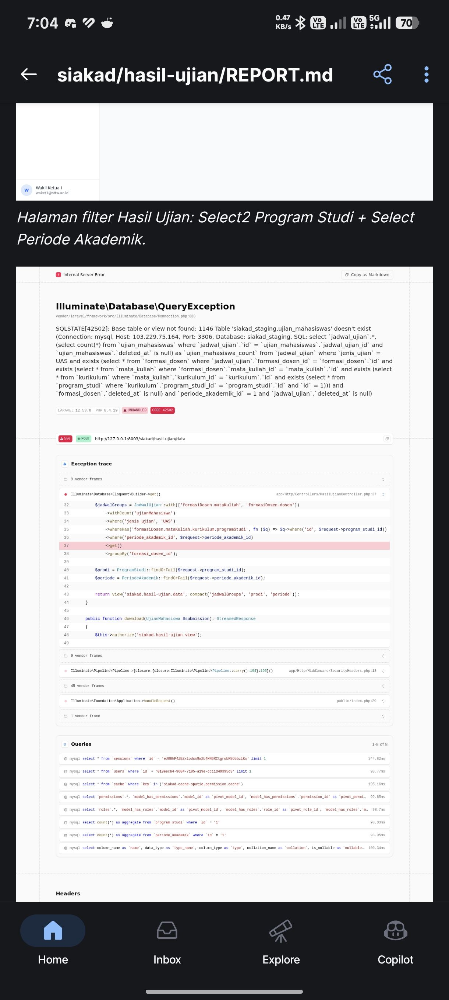
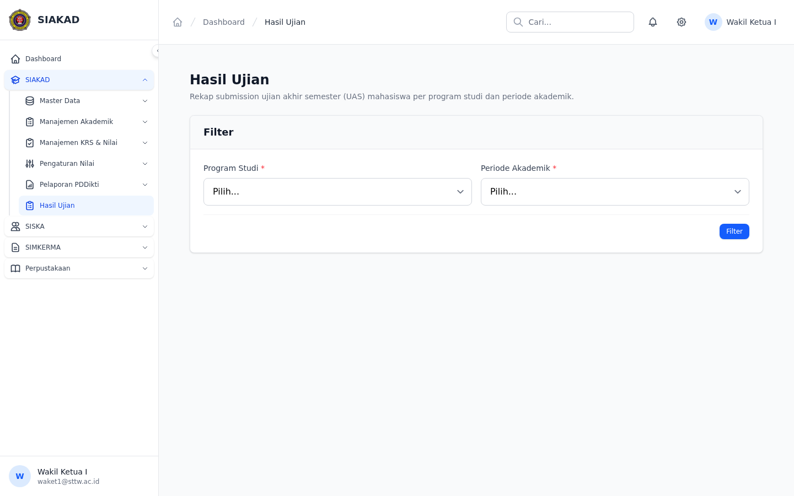
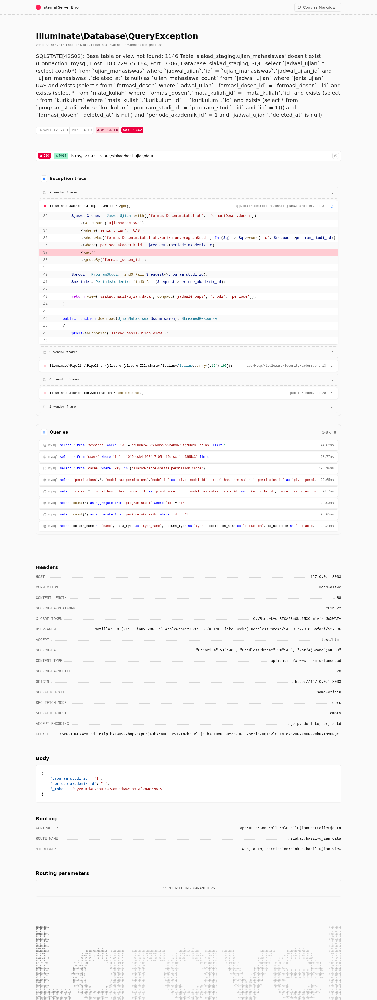

# Workflow Report: Hasil Ujian

**Tanggal**: 2026-07-12
**Role**: Wakil Ketua I / Dosen
**Modul**: SIAKAD (E-Learning)
**Fitur**: Hasil Ujian — Dosen View Exam Submissions
**Status**: Berhasil

## Deskripsi

Migrasi fitur Hasil Ujian dari E-Learning CI3 (`dosen/Hasil.php`) ke SIAKAD Laravel. Dosen dapat melihat jadwal ujian (UAS) dan daftar mahasiswa yang sudah mengumpulkan file ujian.

## Commit Summary

| Commit | Type | Deskripsi |
|--------|------|-----------|
| `6ab1e984` | feat | Migration, model, controller, 3 views, sidebar, permission, 4 tests |
| `809f3727` | fix | Thermos bug review: IDOR guard, N+1, permission dosen, download route |
| `cf06e8db` | fix | Route order: download before wildcard show |
| `09e9cd18` | fix | Post-deploy: `$table` property missing → Laravel auto-pluralized to `ujian_mahasiswas` |

## Bug Ditemukan (Post-Deploy)

**Error**: `SQLSTATE[42S02]: Base table or view not found: 1146 Table 'siakad_staging.ujian_mahasiswas' doesn't exist`

**Root cause**: Model `UjianMahasiswa` tidak memiliki `protected $table`. Laravel auto-pluralizes `UjianMahasiswa` → `ujian_mahasiswas`, tapi tabel legacy bernama `ujian_mahasiswa` (singular — tanpa 's').

**Kenapa Tests Lolos**: 4 Pest tests hanya cover auth + validation form — tidak ada yang mengeksekusi query `withCount('ujianMahasiswa')` di `HasilUjianController::data()`. Bug baru muncul saat user melakukan filter di staging.

**Fix**: Tambah `protected $table = 'ujian_mahasiswa'` di model.

**Deploy**: CI deploy staging broken (SSH key expired) — deploy manual via VPS tunnel.

*Error 500 saat filter: `ujian_mahasiswas` table not found.*

*Halaman filter Hasil Ujian: Select2 Program Studi + Select Periode Akademik.*

*Tabel jadwal ujian (UAS): Nama MK, Nama Dosen, Jumlah Mhs, Jumlah Submit, Aksi Detail.*

## Fitur

| Fitur | Status |
|-------|--------|
| Filter per Prodi + Periode | ✅ |
| List Jadwal Ujian (UAS) | ✅ |
| Detail Mahasiswa Submissions | ✅ |
| Download File Ujian | ✅ |
| Auth + Permission Gate | ✅ |
| Pest Tests (4/4) | ✅ |
| Thermos Bug Review | ✅ (2 Critical + 4 High fixed) |
| Thermos Quality Review | ✅ (2 Critical fixed) |

## Temuan Thermos

**Bug Review (2 Critical, 4 High, 4 Medium):**
- Critical #1: IDOR in show() — no jenis_ujian scope → fixed with `where('jenis_ujian', 'UAS')`
- Critical #2: N+1 in data.blade.php → fixed with `withCount('ujianMahasiswa')`
- High #5: dosen role missing permission → added to seeder
- High #6: Storage::url() unsafe → replaced with authZ-gated download route

**Quality Review (2 Critical, 5 High):**
- Critical #6: Route order /{wildcard} before /download → swapped
- Critical #17: dosen unscoped access → noted as tech debt (future scoping by formasiDosen.dosen_id)

## Catatan

- Fitur di-deploy via PR #518 + hotfix `09e9cd18`.
- Permission: `siakad.hasil-ujian.view` → waket1, ketua, dosen.
- Dosen saat ini bisa melihat semua UAS (belum discope by dosen_id) — tech debt.
- Data submission (`ujian_mahasiswa`) masih kosong — perlu integrasi upload dari mahasiswa.
- 4/4 Pest tests pass, pint clean.
- **⚠️ CI deploy staging broken** — `CPANEL_SSH_KEY` expired, semua deploy gagal. Hotfix dideploy manual via VPS tunnel.
- **⚠️ Test gap**: query `withCount('ujianMahasiswa')` tidak tertutup oleh test — tambahkan integration test untuk endpoint POST `/siakad/hasil-ujian/data`.
