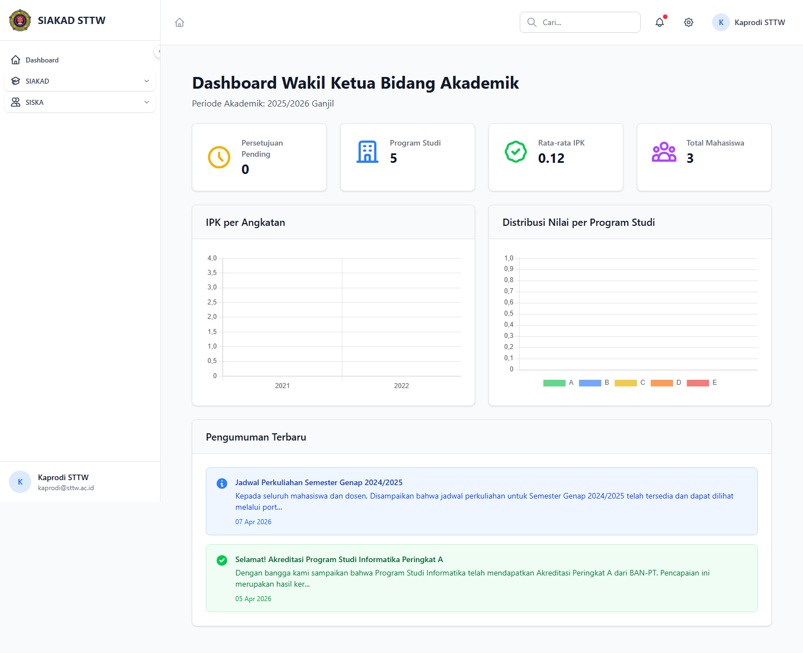
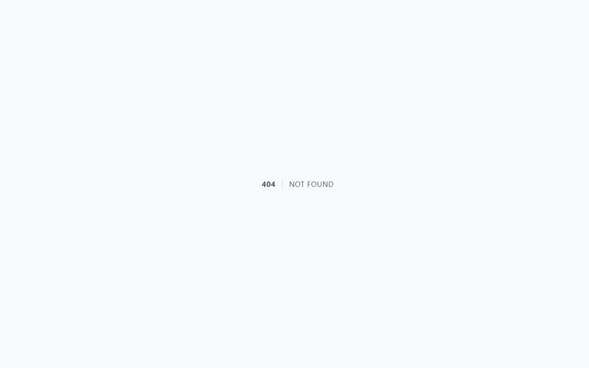
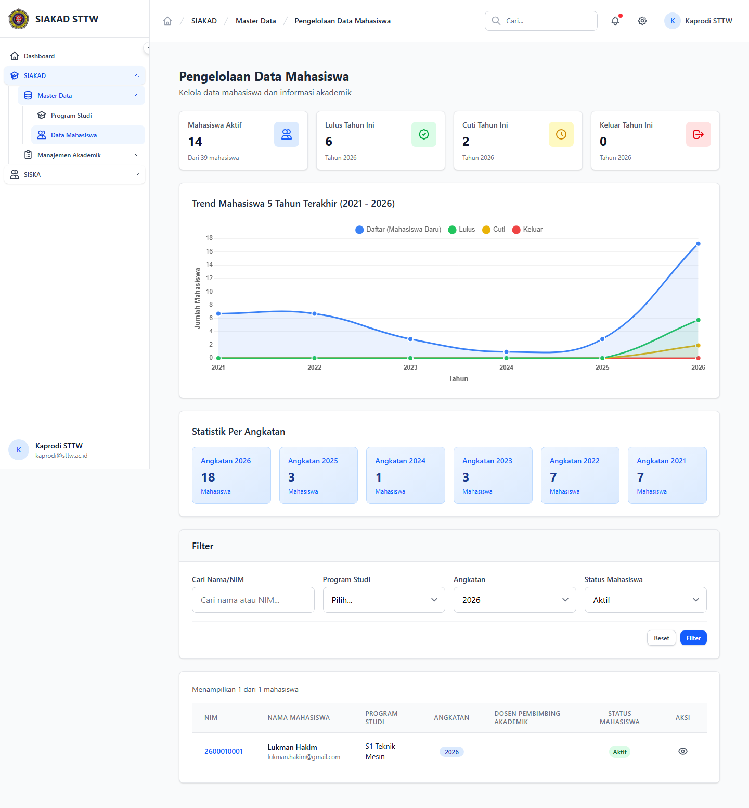
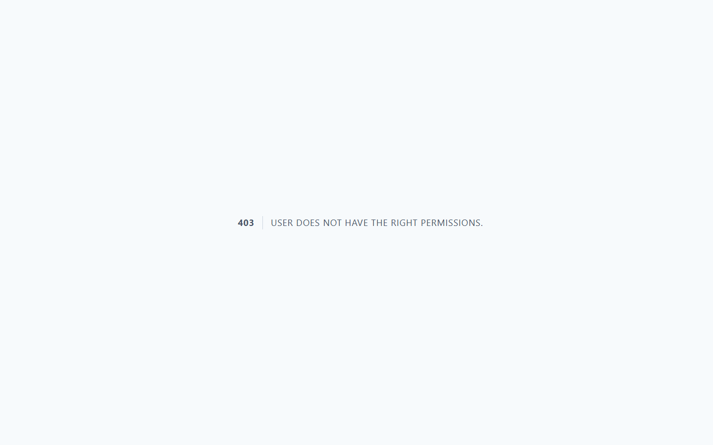
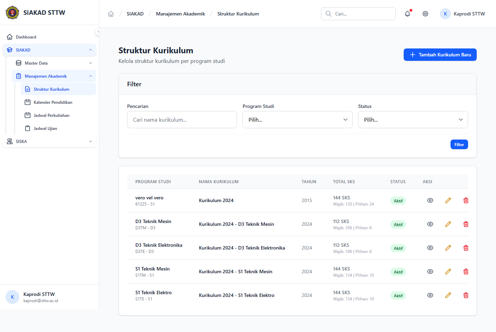
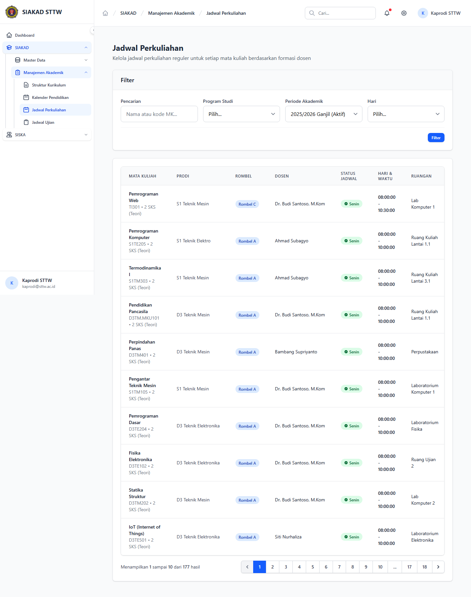

# SIAKAD — Kaprodi Akademik (Kaprodi)

- **Tanggal:** 2026-04-22
- **Role:** kaprodi (akun ad-hoc `kaprodi@sttw.ac.id`, password `password`)
- **Modul:** SIAKAD (akses kaprodi)
- **Status:** ⚠️ Partial — beberapa permission denied + 1 modul tidak terjangkau (KRS index)

## Ringkasan

Scan akses SIAKAD untuk role **kaprodi**. Tidak ada route SIAKAD yang khusus kaprodi — kaprodi memakai route admin SIAKAD biasa namun dibatasi oleh permission. Hasil scan menemukan kombinasi 200/403/404 yang menggambarkan scope efektif role:

- **Boleh:** Dashboard, Kurikulum, Jadwal Perkuliahan, Mahasiswa (auto-filter angkatan terbaru).
- **Forbidden (403):** Dosen, Mata Kuliah — meskipun role kaprodi secara konvensional perlu melihat/edit data ini.
- **404:** `/siakad/krs` — index KRS tidak punya route untuk kaprodi (KRS approval kaprodi terjadi via SISKA/PKL/TA endpoint, bukan SIAKAD).

## Halaman

| # | Halaman | URL | Status | Catatan |
|---|---|---|---|---|
| 1 | Dashboard SIAKAD | `/siakad/dashboard` | 200 | render normal |
| 2 | KRS — Index | `/siakad/krs` | **404** | route tidak terdaftar untuk kaprodi |
| 3 | Mahasiswa — Index | `/siakad/mahasiswa?angkatan=2026&status_mahasiswa=Aktif` | 200 | auto-filter scope angkatan/status |
| 4 | Dosen — Index | `/siakad/dosen` | **403** | permission `siakad.dosen.view` tidak di-assign ke kaprodi |
| 5 | Mata Kuliah — Index | `/siakad/mata-kuliah` | **403** | permission `siakad.mata-kuliah.view` tidak di-assign |
| 6 | Kurikulum — Index | `/siakad/kurikulum` | 200 | |
| 7 | Jadwal Perkuliahan — Index | `/siakad/jadwal-perkuliahan` | 200 | |

## Screenshots

### 03 Dashboard SIAKAD

### 04 KRS Index — 404

### 05 Mahasiswa Index

### 06 Dosen Index — 403

### 07 Mata Kuliah Index — 403

### 08 Kurikulum Index

### 09 Jadwal Perkuliahan Index

## Temuan & Masalah

### ⚠️ Informational — Permission scope kaprodi terlihat lebih sempit dari ekspektasi

Kombinasi 403 pada **Dosen** & **Mata Kuliah** dan 404 pada **KRS** mengindikasikan bahwa kaprodi tidak punya halaman SIAKAD ringkasan untuk:

- Daftar dosen home base prodi (kebutuhan akreditasi/borang).
- Daftar mata kuliah aktif prodi (untuk verifikasi kurikulum).
- Approval/ringkasan KRS mahasiswa per prodi.

**Status:** belum diangkat sebagai bug — kemungkinan by-design (kaprodi menggunakan modul **LPM Kaprodi** yang sudah ada, dan approval KRS dilakukan via menu dosen wali / SISKA). Konfirmasi product owner diperlukan jika akses ini memang dibutuhkan.

### 🛈 Catatan setup

Akun `kaprodi@sttw.ac.id` **belum tersedia di seeder default** — dibuat ad-hoc untuk keperluan scan ini. Seeder produksi sebaiknya menambahkan satu akun kaprodi sample agar QA & user-story berjalan tanpa langkah manual.

## Catatan Skenario

- Recording dengan akun ad-hoc kaprodi.
- Auto-filter pada `/siakad/mahasiswa` adalah behavior controller (scoping otomatis untuk role kaprodi).
