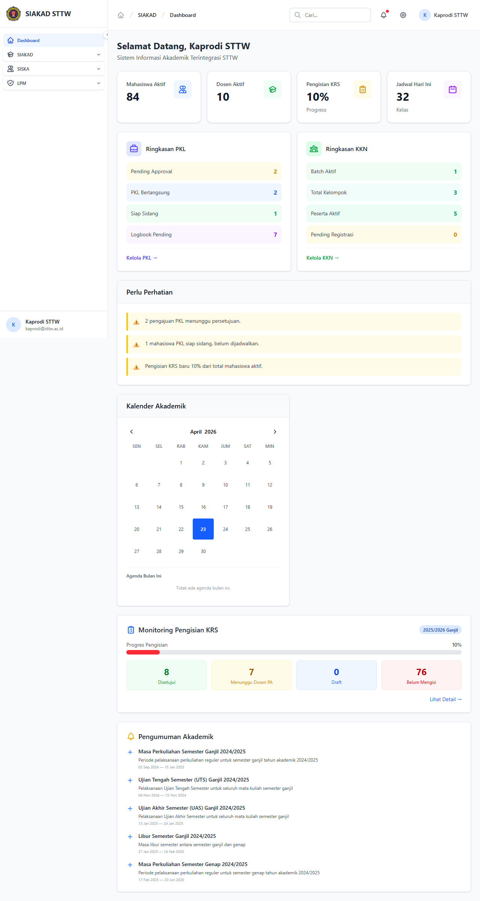
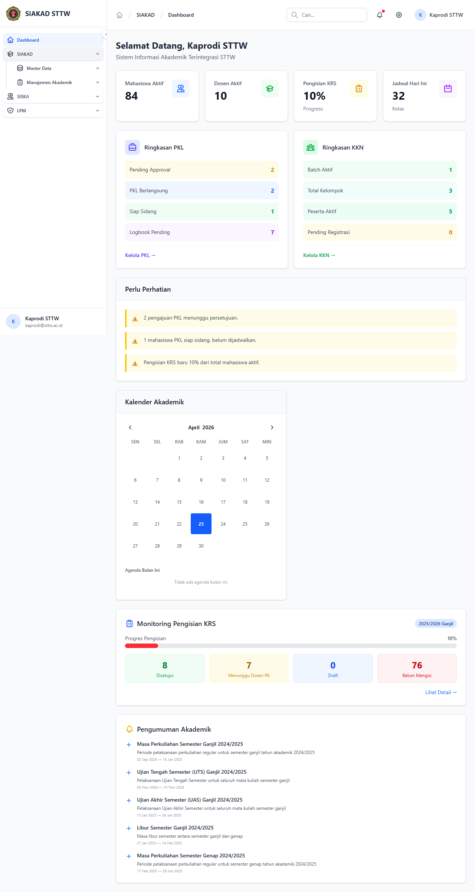
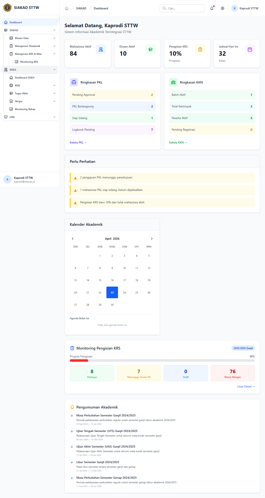
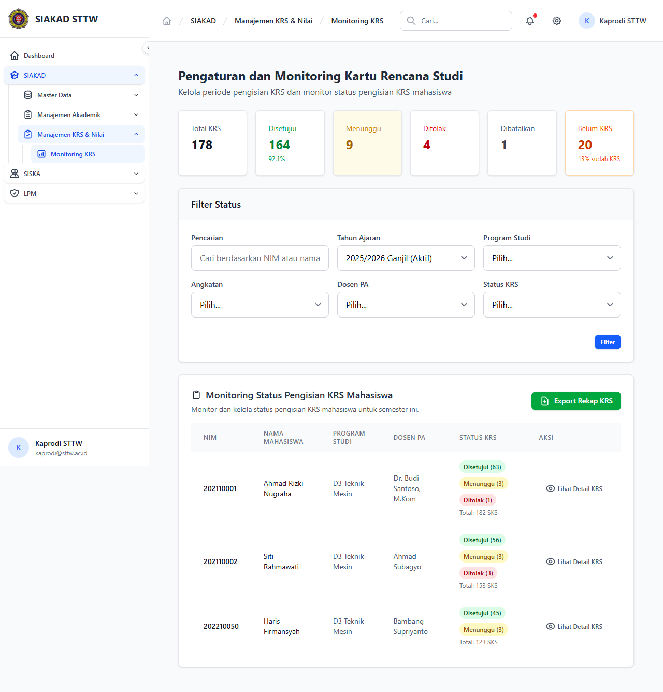
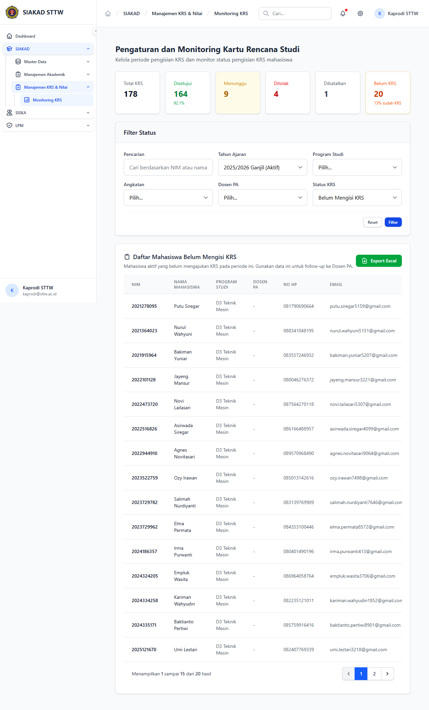
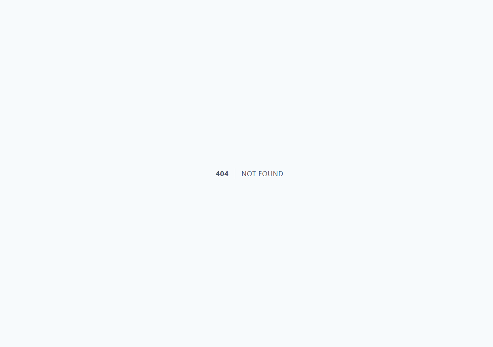

# Workflow Report: Monitoring KRS untuk Kaprodi (Auto-Scoped per Prodi)

**Tanggal**: 2026-04-23
**Role**: kaprodi (`kaprodi@sttw.ac.id`, prodi: D3 Teknik Mesin)
**Modul**: SIAKAD
**Fitur**: Monitoring KRS (auto-scoped per prodi)
**Status**: ✅ Berhasil

## Deskripsi Workflow

Memverifikasi alur Monitoring KRS untuk role **Kaprodi** setelah PR #149 (kaprodi prodi-scoped monitoring) dan PR #150 (sidebar visibility fix). Kaprodi memegang permission baru `siakad.krs.view-prodi` (bukan `siakad.krs.view-all`), sehingga:

1. Sidebar harus menampilkan menu **Monitoring KRS** di grup *Manajemen KRS & Nilai*.
2. Halaman index hanya menampilkan mahasiswa dari prodi yang dipimpin kaprodi (D3 Teknik Mesin), tidak peduli filter program studi yang diisi.
3. Detail mahasiswa dari prodi lain harus mengembalikan 404 (scope enforcement).

## Ringkasan

- ✅ Sidebar menampilkan **Monitoring KRS** di grup *SIAKAD > Manajemen KRS & Nilai* untuk kaprodi.
- ✅ Index `siakad.monitoring-krs.index` hanya memuat mahasiswa D3 Teknik Mesin (35 mhs); dropdown *Program Studi* hanya berisi opsi prodi sendiri.
- ✅ Filter status KRS bekerja (mis. `belum`, `disetujui`).
- ✅ Detail mahasiswa dalam prodi (`/siakad/monitoring-krs/1`) tampil normal.
- ✅ Detail mahasiswa luar prodi (`/siakad/monitoring-krs/6`) mengembalikan **HTTP 404** — scope enforcement berfungsi.

## Langkah-langkah

### 1. Dashboard Kaprodi setelah Login

**Deskripsi**: Setelah login dengan akun `kaprodi@sttw.ac.id`, kaprodi mendarat di Dashboard yang menampilkan ringkasan widget institusi (termasuk widget *Monitoring Pengisian KRS* di main content area).

**URL**: `http://127.0.0.1:8000/dashboard`

### 2. Buka Sidebar Grup SIAKAD

**Deskripsi**: Klik header **SIAKAD** di sidebar untuk meng-expand. Tampak subgrup *Master Data*, *Manajemen Akademik*, dan **Manajemen KRS & Nilai** (sebelum PR #150, grup ini tidak terlihat untuk kaprodi karena permission gating hanya cek `siakad.krs.view-all`).

**URL**: `http://127.0.0.1:8000/dashboard`

### 3. Buka Subgrup Manajemen KRS & Nilai

**Deskripsi**: Klik **Manajemen KRS & Nilai** untuk meng-expand. Item **Monitoring KRS** kini terlihat untuk kaprodi (sebelumnya hilang karena hanya cek `siakad.krs.view-all`).

**URL**: `http://127.0.0.1:8000/dashboard`

### 4. Halaman Index Monitoring KRS (Auto-Scoped)

**Deskripsi**: Klik **Monitoring KRS**. Halaman menampilkan daftar mahasiswa **hanya dari prodi D3 Teknik Mesin**, dengan ringkasan status KRS per mahasiswa (Disetujui / Menunggu / Ditolak / Total SKS). Dropdown filter *Program Studi* hanya berisi opsi `D3 Teknik Mesin` — kaprodi tidak bisa memilih prodi lain dari UI.

**URL**: `http://127.0.0.1:8000/siakad/monitoring-krs`

### 5. Filter Status KRS = Belum Mengisi

**Deskripsi**: Pilih status `Belum Mengisi` di filter dan klik **Filter**. Tabel menampilkan mahasiswa yang belum mengisi KRS untuk periode aktif. Periode default ke `2025/2026 Ganjil (Aktif)`.

**URL**: `http://127.0.0.1:8000/siakad/monitoring-krs?status_krs=belum`

### 6. Detail KRS Mahasiswa (Dalam Prodi)

**Deskripsi**: Klik **Lihat Detail KRS** pada mahasiswa `202110001 - Ahmad Rizki Nugraha`. Halaman detail menampilkan informasi mahasiswa, daftar mata kuliah yang diambil, dan status pengajuan per mata kuliah. Akses sukses karena mahasiswa berasal dari prodi kaprodi.

**URL**: `http://127.0.0.1:8000/siakad/monitoring-krs/1`

## Skenario Alternatif

### Skenario A: Akses Mahasiswa Luar Prodi (Scope Enforcement)

**Deskripsi**: Memverifikasi bahwa kaprodi tidak bisa mengakses detail KRS mahasiswa dari prodi lain meskipun URL diketik manual. Mahasiswa ID `6` berasal dari prodi non-D3-Teknik-Mesin.

#### A.1. Akses Detail KRS Mahasiswa ID 6 (Prodi Lain)

**Deskripsi**: Navigasi langsung ke `/siakad/monitoring-krs/6`. Server merespon **HTTP 404 Not Found** — controller `MonitoringKrsController::show` melakukan scope check terhadap `program_studi_id` user.

**URL**: `http://127.0.0.1:8000/siakad/monitoring-krs/6`

## Temuan & Masalah

| # | Halaman | URL | Kategori | Deskripsi | Screenshot | Prioritas |
|---|---------|-----|----------|-----------|------------|-----------|
| — | — | — | — | Tidak ada temuan baru. Sebelum PR #150, sidebar **Monitoring KRS** tidak muncul untuk kaprodi (kategori `missing-sidebar`). Sudah diperbaiki di PR #150 dan diverifikasi di laporan ini. | — | — |

## Catatan

- Data prep: user `kaprodi@sttw.ac.id` di-link ke `program_studi_id=1` (D3 Teknik Mesin) lewat tinker — seeder default belum melakukan ini, perlu fix terpisah agar kaprodi langsung usable di dev.
- PR #150 (`dev/2026-04-23-kaprodi-sidebar-monitoring`) memperbaiki sidebar visibility untuk kaprodi: grup *Manajemen KRS & Nilai* + item *Monitoring KRS* sekarang menerima permission `siakad.krs.view-prodi` (bukan hanya `siakad.krs.view-all`).
- Test regression: `tests/Feature/Kaprodi/MonitoringScopeTest.php` (12 test, 21 assertion, semua passed).
- Export: tombol export per status KRS tersedia di index, tapi tidak di-screenshot karena memicu file download (sudah dicover oleh test `kaprodi export status-krs returns successful download`).
