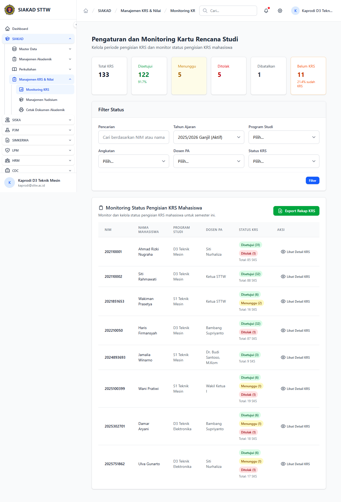

# Workflow Report: Kaprodi Monitoring KRS

**Tanggal**: 2026-05-12
**Role**: kaprodi
**Modul**: siakad
**Fitur**: kaprodi-monitoring-krs
**Status**: ✅ Berhasil

## Deskripsi Workflow

Monitoring pengisian KRS dengan filter prodi (TASK-104).

## Ringkasan

Halaman diakses pada delta scan pertengahan April 2026.

## Langkah-langkah

### 1. Buka halaman Kaprodi Monitoring KRS

**Deskripsi**: Pengguna (kaprodi) membuka `/siakad/monitoring-krs`.

**URL**: `http://127.0.0.1:8000/siakad/monitoring-krs`

## Temuan & Masalah

_Tidak ada temuan signifikan._

## Catatan

- Diambil otomatis pada batch scan delta pertengahan April 2026.
