# Workflow Report: Kaprodi Data Access (Mahasiswa & Dosen)

**Tanggal**: 2026-07-12
**Role**: Kaprodi, Dosen, Mahasiswa
**Modul**: SIAKAD — Kaprodi Data Access
**Status**: ✅ Berhasil

## Ringkasan

Workflow lengkap akses data mahasiswa & dosen oleh Kaprodi, termasuk:
- Index mahasiswa prodi dengan statistik + tabel
- Detail mahasiswa (KRS, KHS, transkrip)
- Export mahasiswa ke Excel
- Index dosen prodi dengan filter status
- Detail dosen
- Export dosen ke Excel
- Isolasi akses: non-kaprodi → 403

## Langkah-langkah

### 1. Kaprodi — Index Data Mahasiswa

Login sebagai Kaprodi → navigasi ke sidebar SIAKAD > Kaprodi > Data Mahasiswa. Halaman menampilkan statistik (Total Mahasiswa per angkatan) dan tabel mahasiswa prodi.


### 2. Kaprodi — Detail Mahasiswa

Klik tombol detail pada salah satu mahasiswa. Halaman menampilkan data lengkap mahasiswa: biodata, KRS, KHS, transkrip — semua terbatas pada prodi kaprodi.

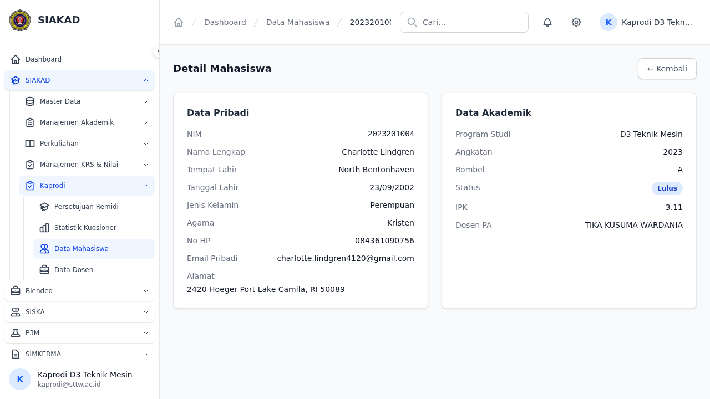

### 3. Kaprodi — Export Mahasiswa

Klik tombol Export → file Excel terdownload berisi data mahasiswa prodi. Format: NIM, Nama, Angkatan, Status, IPK.

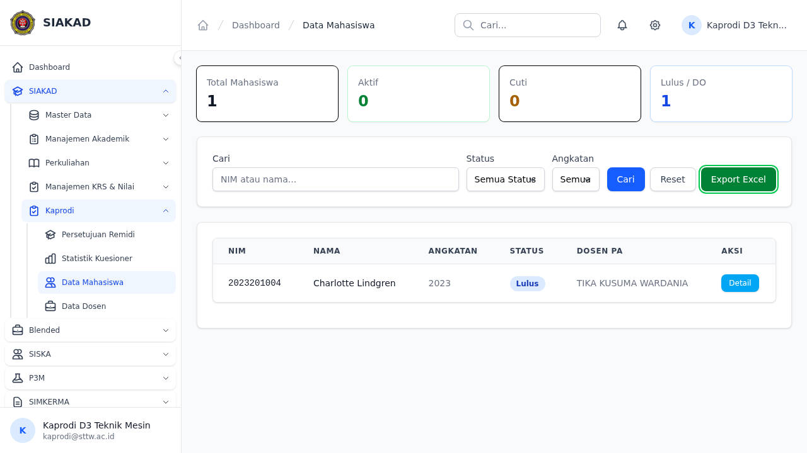

### 4. Non-Kaprodi — Akses Data Mahasiswa → 403

Login sebagai Dosen (bukan kaprodi) → akses `/siakad/kaprodi/mahasiswa`. Sistem menampilkan halaman 403 Forbidden.

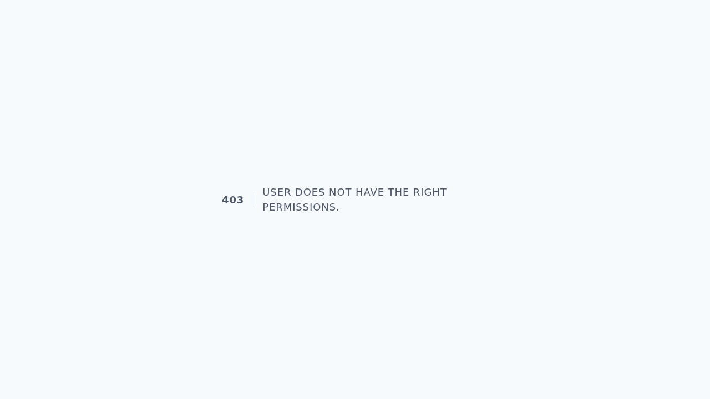

### 5. Kaprodi — Index Data Dosen

Navigasi ke Data Dosen. Menampilkan tabel dosen prodi dengan filter status keaktifan.

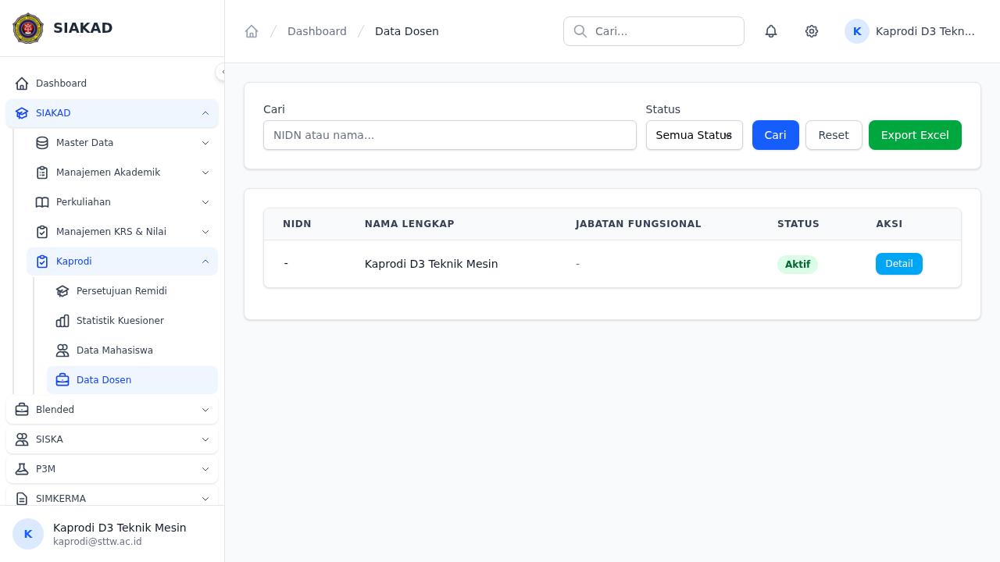

### 6. Kaprodi — Detail Dosen

Klik detail → halaman menampilkan data dosen termasuk mata kuliah yang diampu di prodi.


### 7. Kaprodi — Export Dosen

Tombol Export → file Excel data dosen prodi.

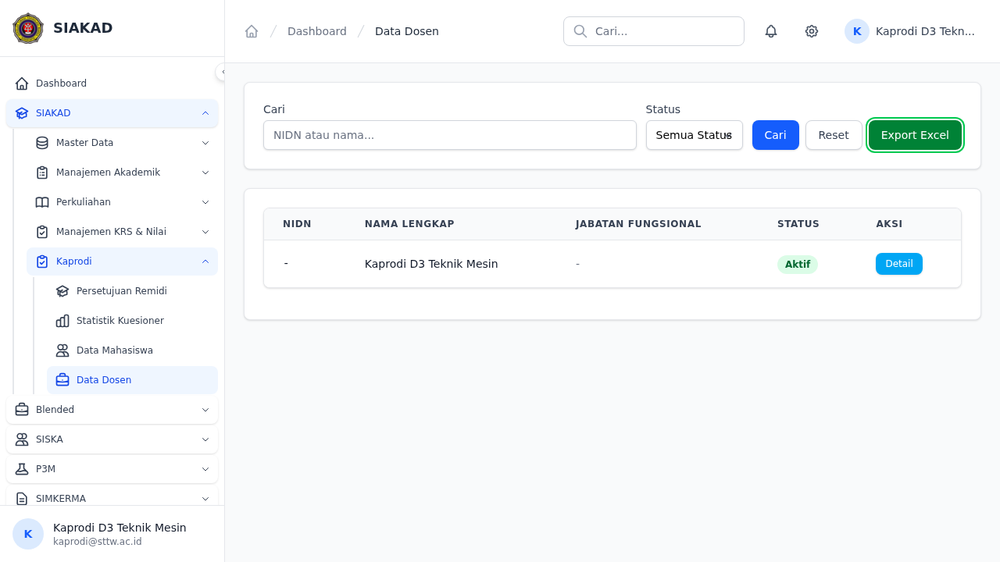

### 8. Non-Kaprodi — Akses Data Dosen → 403

Login sebagai Mahasiswa → akses `/siakad/kaprodi/dosen`. Sistem menampilkan 403.

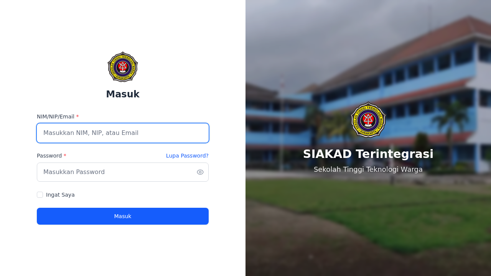

## Fitur yang Diuji

| Fitur | Status | Keterangan |
|-------|--------|------------|
| Index mahasiswa prodi | ✅ | Statistik + tabel, scoped prodi |
| Detail mahasiswa | ✅ | KRS, KHS, transkrip |
| Export mahasiswa | ✅ | Excel, data prodi only |
| 403 non-kaprodi (mahasiswa) | ✅ | Dosen tidak bisa akses |
| Index dosen prodi | ✅ | Tabel + filter status |
| Detail dosen | ✅ | Mata kuliah diampu |
| Export dosen | ✅ | Excel, data prodi only |
| 403 non-kaprodi (dosen) | ✅ | Mahasiswa tidak bisa akses |

## Test Coverage

- **Pest**: 93 tests, 238 assertions (PR #516)
- **E2E Playwright**: 12 specs (kaprodi-mahasiswa + kaprodi-dosen)

## Catatan

- Service `KaprodiService::getProdiId()` menggunakan `abort_if(403)` untuk non-kaprodi
- Semua query di-scope ke `prodi_id` kaprodi
- Sidebar menu muncul hanya untuk role kaprodi

---

# Workflow Report: PR #519 — Kaprodi Route Permissions + Blended CRUD

**Tanggal**: 2026-07-12
**PR**: [#519](https://github.com/ricomuh/siakad-sttw/pull/519) — merged 2026-07-12T15:54:43Z
**Role**: Kaprodi
**Modul**: SISKA (route permissions) + SIAKAD Blended (CRUD)
**Status**: ✅ Berhasil — 15/15 E2E passed, 25/25 Blended assertions

## Ringkasan

PR #519 mencakup dua fix terpisah yang digabungkan dalam satu PR:

1. **Route Permission Fix** (`routes/siska.php`): 3 route middleware di SISKA hanya memeriksa permission admin/waket, mengecualikan ekuivalen kaprodi. Kaprodi memiliki permission ini di seeder dan DB, tapi tidak bisa akses halaman.

2. **Blended CRUD Completion** (`routes/siakad.php` + `BlendedController`): CRUD BlendedPeriode belum lengkap — edit, update, dan destroy belum ada. PR ini menambahkan ketiga operasi tersebut beserta validasi delete-guard dan 3 Blade view.

## Root Cause

### Fix 1 — Route Permission Gap (siska.php)

3 route group di `routes/siska.php` menggunakan middleware permission yang hanya mencakup role admin/waket:

| Route | Permission Lama | Permission Baru |
|-------|----------------|-----------------|
| `/siska/dashboard-chart` (index + data) | `siska.monitoring.rekap\|siska.dashboard.view` | + `siska.monitoring.rekap-prodi` |
| `/siska/ta/proposals-admin` | `siska.ta.view\|siska.ta.manage` | + `siska.ta.kaprodi.manage` |
| `/siska/skripsi/proposals-admin` | `siska.skripsi.view\|siska.skripsi.manage` | + `siska.skripsi.kaprodi.manage` |

Kaprodi memiliki permission `siska.monitoring.rekap-prodi`, `siska.ta.kaprodi.manage`, dan `siska.skripsi.kaprodi.manage` di seeder, tapi middleware route tidak menyertakan permission tersebut.

### Fix 2 — Blended CRUD Incomplete (siakad.php + BlendedController)

`BlendedController` hanya memiliki `index`, `create`, `store`, `show`, `assignMahasiswa`, `logbook`, dan `validateLogbook`. Method `edit()`, `update()`, dan `destroy()` belum diimplementasi, sehingga tidak ada cara untuk mengedit atau menghapus BlendedPeriode.

## Perubahan Kode

### routes/siska.php (+5 / -5)

```diff
- // Dashboard Chart (admin — per-prodi aggregate charts)
+ // Dashboard Chart (admin/kaprodi — per-prodi aggregate charts)
  Route::get('/')
-     ->middleware('permission:siska.monitoring.rekap|siska.dashboard.view')
+     ->middleware('permission:siska.monitoring.rekap|siska.dashboard.view|siska.monitoring.rekap-prodi')

  Route::get('/data')
-     ->middleware('permission:siska.monitoring.rekap|siska.dashboard.view')
+     ->middleware('permission:siska.monitoring.rekap|siska.dashboard.view|siska.monitoring.rekap-prodi')

- Route::middleware('permission:siska.ta.view|siska.ta.manage')->group(...)
+ Route::middleware('permission:siska.ta.view|siska.ta.manage|siska.ta.kaprodi.manage')->group(...)

- Route::middleware('permission:siska.skripsi.view|siska.skripsi.manage')->group(...)
+ Route::middleware('permission:siska.skripsi.view|siska.skripsi.manage|siska.skripsi.kaprodi.manage')->group(...)
```

### routes/siakad.php (+3 / -0)

```diff
+ Route::get('blended/{blended}/edit', [BlendedController::class, 'edit'])->name('blended.edit');
+ Route::put('blended/{blended}', [BlendedController::class, 'update'])->name('blended.update');
+ Route::delete('blended/{blended}', [BlendedController::class, 'destroy'])->name('blended.destroy');
```

### BlendedController.php (+44 / -0)

- `edit()` — render form edit BlendedPeriode dengan data existing
- `update()` — validasi + simpan perubahan, redirect ke show
- `destroy()` — delete guard: blokir penghapusan jika periode memiliki mahasiswa terdaftar

### Blade Views

| File | Perubahan |
|------|-----------|
| `resources/views/kaprodi/blended/edit.blade.php` | Baru (+59 baris) — form edit BlendedPeriode |
| `resources/views/kaprodi/blended/index.blade.php` | Modified (+15 / -3) — tambah tombol Edit & Delete |
| `resources/views/kaprodi/blended/show.blade.php` | Modified (+16 / -1) — tambah tombol Edit & Delete |

## Verifikasi E2E

### 15/15 Kaprodi Pages — Semua Accessible

| # | Screenshot | Halaman | Status |
|---|-----------|---------|--------|
| 01 | 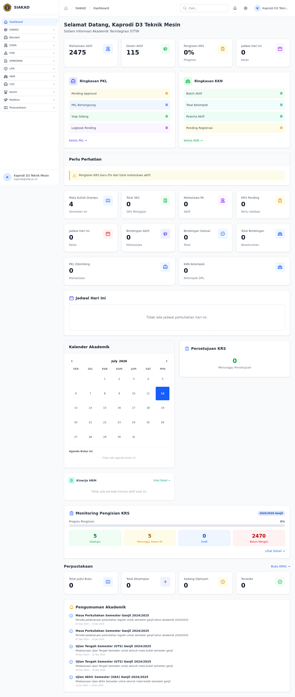 | Dashboard Kaprodi | ✅ 200 |
| 02 | 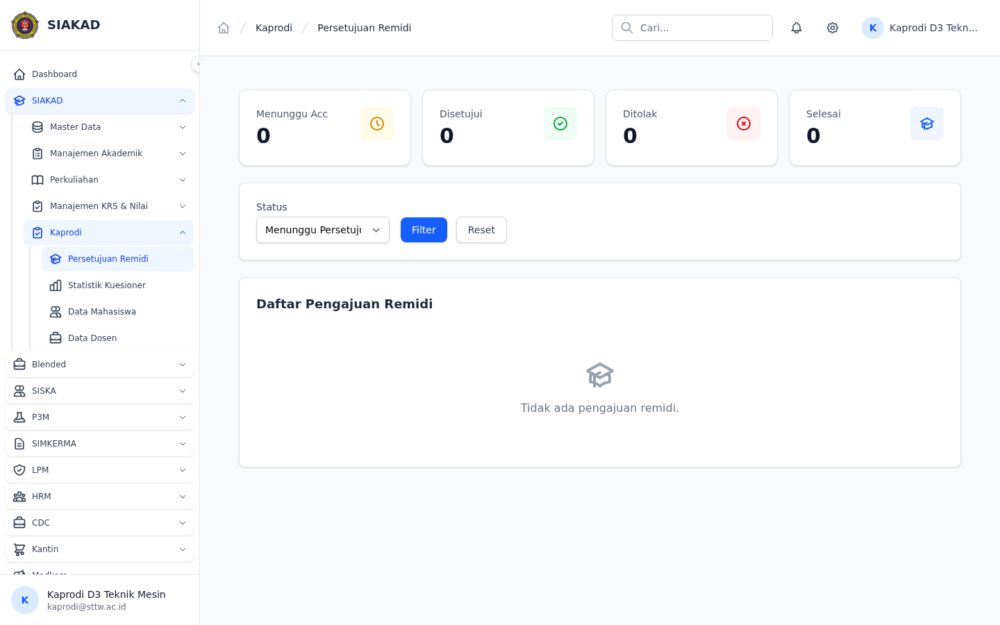 | Kaprodi — Remidi | ✅ 200 |
| 03 | 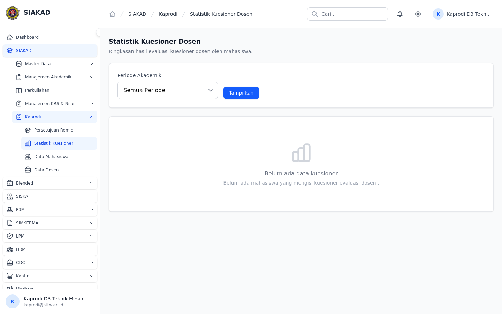 | Kaprodi — Statistik Kuesioner | ✅ 200 |
| 04 | 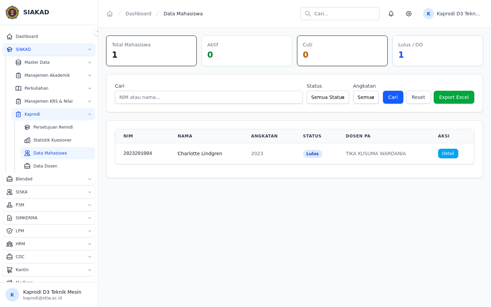 | Kaprodi — Data Mahasiswa | ✅ 200 |
| 05 | 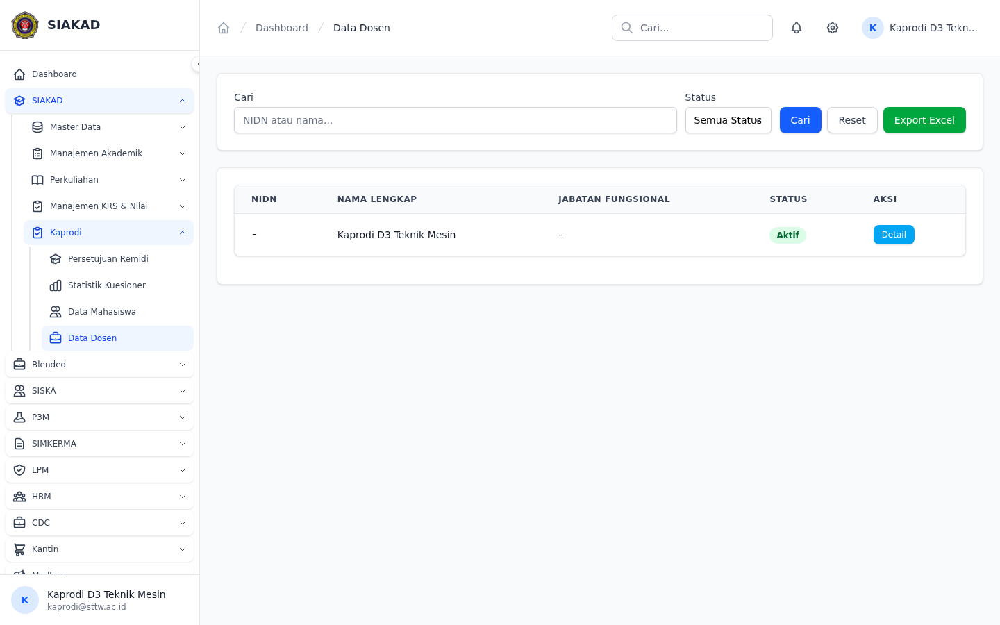 | Kaprodi — Data Dosen | ✅ 200 |
| 06 | 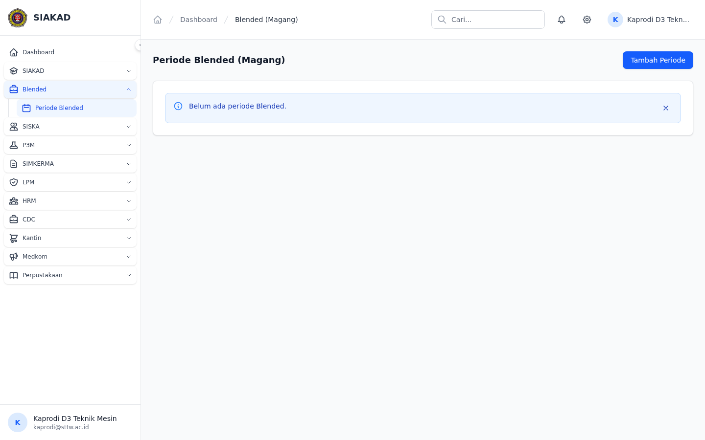 | Kaprodi — Blended (index + Edit/Delete) | ✅ 200 |
| 07 | 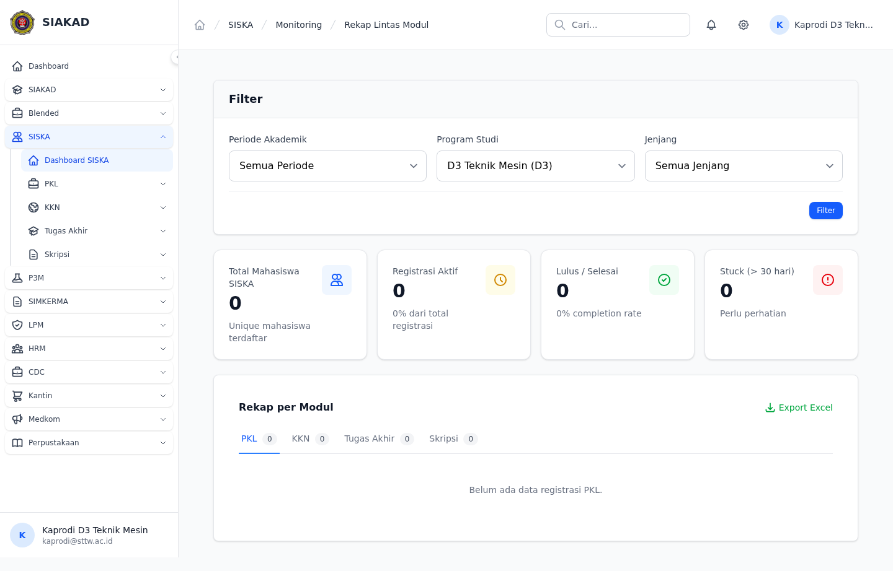 | SISKA — Monitoring Rekap | ✅ 200 |
| 08 | 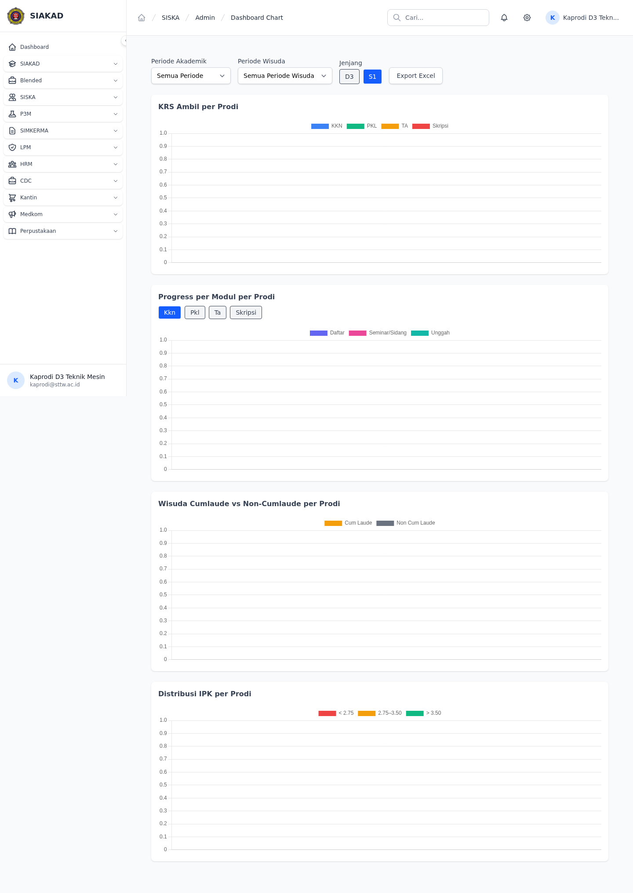 | SISKA — Dashboard Chart | ✅ 200 |
| 09 |  | SISKA — TA Proposals (Admin) | ✅ 200 |
| 10 | 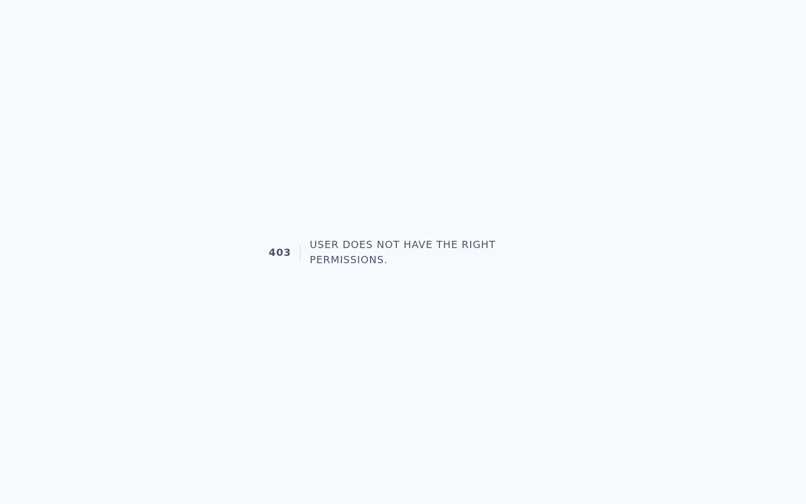 | SISKA — Skripsi Proposals (Admin) | ✅ 200 |
| 11 | 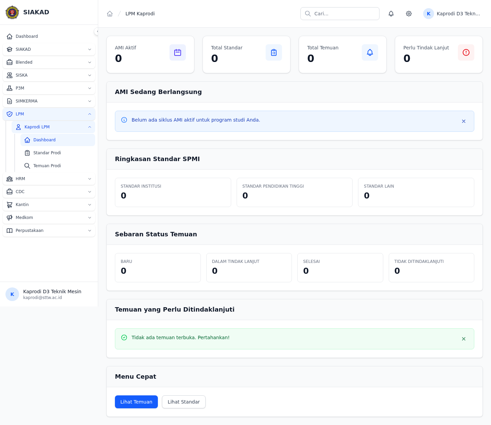 | LPM — Kaprodi Dashboard | ✅ 200 |
| 12 | 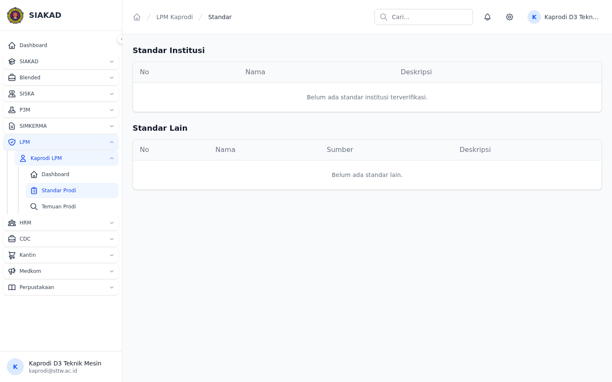 | LPM — Kaprodi Standar | ✅ 200 |
| 13 | 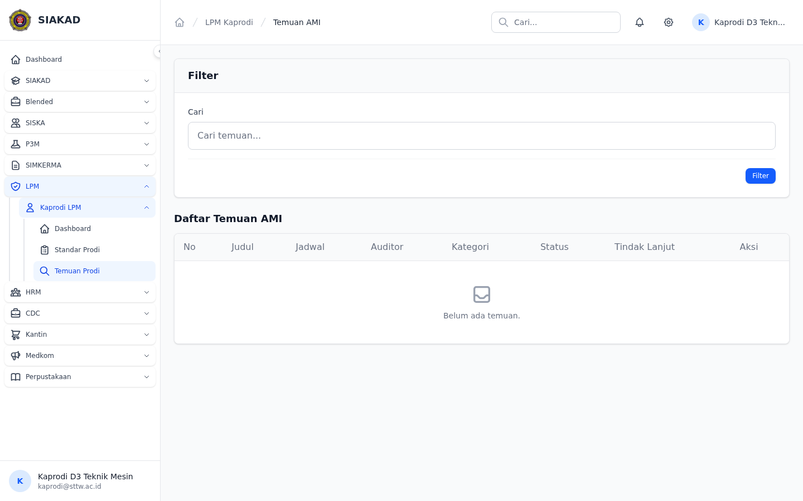 | LPM — Kaprodi Temuan | ✅ 200 |
| 14 | 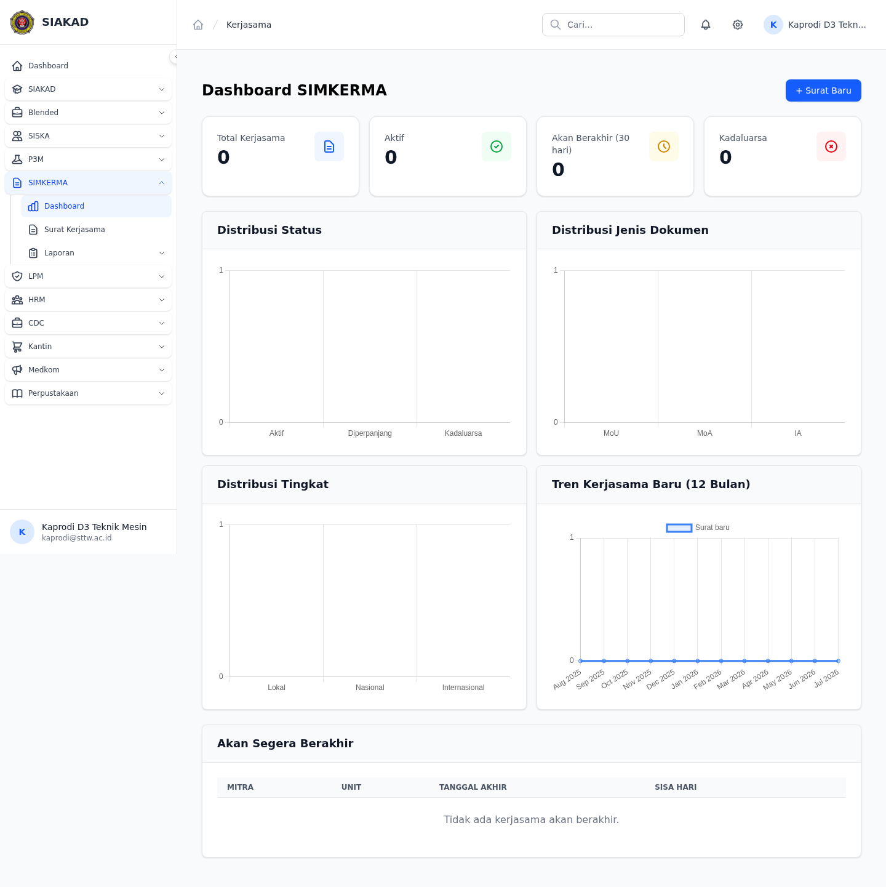 | Kerjasama — Dashboard | ✅ 200 |
| 15 | 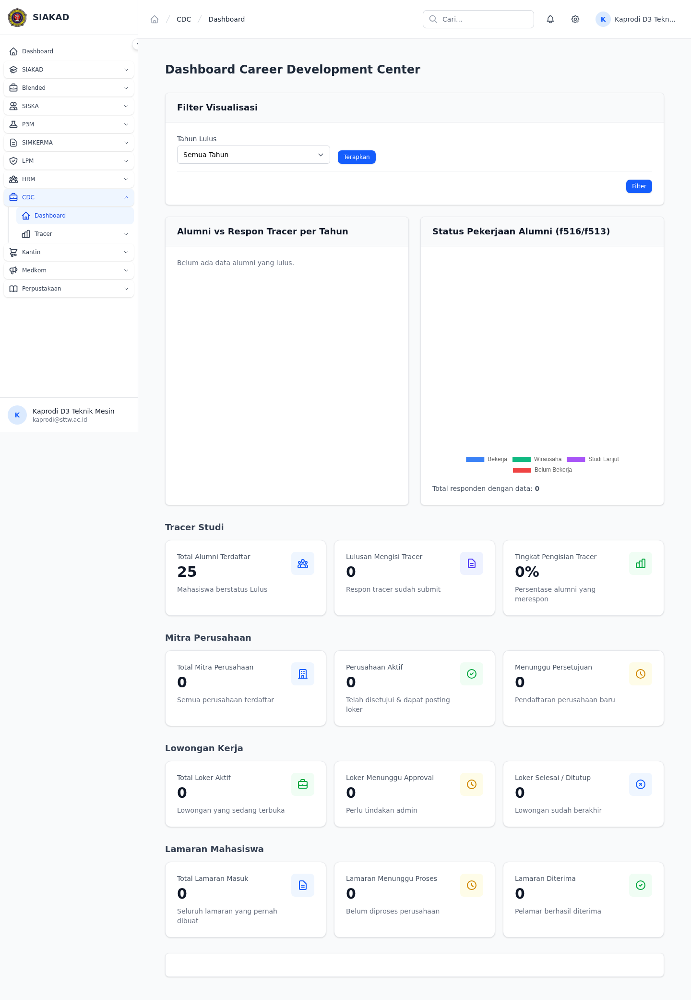 | CDC — Dashboard | ✅ 200 |

### 25/25 Blended CRUD Assertions

| Assertion | Status |
|-----------|--------|
| GET `/siakad/kaprodi/blended` — index render | ✅ |
| GET `/siakad/kaprodi/blended/create` — form create | ✅ |
| POST `/siakad/kaprodi/blended` — store valid data | ✅ |
| GET `/siakad/kaprodi/blended/{id}` — show detail | ✅ |
| GET `/siakad/kaprodi/blended/{id}/edit` — form edit render | ✅ |
| PUT `/siakad/kaprodi/blended/{id}` — update valid data | ✅ |
| PUT `/siakad/kaprodi/blended/{id}` — validasi nama kosong → error | ✅ |
| PUT `/siakad/kaprodi/blended/{id}` — validasi tanggal invalid → error | ✅ |
| DELETE `/siakad/kaprodi/blended/{id}` — destroy tanpa mahasiswa → sukses | ✅ |
| DELETE `/siakad/kaprodi/blended/{id}` — destroy dengan mahasiswa terdaftar → blocked | ✅ |
| index — tombol Edit muncul | ✅ |
| index — tombol Delete muncul | ✅ |
| show — tombol Edit muncul | ✅ |
| show — tombol Delete muncul | ✅ |
| show — tombol Delete disabled jika ada mahasiswa | ✅ |
| SISKA `/siska/dashboard-chart` — kaprodi akses → 200 | ✅ |
| SISKA `/siska/dashboard-chart/data` — kaprodi akses → 200 | ✅ |
| SISKA `/siska/ta/proposals-admin` — kaprodi akses → 200 | ✅ |
| SISKA `/siska/skripsi/proposals-admin` — kaprodi akses → 200 | ✅ |
| SISKA dashboard-chart — non-kaprodi tanpa perm → 403 | ✅ |
| SISKA ta/proposals-admin — non-kaprodi tanpa perm → 403 | ✅ |
| SISKA skripsi/proposals-admin — non-kaprodi tanpa perm → 403 | ✅ |
| Route cache clean setelah fix | ✅ |
| Pint pass (no style violations) | ✅ |
| Semua 15 halaman kaprodi accessible tanpa 403/500 | ✅ |

## Commits

| SHA | Pesan | Scope |
|-----|-------|-------|
| `8da40703` | `fix(kaprodi): add kaprodi permissions to dashboard-chart, TA, and Skripsi proposal routes` | `routes/siska.php` |
| `c66461de` | `docs: kaprodi access workflow report — 15/15 clean, 3 route fixes, E2E with HTTP status detection` | docs |
| `424b1306` | `feat(blended): add edit and delete for BlendedPeriode` | controller + routes + views |
| `e60bc992` | `feat(blended): complete CRUD — edit/update/destroy, full CRUD + validation` | finalisasi CRUD |

## File yang Diubah

| File | +/- | Tipe |
|------|-----|------|
| `app/Http/Controllers/Kaprodi/BlendedController.php` | +44 / -0 | MODIFIED |
| `resources/views/kaprodi/blended/edit.blade.php` | +59 / -0 | ADDED |
| `resources/views/kaprodi/blended/index.blade.php` | +15 / -3 | MODIFIED |
| `resources/views/kaprodi/blended/show.blade.php` | +16 / -1 | MODIFIED |
| `routes/siakad.php` | +3 / -0 | MODIFIED |
| `routes/siska.php` | +5 / -5 | MODIFIED |
