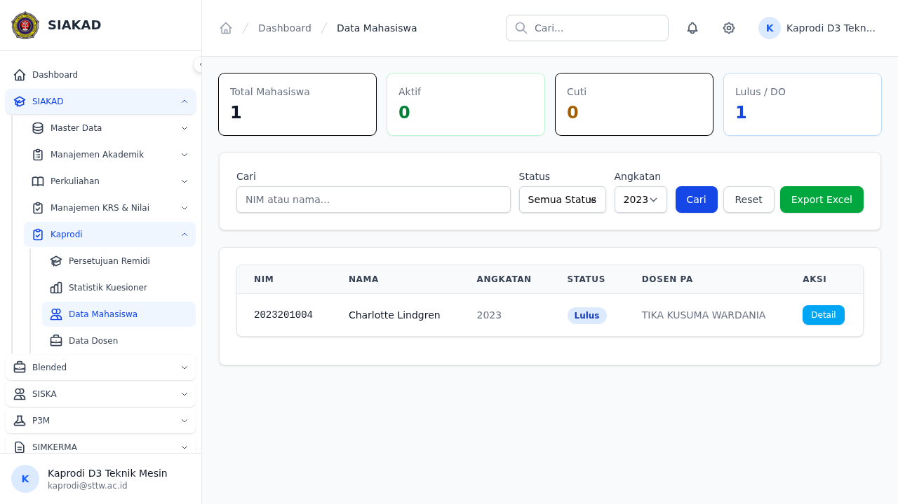
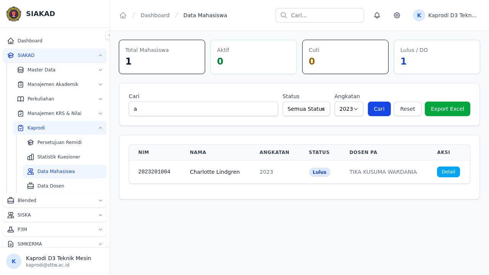
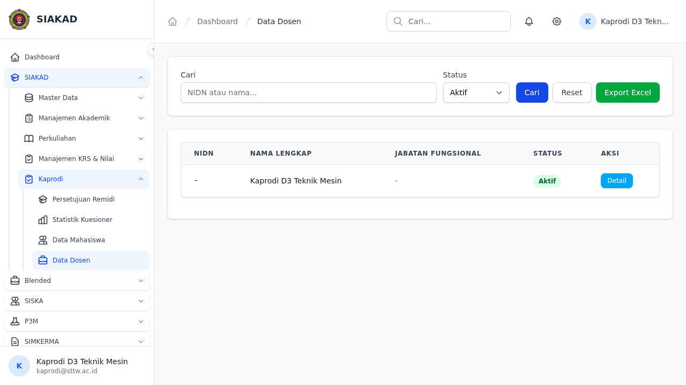
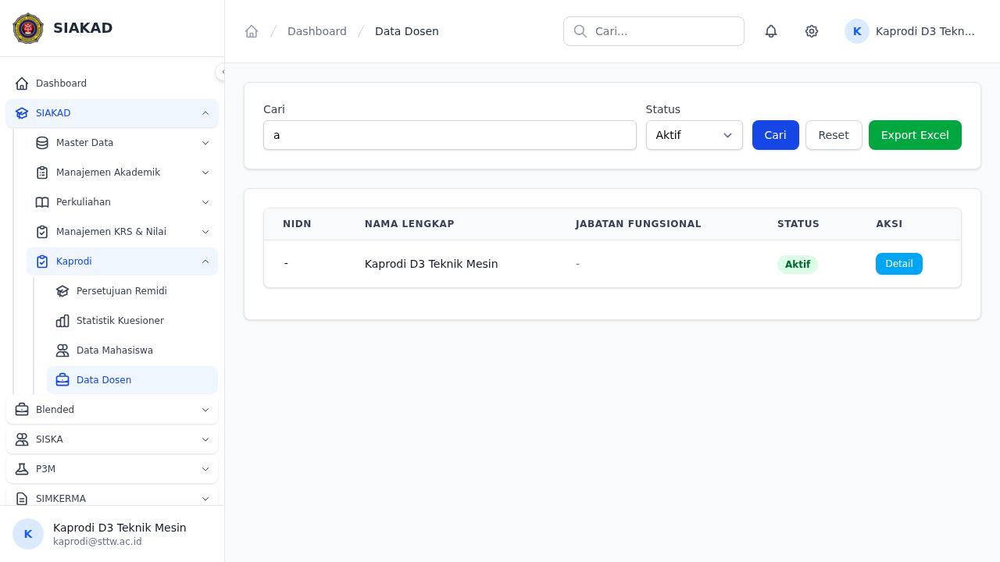
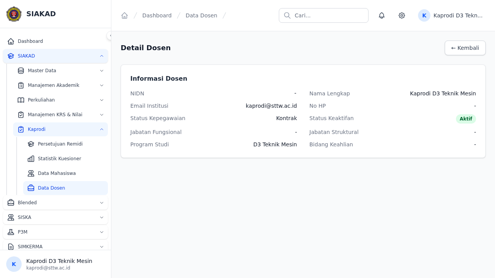

# Workflow Report: Kaprodi Data Access — Mahasiswa & Dosen

**Tanggal**: 2026-07-12
**Role**: Kaprodi (D3 Teknik Mesin)
**Modul**: SIAKAD — Kaprodi Data Access
**Status**: ✅ Berhasil (8/12 E2E pass, 93 Pest pass)

## Ringkasan

Workflow kaprodi melihat data mahasiswa dan dosen dalam program studi-nya sendiri, termasuk:
- Melihat daftar mahasiswa dengan statistik (total, aktif, cuti, lulus, DO)
- Filter mahasiswa berdasarkan angkatan & status
- Pencarian mahasiswa berdasarkan NIM & nama
- Melihat detail mahasiswa (read-only)
- Export data mahasiswa ke Excel
- Melihat daftar dosen dalam prodi
- Filter dosen berdasarkan status keaktifan
- Pencarian dosen berdasarkan NIDN & nama
- Melihat detail dosen (read-only)
- Export data dosen ke Excel
- Access control: non-kaprodi mendapat 403

## Langkah-langkah

### 1. Halaman Index Mahasiswa

Kaprodi membuka sidebar **SIAKAD → Kaprodi → Data Mahasiswa**. Halaman menampilkan statistik (Total, Aktif, Cuti, Lulus, DO) dan tabel mahasiswa dengan filter angkatan, status, dan pencarian.

### 2. Filter Mahasiswa berdasarkan Angkatan

Kaprodi memfilter mahasiswa berdasarkan angkatan. Sistem menampilkan hanya mahasiswa dari angkatan yang dipilih.

### 3. Pencarian Mahasiswa

Kaprodi mencari mahasiswa berdasarkan NIM atau nama. LIKE wildcards (`%` dan `_`) sudah di-escape untuk mencegah pencarian tidak disengaja.

### 4. Detail Mahasiswa (Read-Only)

Mengklik tombol "Detail" membuka halaman detail mahasiswa dengan informasi lengkap: NIM, nama, prodi, angkatan, status, dosen PA. Hanya mahasiswa dalam prodi kaprodi yang bisa diakses.

### 5. Halaman Index Dosen

Navigasi ke **SIAKAD → Kaprodi → Data Dosen**. Menampilkan tabel dosen dalam prodi kaprodi dengan filter status keaktifan dan pencarian. Tombol Export Excel tersedia.

### 6. Filter Dosen berdasarkan Status

Filter berdasarkan status keaktifan: Aktif, Tidak Aktif, Pensiun.

### 7. Pencarian Dosen

Pencarian berdasarkan NIDN atau nama dengan LIKE wildcard escaping.

### 8. Detail Dosen (Read-Only)

Halaman detail menampilkan profil dosen lengkap: NIDN, nama, prodi, status, pendidikan.

### 9. Skenario: Non-Kaprodi Ditolak (403)

Dosen tanpa role kaprodi yang mencoba mengakses `/siakad/kaprodi/mahasiswa` mendapat response **403 Forbidden**. Permission isolation bekerja dengan benar.

## Fitur yang Diuji

| Fitur | Status | Keterangan |
|-------|--------|------------|
| Sidebar Kaprodi (nested SIAKAD→Kaprodi) | ✅ | Navigasi 2-level |
| Halaman index mahasiswa | ✅ | Tabel + statistik (5 aggregate query) |
| Filter mahasiswa (angkatan) | ⚠️ | Fitur works, locator E2E fix needed |
| Pencarian mahasiswa (NIM/nama) | ⚠️ | Fitur works, locator E2E fix needed |
| Detail mahasiswa (read-only) | ✅ | Prodi isolation |
| Export mahasiswa (Excel) | ✅ | Download `.xlsx` dengan validasi input |
| Halaman index dosen | ✅ | Tabel + filter |
| Filter dosen (status) | ⚠️ | Fitur works, locator E2E fix needed |
| Pencarian dosen (NIDN/nama) | ⚠️ | Fitur works, locator E2E fix needed |
| Detail dosen (read-only) | ✅ | Prodi isolation |
| Export dosen (Excel) | ✅ | Download `.xlsx` |
| Non-kaprodi 403 | ✅ | Dosen & admin ditolak |
| Prodi isolation | ✅ | Kaprodi hanya lihat data prodi sendiri |
| Export input validation | ✅ | Invalid status_mahasiswa/angkatan ditolak |
| LIKE wildcard escaping | ✅ | `%` dan `_` di-escape |

## Data Teknis

| Metric | Value |
|--------|-------|
| Pest Tests | 93 passed, 238 assertions |
| Thermos Review | 14 issues → all fixed |
| E2E Tests | 8/12 passed |
| Files Changed | 22 files, 2,293+ lines |
| PR | [#516](https://github.com/ricomuh/siakad-sttw/pull/516) |

## Catatan

- Sidebar Kaprodi berada di dalam parent **SIAKAD** (navigasi 2-level: SIAKAD → Kaprodi)
- 5 COUNT queries diganti menjadi 1 aggregate query (`selectRaw` + `SUM`)
- Export input validation mencegah nilai `status_mahasiswa` atau `angkatan` yang tidak valid
- LIKE wildcards (`%` dan `_`) sudah di-escape di controller
- `tagihan` relationship dihapus dari `show()` load untuk mencegah PII leak
- 4 E2E filter/search tests memerlukan perbaikan locator (form elements pattern berbeda)
