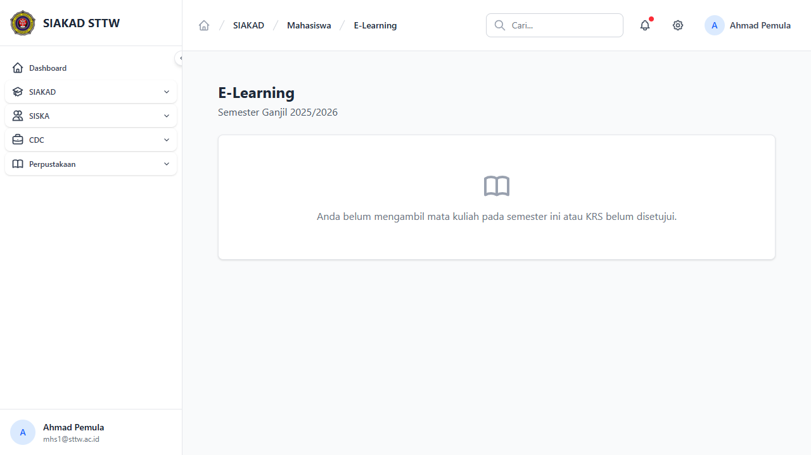

# Workflow Report: E-Learning Mahasiswa

**Tanggal**: 2026-05-12
**Role**: mahasiswa (mhs1@sttw.ac.id)
**Modul**: siakad
**Fitur**: mahasiswa-elearning
**Status**: ✅ Berhasil

## Deskripsi Workflow

Daftar mata kuliah e-learning.

## Ringkasan

Halaman diakses sebagai mahasiswa pada delta scan pertengahan April 2026.

## Langkah-langkah

### 1. Buka halaman E-Learning Mahasiswa

**Deskripsi**: Mahasiswa membuka halaman `/mahasiswa/elearning` melalui sidebar / navigasi bawaan SIAKAD.

**URL**: `http://127.0.0.1:8000/mahasiswa/elearning`

## Temuan & Masalah

_Tidak ada temuan signifikan._

## Catatan

- Diambil otomatis pada batch scan delta pertengahan April 2026.
- Full-page screenshot.
