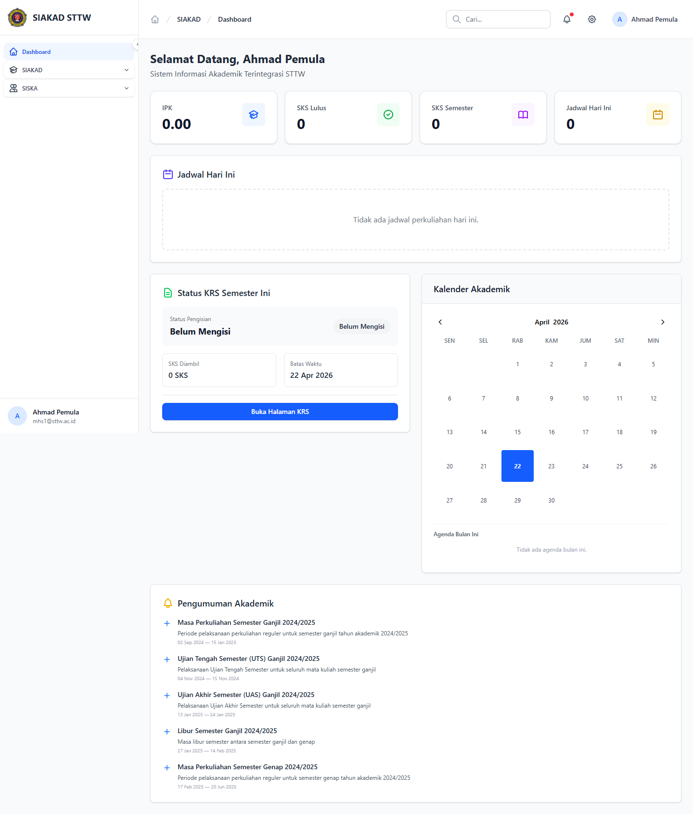
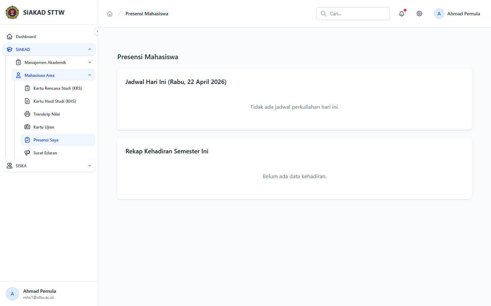

# Laporan Workflow — Mahasiswa: Jadwal & Presensi

**Tanggal:** 2026-04-22
**Penguji:** Agen Otomatis (Session B)
**Modul:** SIAKAD — Mahasiswa
**Akun Diuji:** `mhs1@sttw.ac.id` (role `mahasiswa`, profil "Ahmad Pemula")
**Sumber Plan:** `plan/2026-04-21-process-workflow-reporter-all-modules-1.md` — TASK-012 (sebelumnya ⚠️ Partial)

## Skenario

Memverifikasi bahwa mahasiswa dapat melihat ringkasan jadwal kuliah pada dashboard dan mengakses halaman presensi mahasiswa untuk mencatat kehadiran terhadap mata kuliah aktifnya.

## Langkah Pengujian

### 1. Dashboard Mahasiswa (ringkasan jadwal)

Setelah login, mahasiswa diarahkan ke `/dashboard`. Halaman ini menampilkan sambutan personal ("Selamat Datang, Ahmad Pemula"), kartu ringkas akademik (KRS, IPK, SKS), dan blok jadwal terdekat. Tidak ada menu sidebar terpisah bernama "Jadwal Kuliah" untuk role mahasiswa — jadwal disampaikan melalui dashboard dan turunan KRS (`/mahasiswa/krs`).

### 2. Halaman Presensi Mahasiswa

Navigasi ke `/mahasiswa/presensi` (route `mahasiswa.presensi.index`, controller `App\Http\Controllers\Mahasiswa\PresensiController`). Halaman menampilkan judul "Presensi Mahasiswa" dan area input untuk mencatat kehadiran berdasarkan sesi kuliah yang sedang berjalan. Endpoint POST tersedia di `mahasiswa.presensi.store` untuk menyimpan absen.

## Fitur Yang Diuji

| Fitur | Endpoint | Status |
|---|---|---|
| Dashboard mahasiswa (ringkasan jadwal) | `GET /dashboard` | ✅ Tampil |
| Index Presensi Mahasiswa | `GET /mahasiswa/presensi` | ✅ Tampil |
| Submit Presensi | `POST /mahasiswa/presensi` | ⏭️ Tidak diuji (butuh sesi presensi aktif dengan kode/QR yang valid) |

## Temuan & Masalah

Tidak ditemukan error 4xx/5xx pada kedua halaman. Catatan minor: untuk role mahasiswa tidak terdapat halaman daftar jadwal mingguan terpisah seperti pada role dosen (`/siakad/dosen/jadwal-mengajar`). Bila stakeholder menginginkan tampilan "kalender mingguan" mahasiswa, diperlukan controller/view baru — tidak masuk scope tugas ini.

## Catatan

Pengujian alur submit presensi (POST) memerlukan sesi kuliah yang dibuka dosen pada hari yang sama dengan token presensi aktif. Pada sesi ini hanya verifikasi tampilan dilakukan. Sesi ini menutup TASK-012 yang sebelumnya berstatus ⚠️ Partial pada plan workflow-reporter.
