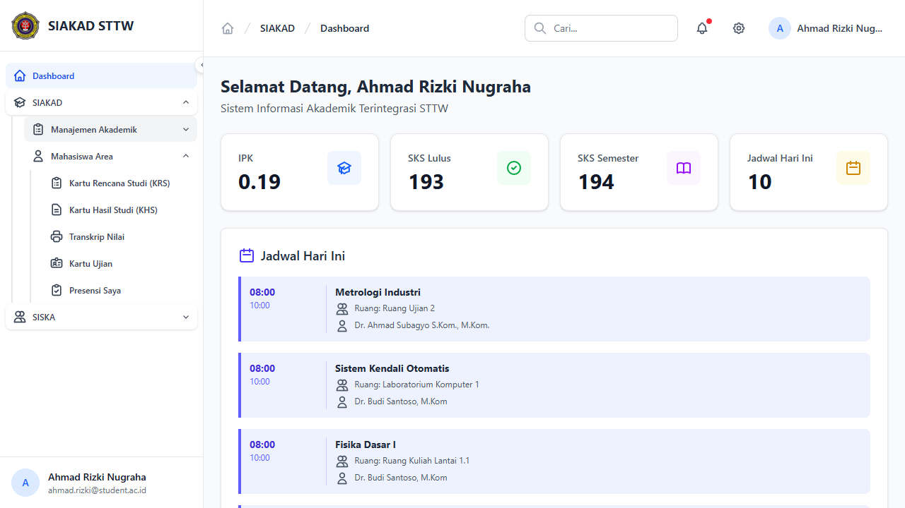
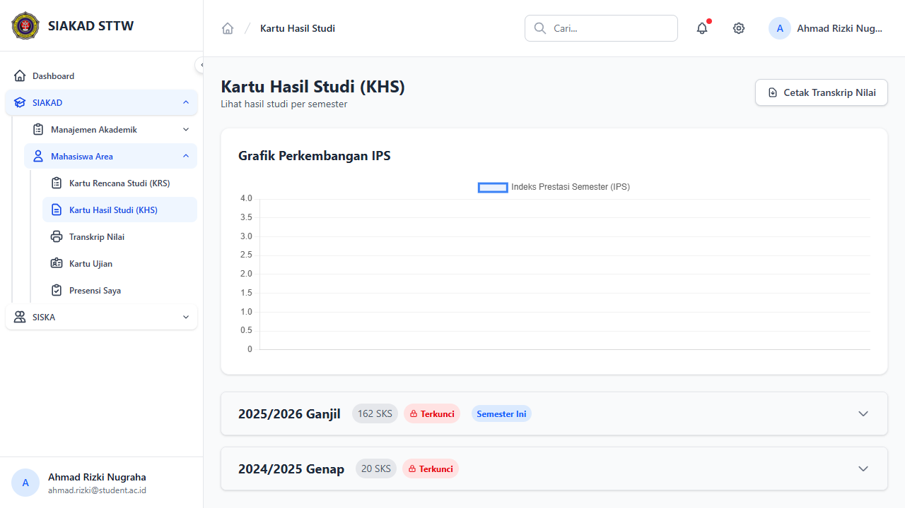

# Workflow Report: Kartu Hasil Studi (Mahasiswa)

**Tanggal**: 2026-04-18
**Role**: Mahasiswa
**Modul**: SIAKAD
**Fitur**: Kartu Hasil Studi (KHS)
**Status**: Partial

## Deskripsi Workflow

Verifikasi halaman indeks KHS mahasiswa setelah penyesuaian parameter cetak KHS agar memakai `periode_akademik_id`. Fokus manual pada sesi ini adalah memastikan halaman KHS dan daftar semester dapat diakses melalui sidebar mahasiswa.

## Ringkasan

Halaman `Kartu Hasil Studi (KHS)` berhasil dibuka melalui sidebar `SIAKAD -> Mahasiswa Area`. Namun pada data lokal saat ini semester-semester KHS berada pada status terkunci, sehingga tombol `Cetak KHS` tidak muncul dan flow cetak PDF tidak bisa diverifikasi secara visual di browser.

## Langkah-langkah

### 1. Login Mahasiswa

**Deskripsi**: Membuka halaman login untuk autentikasi mahasiswa sebelum masuk ke area akademik pribadi.

**URL**: `http://127.0.0.1:8000/login`

### 2. Buka Sidebar KHS

**Deskripsi**: Dari dashboard mahasiswa, grup `SIAKAD` dibuka lalu submenu `Mahasiswa Area` diekspansi agar menu `Kartu Hasil Studi (KHS)` terlihat jelas di sidebar.

**URL**: `http://127.0.0.1:8000/dashboard`

### 3. Buka Halaman KHS

**Deskripsi**: Mahasiswa membuka halaman `Kartu Hasil Studi (KHS)`. Halaman menampilkan daftar semester/accordion, namun semester yang tersedia pada data saat ini masih berstatus terkunci sehingga aksi cetak KHS belum tersedia di UI.

**URL**: `http://127.0.0.1:8000/mahasiswa/khs`

## Temuan & Masalah

| # | Halaman | URL | Kategori | Deskripsi | Screenshot | Prioritas |
|---|---------|-----|----------|-----------|------------|-----------|
| 1 | KHS Index | /mahasiswa/khs | `incomplete-data` | Semester KHS pada data lokal masih terkunci sehingga tombol `Cetak KHS` tidak muncul untuk verifikasi visual flow cetak. |  | Medium |

## Catatan

- Validasi browser pada report ini bersifat parsial karena state data lokal belum membuka akses cetak KHS.
- Perubahan route cetak yang memakai `periode_akademik_id` sudah ditutup oleh test `tests/Feature/Mahasiswa/KhsTest.php`.
- Screenshot diambil per viewport karena full-page capture Chromium gagal pada environment Windows saat ini.
