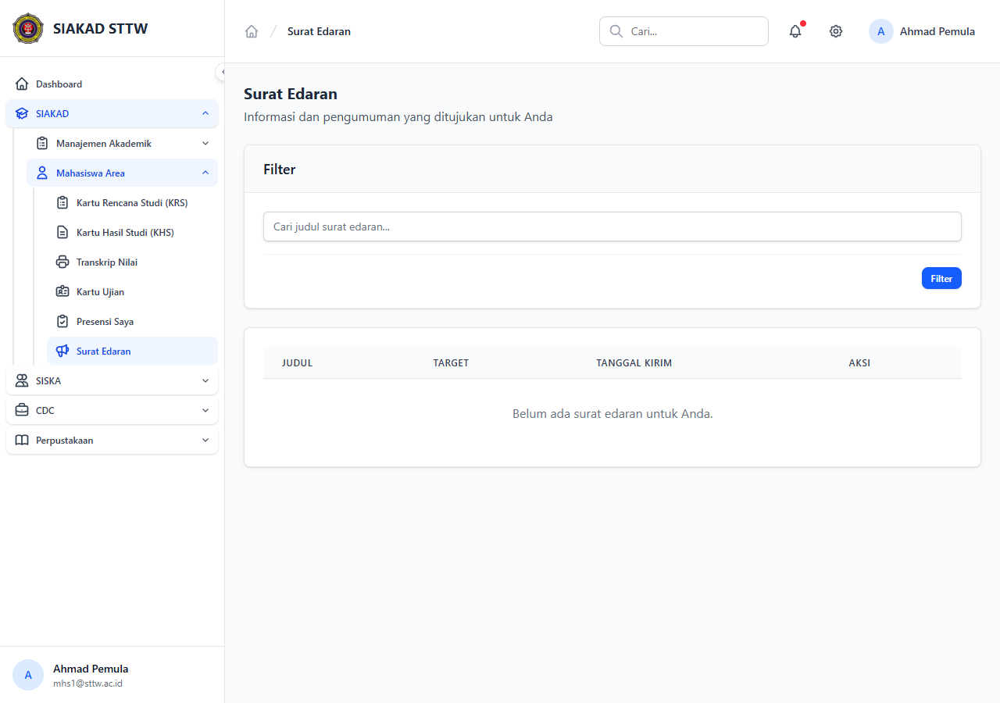

# Workflow Report: Surat Edaran (Mahasiswa, Read-Only)

**Tanggal**: 2026-05-12
**Role**: Mahasiswa (mhs1@sttw.ac.id)
**Modul**: SIAKAD — Layanan Mahasiswa
**Fitur**: Surat Edaran (Read-Only View)
**Status**: ⚠️ Partial (halaman load tetapi belum ada data dummy)

## Deskripsi Workflow

Mahasiswa dapat melihat daftar surat edaran institusi yang telah diterbitkan oleh admin (modul `siakad/surat-edaran`). Surface mahasiswa **read-only** — hanya `index` dan `show`. Workflow ini memverifikasi mahasiswa dengan permission `siakad.surat-edaran.view` dapat mengakses halaman tanpa error.

## Ringkasan

- Halaman index load 200 OK dengan title "Surat Edaran".
- Permission middleware `permission:siakad.surat-edaran.view` lulus untuk role mahasiswa.
- ⚠️ **Tidak ada surat edaran ter-seed** di database dummy → empty state ditampilkan.

## Langkah-langkah

### 1. Halaman Daftar Surat Edaran (Mahasiswa)

**Deskripsi**: Akses `/mahasiswa/surat-edaran` setelah login sebagai mahasiswa. Halaman menampilkan layout standar mahasiswa dengan empty state ("Belum ada surat edaran" atau setara) karena belum ada surat edaran yang dipublish.

**URL**: `http://127.0.0.1:8000/mahasiswa/surat-edaran`

## Temuan & Masalah

| # | Halaman | URL | Kategori | Deskripsi | Screenshot | Prioritas |
|---|---------|-----|----------|-----------|------------|-----------|
| 1 | Surat Edaran Mahasiswa | `/mahasiswa/surat-edaran` | `no-data` | Tabel surat edaran kosong; belum ada seed data SuratEdaran di DB dummy. Detail page (`/mahasiswa/surat-edaran/{id}`) tidak bisa diuji. |  | Medium |

## Catatan

- Modul ini adalah read-only view; admin manage di `/siakad/surat-edaran` (CRUD lengkap dengan preview & send).
- Permission: `siakad.surat-edaran.view` (di-seed untuk role `mahasiswa` di `RolePermissionSeeder.php:890`).
- **Rekomendasi**: tambahkan SuratEdaran factory + seed minimal 2-3 surat ber-status published ke DummyDataSeeder agar workflow detail page bisa diverifikasi pada scan berikutnya.
