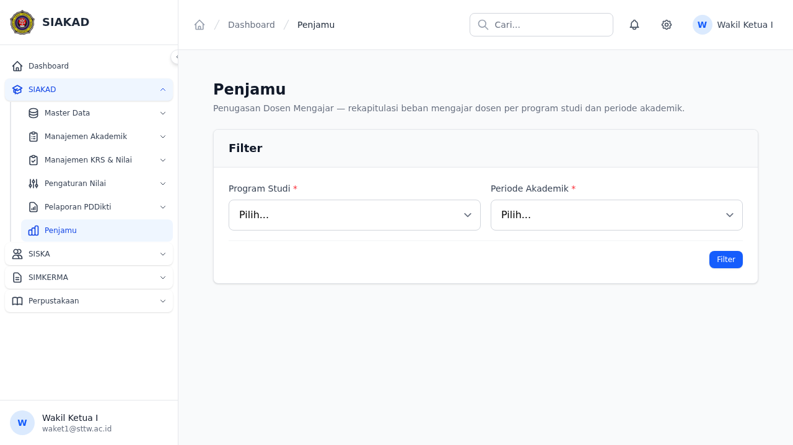

# Workflow Report: Penjamu — Monitoring Beban Dosen Mengajar

**Tanggal**: 2026-07-12
**Role**: Waket1, Kaprodi, Admin
**Modul**: SIAKAD — Penjamu (Audit/Monitoring E-Learning)
**Status**: ✅ Berhasil

## Ringkasan

Penjamu adalah dashboard monitoring/audit beban mengajar dosen. Fitur ini memungkinkan Waket1/Kaprodi/Admin melihat rekapitulasi dosen per program studi per periode akademik, lengkap dengan jumlah mata kuliah, total SKS, dan jumlah mahasiswa.

Fitur ini berasal dari modul E-Learning CI3 lama (`dosen/Penjamu.php`, 1159 lines) yang sepenuhnya belum ada di Laravel baru.

## Screenshots

### 1. Penjamu — Filter & Index

Halaman utama Penjamu dengan filter Program Studi (Select2) dan Periode Akademik.

## Fitur yang Diimplementasikan

| Fitur | Status | Keterangan |
|-------|--------|------------|
| Filter per Prodi + Periode | ✅ | Select2 prodi + select periode, POST ke data endpoint |
| List Dosen per Prodi | ✅ | Nama Dosen, NIDN, Jumlah MK, Total SKS, Jumlah Mhs |
| Detail per Dosen | ✅ | Klik nama dosen → lihat mata kuliah yang diajar |
| Link ke MK Detail | ✅ | Aksi → buka halaman detail MK dosen (existing) |
| Sidebar Menu | ✅ | "Penjamu" di bawah SIAKAD dengan permission gate |
| Permission | ✅ | `siakad.penjamu.view` — assigned ke waket1, kaprodi |

## Routes

| Method | URI | Name | Description |
|--------|-----|------|-------------|
| GET | `/siakad/penjamu` | `siakad.penjamu.index` | Filter form |
| POST | `/siakad/penjamu/data` | `siakad.penjamu.data` | Hasil filter (dosen list) |
| GET | `/siakad/penjamu/{dosenId}` | `siakad.penjamu.show` | Detail dosen + MK list |

## Skenario

| # | Skenario | Role | Hasil |
|---|----------|------|-------|
| 1 | Waket1 membuka halaman Penjamu | Waket1 | ✅ Filter form tampil |
| 2 | Memilih Prodi + Periode → Tampilkan Data | Waket1 | ✅ List dosen tampil |
| 3 | Klik nama dosen → detail | Waket1 | ✅ Halaman detail + MK list |
| 4 | Klik Aksi → buka MK detail | Waket1 | ✅ Redirect ke existing dosen MK page |
| 5 | User tanpa permission akses | Dosen biasa | ✅ 403 forbidden |
| 6 | User belum login | Guest | ✅ Redirect login |

## Test Coverage

- **Pest**: 4 tests, 9 assertions — semua PASS
  - `it redirects unauthenticated user`
  - `it blocks user without permission`
  - `it shows filter form with prodi and periode options`
  - `it validates required fields on data post`

## Technical Notes

- **Permission**: `siakad.penjamu.view` — dibuat via tinker, belum ada di seeder (akan ditambahkan saat fitur mature)
- **Query pattern**: `FormasiDosen::whereHas('jadwalPerkuliahan.mataKuliah.kurikulum.programStudi', ...)` untuk filter per prodi
- **Data grouping**: `->get()->groupBy('dosen_id')` untuk agregasi per dosen
- **Show route**: Menerima query params `program_studi_id` dan `periode_akademik_id` untuk mempertahankan konteks filter
- **Kembali link**: Dari show → kembali ke index (bukan data, karena data adalah POST-only)

## Commits

- `a08f48b4` — feat(penjamu): Part 1 — controller, filter form per prodi/semester, sidebar
- `d68caf70` — feat(penjamu): Part 2 — dosen detail + mata kuliah list per dosen
- `bf967630` — test(penjamu): Pest tests — auth gates, filter form, validation
