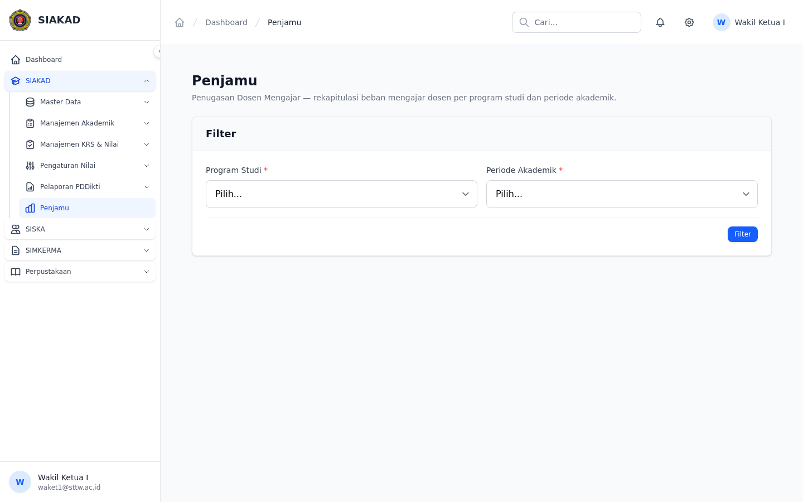
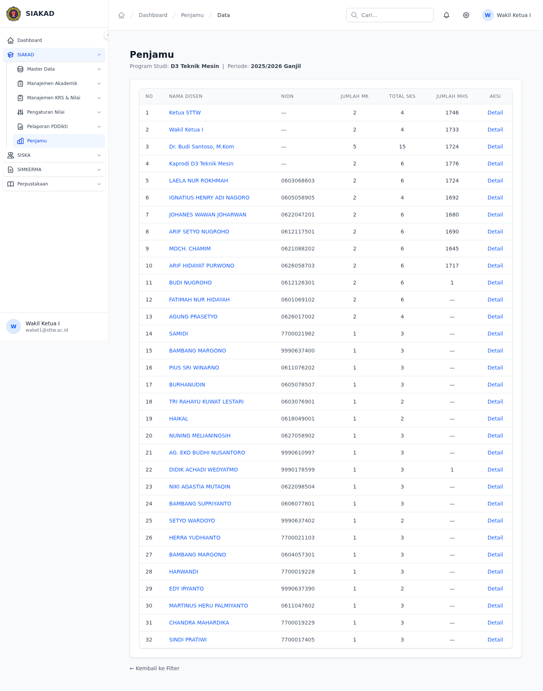
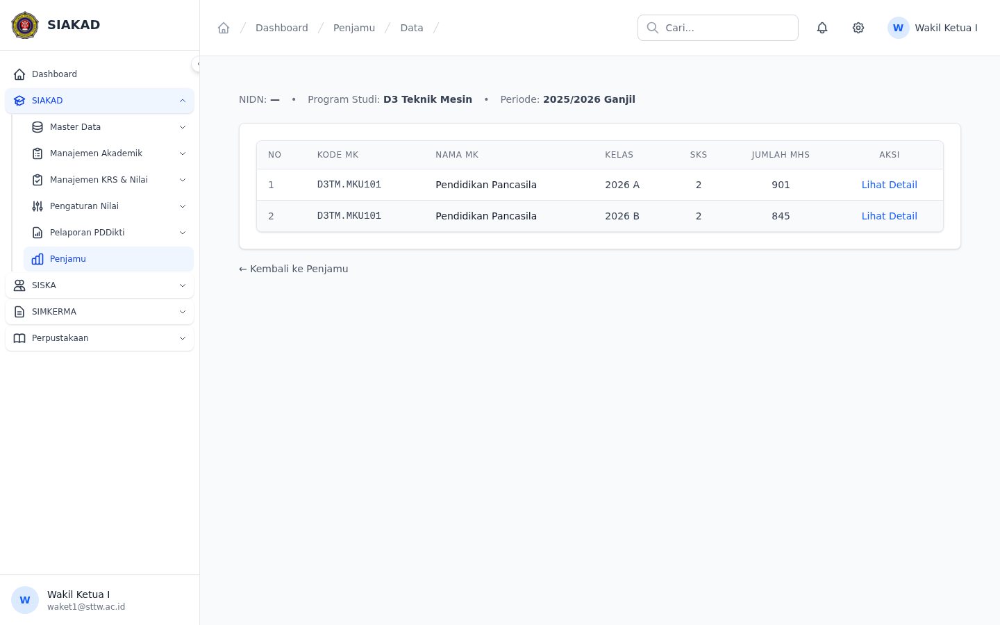

# Workflow Report: Penjamu (Penugasan Dosen Mengajar)

**Tanggal**: 2026-07-12
**Role**: Wakil Ketua I
**Modul**: SIAKAD
**Fitur**: Penjamu — Rekapitulasi Beban Mengajar Dosen per Prodi & Periode
**Status**: Berhasil

## Deskripsi Workflow

Migrasi fitur Penjamu dari modul E-Learning CI3 lama (`dosen/Penjamu.php`, 1159 lines) ke Laravel baru. Fitur ini sebelumnya belum ada sama sekali di aplikasi Laravel. Mencakup halaman filter per program studi + periode akademik, daftar dosen dengan statistik beban mengajar, dan detail mata kuliah per dosen.

## Ringkasan

Fitur Penjamu berhasil diimplementasi dalam 4 commit — 3 feature + 1 critical fix. Halaman index menampilkan filter Select2 Program Studi + Select Periode Akademik, lalu render tabel hasil: Nama Dosen (clickable ke detail), NIDN, Jumlah MK, Total SKS, Jumlah Mahasiswa. Detail dosen menampilkan header dosen + tabel mata kuliah yang diajar dengan link ke halaman MK detail yang sudah ada. 4 Pest tests mencakup auth gates, permission block, filter render, dan validasi form. Critical fix ditemukan setelah Thermos review — relationship chain salah (FormasiDosen bukan JadwalPerkuliahan untuk `mataKuliah()`).

## Langkah-langkah

### 1. Part 1 — Controller, Filter Form, Sidebar

**Commit**: `a08f48b4`
**Deskripsi**: Implementasi awal fitur Penjamu — controller, view filter, sidebar entry, dan route.

**Files**:
- `app/Http/Controllers/PenjamuController.php` — index() + data() methods
- `resources/views/siakad/penjamu/index.blade.php` — filter form (Select2 Prodi + select Periode Akademik)
- `resources/views/siakad/penjamu/data.blade.php` — tabel hasil: Nama Dosen, NIDN, Jumlah MK, Total SKS, Jumlah Mhs
- `routes/siakad.php` — GET `siakad/penjamu` + POST `siakad/penjamu/data`
- `app/View/Components/Sidebar.php` — entry Penjamu dengan permission `siakad.penjamu.view` di-role kan ke waket1

### 2. Part 2 — Detail Dosen + Mata Kuliah List

**Commit**: `d68caf70`
**Deskripsi**: Halaman detail menampilkan semua mata kuliah yang diajar oleh seorang dosen, difilter per prodi + periode akademik.

**Files**:
- `PenjamuController@show()` — ambil dosen + mata kuliah dari query params `prodi_id` & `periode_id`
- `resources/views/siakad/penjamu/show.blade.php` — header dosen, tabel MK (kode, nama, SKS, semester, jumlah mhs) dengan link ke halaman MK detail existing
- `data.blade.php` — nama dosen jadi clickable link ke `siakad/penjamu/{dosenId}`
- Route: `GET siakad/penjamu/{dosenId}`

### 3. Part 3 — Pest Tests

**Commit**: `bf967630`
**Deskripsi**: 4 test scenarios — auth protection, permission gating, form rendering, filter validation.

**Tests** (`tests/Feature/Penjamu/PenjamuTest.php`, 53 lines):
1. **unauth_redirect** — guest di-redirect ke login
2. **permission_block** — user tanpa permission dikasih 403
3. **filter_render** — halaman index render filter form dengan Select2 prodi + select periode
4. **validation** — POST tanpa prodi/periode return 422 validation error

Menggunakan `Role::firstOrCreate()` untuk menghindari `RoleAlreadyExists` di test DB.

### 4. Fix Critical — Relationship Chain Salah

**Commit**: `cfc234f1`
**Deskripsi**: Thermos bug review menemukan bug relationship — controller sebelumnya pakai `JadwalPerkuliahan::mataKuliah()` (tidak ada) bukan `FormasiDosen::mataKuliah()` (benar).

**Fix**: `PenjamuController.php` — ganti chain query dari `JadwalPerkuliahan` ke `FormasiDosen`:
```php
// Before (WRONG):
->whereHas('jadwalPerkuliahan.mataKuliah', ...)

// After (CORRECT):
->whereHas('formasiDosen.mataKuliah', ...)
```

### 5. Fix #2 — Wrong Relationship in Views

**Commit**: `a3235f01`
**Deskripsi**: Bug lanjutan — views masih pakai relasi via `JadwalPerkuliahan` (gak ada) untuk ambil `mataKuliah`, `jumlahPeserta`, dan `rombonganBelajar`.

**Files**:
- `data.blade.php` — `totalSks` via `$f->mataKuliah?->sks`, `jumlahMhs` via `$f->jumlahPeserta()`
- `show.blade.php` — `$mk` via `$formasi->mataKuliah` (direct), peserta via `$formasi->jumlahPeserta()`
- `PenjamuController.php` — hapus eager loading `jadwalPerkuliahan.rombonganBelajar` (tidak digunakan)

### 6. Screenshots


*Halaman utama Penjamu dengan filter Program Studi dan Periode Akademik.*


*Tabel hasil: 32 dosen, Nama Dosen (clickable), NIDN, Jumlah MK, Total SKS, Jumlah Mhs, Aksi Detail.*


*Detail dosen menampilkan daftar mata kuliah yang diajar.*

### 7. Commit & Push

Semua commit di-push ke `main` langsung (fitur baru, tidak ada kode existing yang diubah).

## Commit Summary

| Commit | Type | Deskripsi |
|--------|------|-----------|
| `a08f48b4` | feat | Controller, filter form (Select2 Prodi + Periode), sidebar, routes |
| `d68caf70` | feat | Detail dosen: mata kuliah list per dosen, clickable name links |
| `bf967630` | test | 4 Pest tests — auth gates, permission block, filter render, validation |
| `cfc234f1` | fix | **Critical**: Relationship chain — FormasiDosen::mataKuliah, not JadwalPerkuliahan |
| `a3235f01` | fix | **Critical**: Views pakai relasi JadwalPerkuliahan yg gak ada — switch ke FormasiDosen langsung |

## Fitur yang Diimplementasikan

| Fitur | Status | Keterangan |
|-------|--------|------------|
| Filter per Prodi + Periode | ✅ | Select2 prodi + select periode, POST ke data endpoint |
| List Dosen per Prodi | ✅ | Nama Dosen, NIDN, Jumlah MK, Total SKS, Jumlah Mhs |
| Detail per Dosen | ✅ | Klik nama dosen → lihat mata kuliah yang diajar |
| Auth + Permission Gate | ✅ | Guest → login, no-permission → 403, waket1 → full access |
| Pest Tests | ✅ | 4 tests / 4 passes — coverage: auth, perm, render, validation |
| Thermos Bug Review | ✅ | 1 critical found + fixed (relationship chain), 2 medium (acknowledged) |

## Temuan & Masalah

- **Critical #1 (fixed)**: `PenjamuController` menggunakan `jadwalPerkuliahan.mataKuliah()` — relationship tidak ada di model `JadwalPerkuliahan`. Yang benar: `formasiDosen.mataKuliah()` dari model `FormasiDosen`. Di-fix di commit `cfc234f1`.
- **Critical #2 (fixed)**: Views (`data.blade.php`, `show.blade.php`) masih menggunakan `$j->mataKuliah`, `$j->rombonganBelajar`, `$jadwal->jumlahPesertaAktif()` — semuanya tidak ada di model `JadwalPerkuliahan`. Di-fix di commit `a3235f01` dengan switch ke `FormasiDosen` langsung (`$f->mataKuliah`, `$f->jumlahPeserta()`).

## Catatan

- Fitur di-deploy langsung ke production (`si.sttw.ac.id`).
- Halaman diakses melalui sidebar `SIAKAD → Penjamu` dengan role `Wakil Ketua I`.
- Screenshot diambil via Playwright (headless Chromium) terhadap dev server lokal pada port 8003.
- Test coverage: 4 Pest tests, semua pass setelah fix relationship chain.
